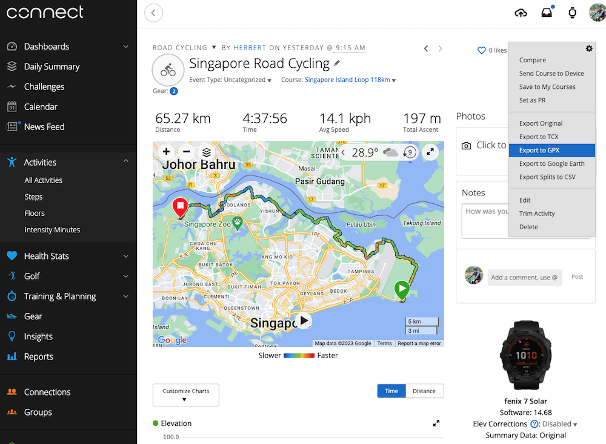
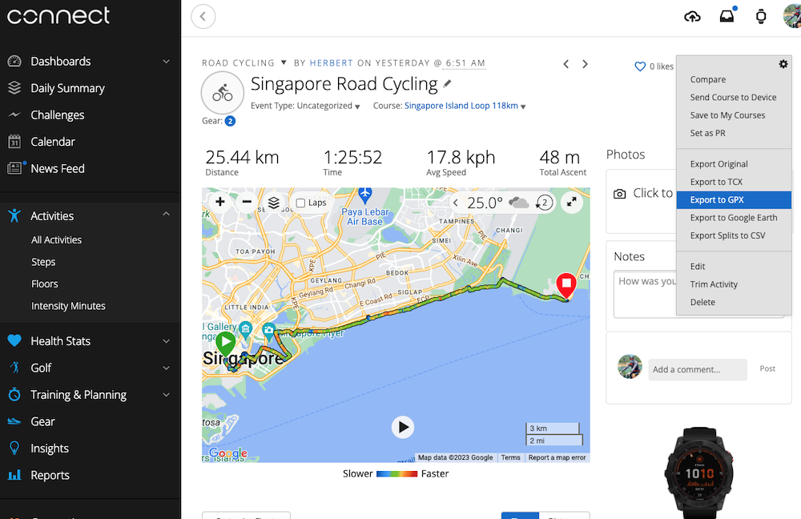
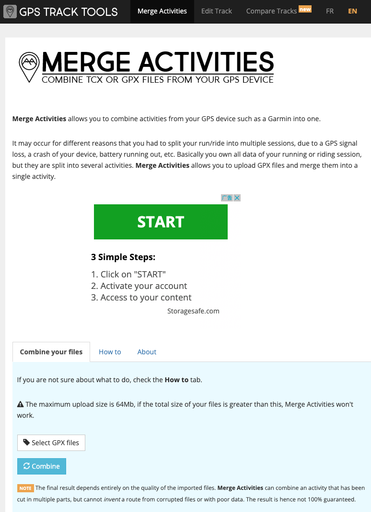
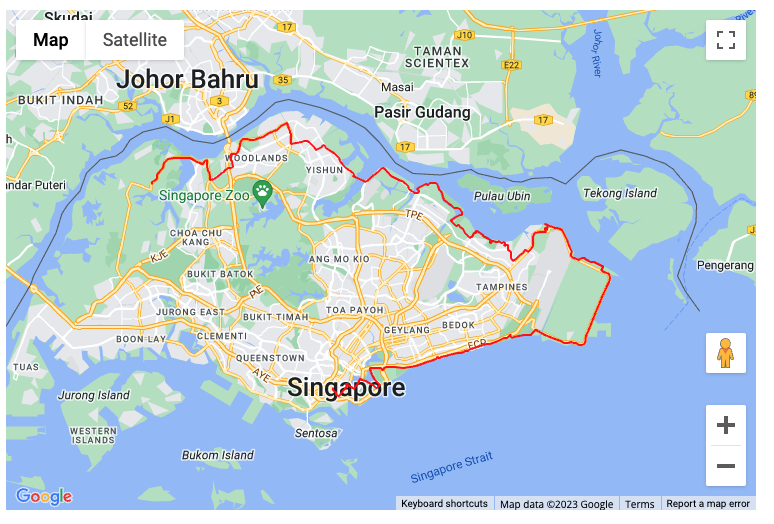

# Merge Multiple GPS Activities

## Problem

Garmin provides 3 options when an activitiy (running, swimming or cycling) is paused:

- Resume
- Save
- Resume Later

:::warning
Once `Save` is pressed, the activity is stopped and cannot be resumed any more
:::

Garmin's clumsy button-based mechanics don't make this easy. If I'm in the middle of a cycling trip and pause the meter, my intention is to `Resume Later`, but it's very easy for the fat finger to press `Save` instead. On Garmin devices (such as Fenix 7 or EdgePro 530), once an activity is saved, it can no longer be modified. This not only impacts my subsequent riding experience, but also screws up the sync to my Garmin Connect and Strava. More importantly, I will not be able to have a complete cycling route map at the end of a sweating day. This could be quite annoying.

## Solution

While Garmin cannot fix this issue (or even consider this as an issue), third party tool [GPS Track Tools](https://gtt.feub.net/merge-activities/) can save the day. 

1. Login to [Garmin Connect](https://connect.garmin.com/modern/). 
2. In `Activities` -> `All Activities` . Find the disjointed activities.
3. In each of the activities, press `Export to GPX` to down the `gpx` file into the local machine.

    
    
4. Go to [GPS Track Tools](https://gtt.feub.net/merge-activities/) (no sign-up is required), select the disjointed GPX files -> `Combine`.

    

5. Download the new GPX file, which has merged the two previous GPX files and automatically syncronizes all the statistics such as total distance, time, average speed, etc. 

    

6. Import this new GPX file back to your Garmin Connect account on the website. It will then be automatically sync-ed to the devices and eventually Strava. 

7. The initial two GPX files can now be deleted.
