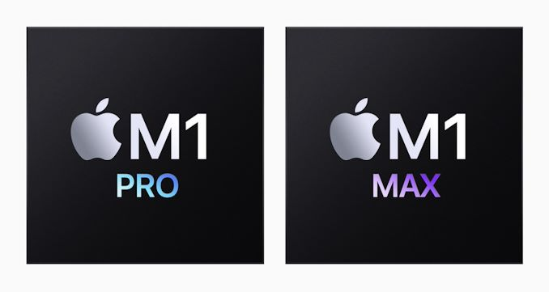

# Use brew on Apple M1 Pro



[brew](https://brew.sh/) is a popular package manager for macOS that can be used to install many softwares. Its behavior on the MacBook Pro with the new M1 chip is however different from before. A simple `brew install some-software` no longer works. 

## Solution

The trick is to add `arch -x86_64` in front of the brew command, like this, 

```bash
arch -x86_64 brew install some-software
```

That will fix the issue.

## Reference

- https://github.com/orgs/Homebrew/discussions/4397