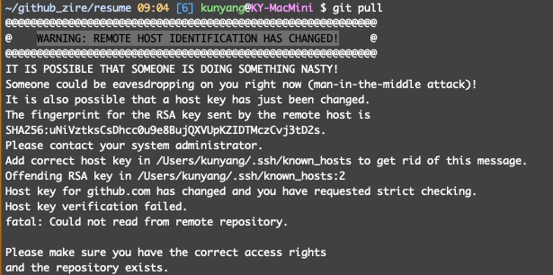
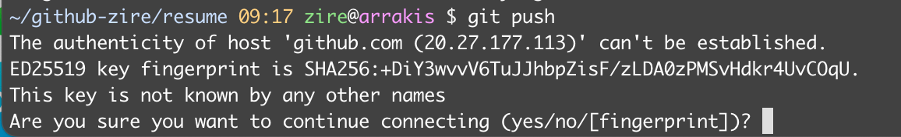

# Fix Github's Error Message "Remote Host Identification Has Changed"

I tried to do git pull and git push on a repo this morning and found this intimidating warning message, on multiple devices.



It turned out that on March 24, 2023, [Github updated its RSA SSH host keys](https://github.blog/2023-03-23-we-updated-our-rsa-ssh-host-key/)  as the previous private keys were briefly exposed in a public Github repository. Based on the instructions from this [Stack Overflow post Stack Overflow post](https://stackoverflow.com/questions/75830783/why-are-connections-to-github-over-ssh-throwing-an-error-warning-remote-host-i) , this warning message can be removed by running: 

```bash
ssh-keygen -R github.com
```

On your next git operation, you'll be prompted with a question whether you trust the new SSH key. 



Verify that against the [4 new SSH key fingerprints published by Github](https://docs.github.com/en/authentication/keeping-your-account-and-data-secure/githubs-ssh-key-fingerprints), namely:

```bash
SHA256:uNiVztksCsDhcc0u9e8BujQXVUpKZIDTMczCvj3tD2s (RSA)
SHA256:br9IjFspm1vxR3iA35FWE+4VTyz1hYVLIE2t1/CeyWQ (DSA - deprecated)
SHA256:p2QAMXNIC1TJYWeIOttrVc98/R1BUFWu3/LiyKgUfQM (ECDSA)
SHA256:+DiY3wvvV6TuJJhbpZisF/zLDA0zPMSvHdkr4UvCOqU (Ed25519)
```

That's it. Git operation is now back to normal.