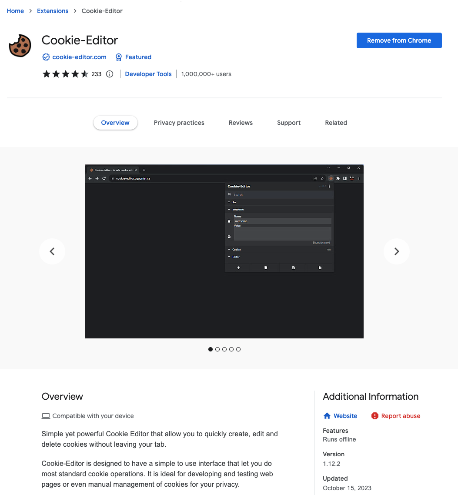
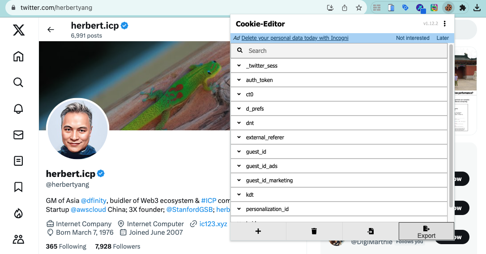

# Download Twitter Spaces Audio Recording

A lot of great discussions for crypto and Web3 are taking place on Twitter Spaces nowadays. It would be helpful to save a copy of those recorded audio files for replay, sharing with others, or just future reference. 

Twitter doesn't make this easy though. Only the host can save the recorded audio to a local machine and the audio is only available for 30 days after the event. After that, the host has to make a formal request from Twitter's desktop client and receive the audio file along with the entire digital archive from his/her account. If you're not the host, you're out of luck.

## Install Python script

That said, there are many ways to download a Twitter Spaces audio record even if you're not a host, from various third-party community developers. Here's one that works, https://github.com/HoloArchivists/twspace-dl , as of November 2023.

Assuming you already have Python installed, use Python package manager pip to install the script.

```bash
pip install twspace-dl
```

You also need to install the versatile multimedia converter `FFmpeg` for twspace-dl to work. FFmpeg has many dependencies from brew and usually the installation would take quite a bit of time (a few hours even). I rarely complete the installation of FFMpeg on a new machine at one go and always have to try multiple times to get it done.

:::caution
Installing FFmpeg may take quite a bit of time
:::

```bash
brew install ffmpeg
```

## Install Cookie-Editor extension

Twitter has made many changes to its API in 2023 since Musk took over. You now have to download your own cookies file in order for this Python script to run properly, as the author pointed out:

>cookies file in the Netscape format. The specs of the Netscape cookies format can be found here: https://curl.se/docs/http-cookies.html. The cookies file is now required due to the Twitter API change that prohibited guest user access to Twitter API endpoints on 2023-07-01.

Download [Cookie-Editor](https://chrome.google.com/webstore/detail/cookie-editor/hlkenndednhfkekhgcdicdfddnkalmdm) extension for Chrome.



## Download cookie file for Twitter

Go to [twitter.com](https://twitter.com), open up Cookie-Editor extension. It will display a list of cookies from Twitter. Go to the bottom-right corner and click the `Export` button. Cookie-Editor will copy the content to the Clipboard. Create a new text file `cookies.txt` and paste the content from Clipboard.



## Download Twitter Spaces Audito

Open the Twitter Spaces event page, start playing the recorded audio, copy the URL link space_url, which is in the form of something like:

`https://twitter.com/i/spaces/1PlJQprNzkaGE?s=20`

In the directory that has the newly created `cookies.txt`, download the audio recording.

```bash
twspace_dl -i https://twitter.com/i/spaces/1OyJAWwyBzoKb -c cookies.txt
```

The download has started. You'll see this message when it's finished.

```bash
[hls @ 0x7f9cba705180] Changing ID3 metadata in HLS audio elementary stream is not implemented. Update your FFmpeg version to the newest one from Git. If the problem still occurs, it means that your file has a feature which has not been implemented.
size=   60772kB time=01:27:10.84 bitrate=  95.2kbits/s speed=5.68x
INFO: Finished downloading
```

You'll find an `m4a` file in the folder. Now you can use the Swiss-Army knife `FFMpeg` to convert it into other formats for storage and publishing. Check out this guide, [Convert Audio m4a Into Video mp4](http://herbertyang.xyz/docs/digitalsovereignty/media/convert-audio-m4a-into-video-mp4/). 
