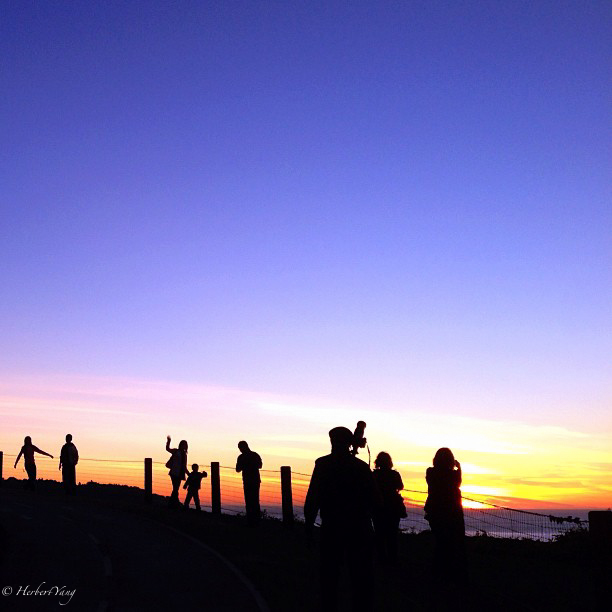
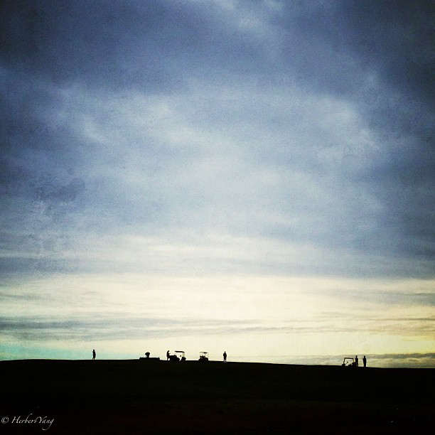
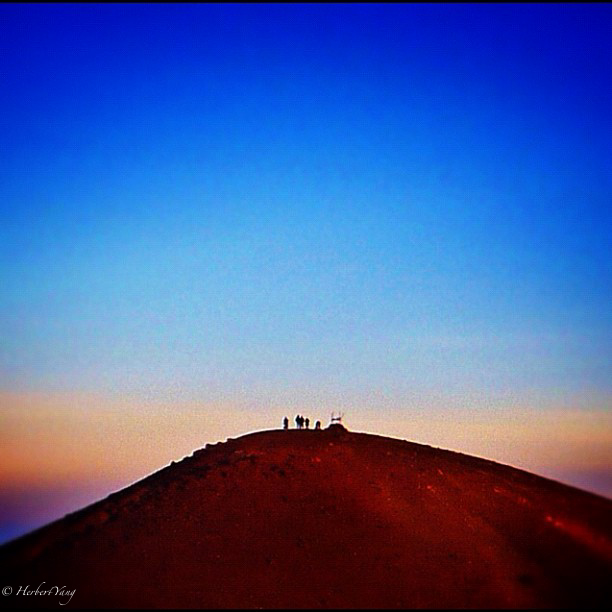

# 诸神的黄昏

Dawn at different parts of the world

## Golden Gate Bridge

San Francisco, USA, 2012, iPhone 5

## Half Moon Bay

USA, 2012, iPhone 4s

## Big Sur

USA, 2012, iPhone 4s

## Mt. Mauna Kea

The Big Island, Hawaii, USA, 2009, Nikon D-70

## Acadia National Park

Maine, USA, 2007, Leica D-Lux 3

