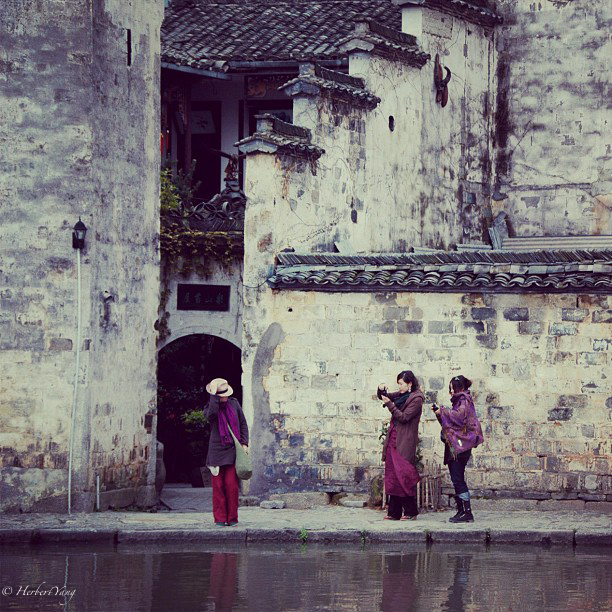
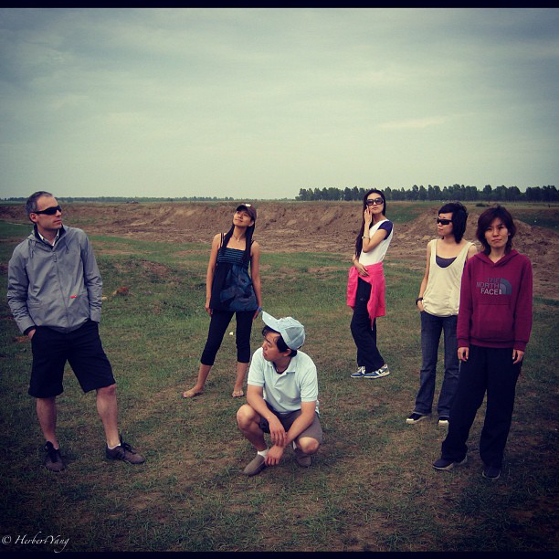
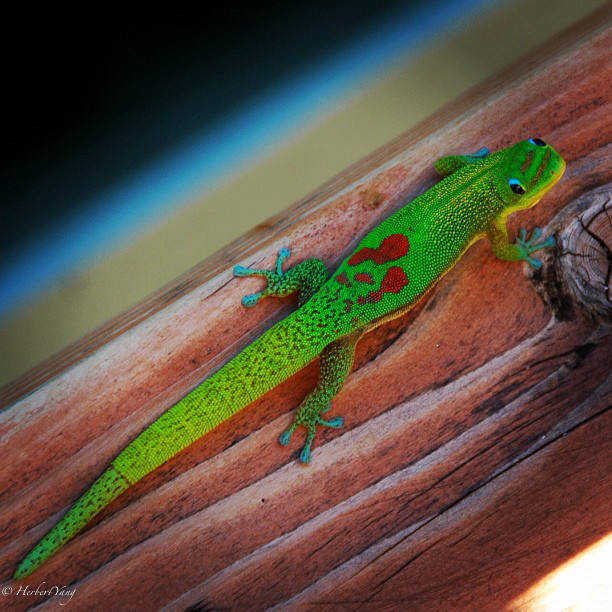

# Here's Looking At You

Here's looking at you, Humphrey Bogart says to Ingrid Bergman in "Casablanca" (1942). Since then this famous and confusing line has been subject to multiple interpretations by fans all over the world. Here's my take, in a visual way.

## Seattle

WA, USA, 2012, iPhone 5

## Hong Village

Mt. Yellow, China, 2010, Nikon D-70

## Peking University

Beijing, China, 2011, iPhone 4s

## Zhangbei Prairie

Hebei, China, 2008, Nikon D-70

## The Big Island

Hawaii, USA, 2009, Nikon D-70

