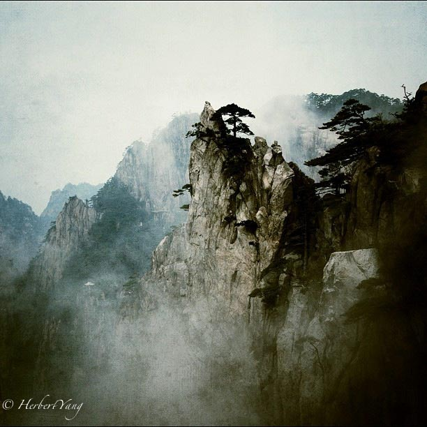
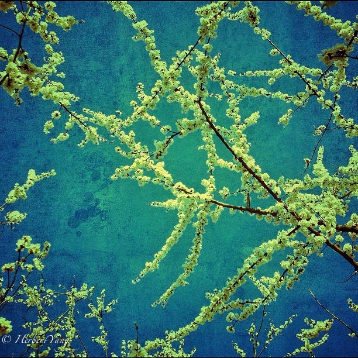
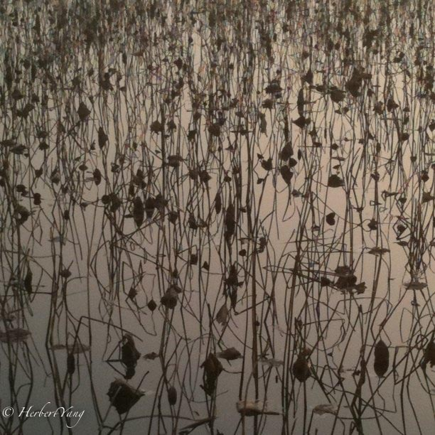

# 向大师们的致敬

Tribute to famous artworks by masters such as Claude Monet, Vincent van Gogh, 吴冠中, 刘海粟 and Andreas Gursky

## Water Lilies，Claude Monet

shot in 2007, Acadia National Park, Maine, USA

## Mt Yellow, Liu Hai Su (刘海粟)

shot in 2011-4, Mt. Yellow, Anhui, China

## Almond Blossom, Vincent van Gogh

shot in 2011, Beijing, China

## 春风桃柳, Wu Guanzhong(吴冠中)

shot in 2010, Summer Palace, Beijing, China

## Rhein II, Andreas Gursky

shot in 2009, Qinghua University, Beijing, China

