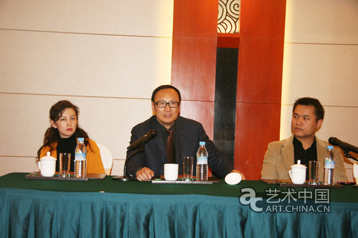
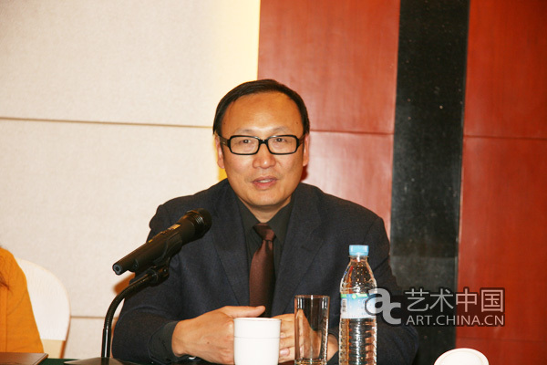

借吴作人国际美术基金会成立二十周年之机，中国首次以艺术基金会发展为主要命题，建立国际交流平台的世界级高端论坛——“2010艺术基金会国际论坛”（Global Forum of Art Foundations），于2010年10月28日-30日在北京举办。论坛由中国最大的艺术基金会，吴作人国际美术基金会（简称“WIFA”)主办，故宫博物院、北京大学和中国美术馆三家机构协办，以严谨的态度、雄厚的实力，邀请来自美国、英国、比利时、德国、韩国、港台地区和大陆多家知名艺术基金会代表，及中外相关领域专家出席，共同探讨艺术赞助的来源、跨地域合作的有效模式、基金会如何推动艺术行业的发展等共同关心的话题。

<!-- truncate -->

论坛将在“全球化下的沟通和协作” （Exchange And Co-operation In The Era of Globalization）的主题下展开，主要议题为：

1、各地区艺术基金会的发展状况，所面临的挑战以及解决方法；

2、艺术基金会如何在发展中国家支持和促进艺术教育和艺术事业的发展；

3、如何促进艺术基金会跨地域的沟通与协作。

希望通过对以上问题细致深入的对话讨论，达到论坛的目标：实现国内外艺术基金会在营运、资金、项目等方面的交流、互动、对接与协作，更好地推动艺术基金会在中国的发展以及中国艺术的对外推广。

三天的论坛包括公开论坛（地点：中国美术馆），闭门会议（地点：故宫博物院）和与北京大学、中央美院等校大学生的互动、参观艺术机构和艺术家工作室等活动。其筹备委员会由吴作人国际美术基金会的主要成员组成，如中国美术馆馆长范迪安（基金会理事长），北京大学教授朱青生（基金会执行秘书长），中央美术学院教授殷双喜、余丁、赵力（基金会副秘书长）等。

吴作人国际美术基金会于1989年8月由吴作人先生亲自创建成立，是中国规模最大、影响最广泛的独立运作的名人艺术类非公募基金会，是具有独立法人地位的全国性非营利的民间公益机构。论坛期间基金会名誉理事靳尚谊、詹建俊等，基金会理事王文章、冯远、刘大为、邵大箴、潘公凯等将出席会议及相关活动。此次论坛上，还将公布《中国艺术基金会发展报告》（中英文），这是中国自1981年成立第一家基金会以来30年中第一个对艺术基金会的整体性调查和研究。

艺术基金会在中国是新生事物，“2010艺术基金会国际论坛”在吴作人国际美术基金会成立20周年之际召开，无疑促进了中国艺术基金会总结自身情况，搭建起国际交流的平台，以期使艺术基金会的管理与运作跟上时代的发展和社会的需求。

## 吴作人国际美术基金会成立二十周年

今年是吴作人国际美术基金会成立二十周年。现代意义上的基金会制度在欧美已经有一百多年的历史，而在中国尚不足30年。作为中国规模最大、影响最广泛的独立运作的艺术类非公募基金会，吴作人基金会自成立之初，一直以推动中国美术事业和当代艺术创作的发展，促进全球化时代中国艺术与世界艺术的研究与交流为使命，致力于组织、奖励和资助中国传统艺术、中国现代美术和中国当代艺术在世界范围内的创作和推广，赞助艺术界的展览、研究和交流活动，奖励和资助美术教育、美术理论、美术批评和艺术史的研究与出版。通过基金会和托管于基金会的各专项基金，为国内外同仁创造共同促进中国美术事业的机会。

廿多年来，吴作人基金会已经形成了以下七个关注领域，即艺术创作、艺术批评、艺术史研究、中外艺术交流、艺术教育、艺术管理和社会公益。围绕着这几个领域，基金会积极有效地开展了包括吴作人艺术奖、萧淑芳艺术奖在内的一系列评奖和学术公益项目资助。二十年前曾经的获奖者大多已成为当今中国艺术界的中坚力量，如韦尔申、妥木斯、黄专、曹意强、常宁生、赵力等。近年来新评出的获奖者，有韦启美、乔十光、郭全忠、万青屴、李松涛、薛永年、田黎明、陈云岗、朝戈、刘小东、史金淞、李松松、崔岫闻等。

同时，吴作人基金会在国家法律规定和基金会宗旨的前提下设立各类专项基金，不仅开拓了基金会的工作领域，也吸纳了广泛的社会资源加入到推进中国艺术发展的事业之中。目前的九个专项基金分别为萧淑芳艺术基金、震后造家专项基金、中国艺术传统研究基金•汉画专项基金、吴作人研究专项基金、艺术史专项基金、中国艺术批评基金、艺术与文化政策专项基金、青年策展人发展基金、中国现代艺术档案专项基金。专款用于为艺术家、学者、艺术机构、艺术从业者、艺术爱好者提供服务。

吴作人国际美术基金会20年来坚持了发起人所制定的宗旨，怀着促进中国社会健康发展的强烈的责任心和使命感，在艺术界做出了一些成绩，受到了社会的积极肯定与支持。今天，我国社会经济发展正步入一个新的发展时期，作为中国较早成立的文化艺术基金会，吴作人国际美术基金会深感文化建设任重道远。特借成立二十周年，主办“艺术基金会国际论坛”，以借鉴国际先进模式和经验，继续推动基金会为艺术行业的发展贡献更大力量。

## 会议议程

09:00 - 09:20/主题演讲1：全球化下的沟通和协作

09:20 - 09:40/主题演讲2：北美艺术基金会的发展状况

09:40 - 10:00/主题演讲3：欧洲艺术基金会的发展状况

10:00 - 10:20/主题演讲4：中国大陆艺术基金会的发展状况

10:20 - 10:40/茶歇

10:40 - 11:40/圆桌讨论1：艺术基金会之间的跨地域协作

11:40 - 14:00/午饭

14:00 - 14:20/主题演讲5：德国艺术基金会的理念与发展

14:20 - 14:40/主题演讲6：韩国艺术基金会的发展状况

14:40 - 15:00/主题演讲7：台湾艺术基金会的发展状况

15:00 - 15:20/主题演讲8：数字化时代对艺术基金会的契机

15:20 - 15:40/茶歇

15:40 - 16:40/圆桌讨论2：基金会对当代艺术的推动

1:640 - 公开论坛结束

## 原文链接

http://art.china.cn/huihua/2010-10/27/content_3797085.htm