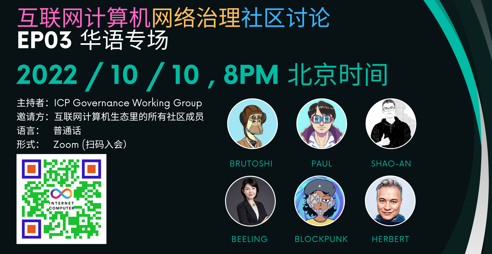

# ICP开发者社区研讨会EP03

<!-- truncate -->

Highlights from the two-hour Zoom call with the Chinese community on 2022/10/10 and the recorded video can be watched on Bilibili:

<iframe src="//player.bilibili.com/player.html?aid=473942566&bvid=BV1LT411N7UA&cid=858356333&page=1" scrolling="no" border="0" frameborder="no" framespacing="0" allowfullscreen="true" title="ICP Community Discussion EP03"> </iframe>

Below is only my first draft of the meeting. [All are welcome to comment on the original Google Doc](https://docs.google.com/document/d/1E0JkMdIxVqz8_1TaHswG6s8YD2hSGV3MlPQ97Cc6gNk/edit?usp=sharing) and suggest edits if anything is missing or should be added to this draft. 

Suggestions and comments:

## Named Neurons

- Named neurons are contributing a lot to the IC community. They should be ranked to reflect their reputation, influence via following, and standing in the community. https://forum.dfinity.org/t/the-sort-of-named-neuron-redesign-proposal/15463 . (Millions)
- NNS can create more fields for the named neurons so voters can get to know them better, such as a brief bio/background introduction. Currently, there is only one field for their names. (Millions)

## Deliberation on Motion Proposals

- Need a mechanism and venue to allow named neurons to not only deliberate their proposals, but also comment on how they cast their votes. Currently, followers only see the result of their votes, but can’t find out easily why they vote so and what factors they have taken into consideration when casting the vote. (Millions)
- NNS should remain a pure-play voting platform, as the last step to officialize motions. Deliberation and discussion on voting are important, but they should not be integrated into NNS and should take place outside of NNS. Most end users will never/rarely go into NNS. Detailed discussions can take place (BlockPunk).
- The Google Doc-based discussion for ICTC was a good example. (BlockPunk)
- Need to preserve the interim discussions for proposals as well, not just the final result. Need to make it easy for new members to the IC ecosystem to find those discussion threads. Developer Foum (https://forum.dfinity.org/) has too many different things, is too wide-ranging, and not easy to find the right topics for newcomers. The discussion threads for important proposals should be streamlined and placed in a dedicated/special place so that the community understands the thought process leading up to the final result. (问心)
- The discussions for motion proposals can be saved on a reputable media platform (Mike Zeng)

## NNS API & Tooling

- NNS’ APIs should be made open to the community so that developers can build their own applications and tools around those APIs to facilitate community discussions. We need a lot more tooling to make NNS easier for all. (BlockPunk)
- [All the APIs for NNS have already been made available to the public and are all defined in one single Candid file](https://raw.githubusercontent.com/dfinity/ic/master/rs/nns/governance/canister/governance.did). (Paul Liu & Herbert Yang) 
- The `governance.did` needs to have its own documentation. (Paul Liu)

## Granularity

- Besides Yes/No, NNS should leave room for more varieties of questions, such as multiple choices, or re-ordering/prioritization of certain options (roadmap milestones). (BlockPunk)
- DFINITY could create a TODO journal that has lower granularity of Roadmap, so that we can all keep track of more specific/detailed items. It doesn’t have to be super polished. It could be fluid and be changed/updated by lead developers as needed. It will be helpful for the developers in the IC community to know what’s being worked on. (问心)

## Roadmap & Feature Requests

- It’s very important to determine which features/milestones should be tackled first and DFINITY should listen to the community for suggestions and feedback more, rather than making sudden and unilateral decisions. (BlockPunk)
- Roadmap should fall under the scope of the Governance Working Group (BlockPunk)
- Need to separate IT project management from NNS voting. With limited resources from DFINITY and the fact that DFINITY remains the only developer that can make substantial changes to the ICP stack, NNS proposals need to focus on the high-level, most impactful features, otherwise it would become too much burden for the foundation, and may divert the focus on P0/P1 features. (Paul Liu)
- It makes sense to create a working group just for Roadmap (BlockPunk, Paul Liu)
- Can try https://canny.io/  to collect feature requests from the community and prioritize them. (Millions)
- What happened to PeopleParty? It just went quiet all of a sudden without an explanation. (BlockPunk)
- PeopleParty team was separate from the NNS team and they continue to work on this feature with now more collaboration with the community (Paul Liu)
- DFINITY should have done a better job explaining to the community the changed direction of such P0/P1 features. PeopleParty ran into some technical challenges that were found hard to solve so it was moved to the back burner. (Herbert)

## Governance Incentives

- The reward system is highly asymetrical to the proposal initiators. There is only punishment (10 ICPs if the motion is not passed) and no rewards (if motion is passed). (Millions)
- The most important thing for IC is to find a way to encourage and incentivize more people to participate in NNS governance. Even though the 8YearGang Chinese group on OpenChat already has 5,000+ members, most don’t activately participate in NNS. (Millions)
- Need a treasury to issue rewards to initiators of governance proposals (Millions)
- May need a special grant besides Developer Grant and Community Awards, to incentivize and subsidize members of the community to work on motion proposals. (Brutoshi)
- Maybe can use NNS to issue bounties to invite community developers to build certain apps. (Rushi)

## Developer Support

- Github issues are not being followed up or closed promptly. Question/PR was raised on Github but no response from DFINITY so far. (Witter)
- After much push from the community, DFINITY finally adopted NAT’s serialization, but JSON is still not supported yet. (Witter)
- Developers can escalate their unanswered questions to me and I’ll help escalate to the R&D leadership team on DFINITY’s internal Tuesday weekly community discussion call. (Herbert)
- Need a robust mechanism to respond and follow up with developers, so that developers know where to ask questions, find documentations, and seek help. (Millions, Witter, many) 
- We’re evaluating various ticketing plugins that could be integrated into ICP Discord server, so that DFINITY and the community can better track how these questions are followed up. Suggestions are welcome. (Herbert)

## Ongoing Communication between DFINITY & IC Community

- All are welcome to attend DFINITY’s monthly public R&D call to watch demos, sync up on milestone progress, ask questions, and share feedback. We can use more attendance and representatives from Asia/Chinese community. (Herbert)
- Many IC developers have been also invited to attend DFINITY’s weekly calls as well. If anyone wants to join, let me know and I’ll ask DFINITY’s R&D team to invite you. (Herbert)
- Dom is willing to listen to the community and take feedback, from my personal interaction with him in Singapore. (Shao-an)
- We need a lot more community discussions like this (Shao-an)
- We’ll create a regular bi-weekly Chinese community call series on every other Monday (Brutoshi, Herbert, and all)

## Tokenomics & Other Topics

- The working group should probably have partial power to influence the design of the IC tokenomics, so that it can drive discussions more effectively in the community. (BlockPunk)
It took way too long to launch the token standard (https://github.com/dfinity/ICRC-1)
- DFINITY has been acting too slowly on important initiatives, such as the token standard. The community needs to push DFINITY to focus on the most important initiatives, rather than waiting for DFINITY (to get its act together…) (Shao-an)
- SNS is already usable, but most IC developers are still waiting for OpenChat to be the first one to adopt it and see how it goes, before getting on it. It still needs a front-end and other pieces to be more complete. If there are issues with SNS, they will probably not manifest in the initial adoption, but only through later stage. (BlockPunk)

## General Ecosystem Growth

- Hackathon, community county, and developer-driven applications should collectively create healthy competition among IC developers and incentivize them to create the best apps. (Rushi)
- What is holding back the integration with stable coins? They’re essential to kickoff DeFi on IC. (Millions)
- It was hard to start the discussion with stable coins before the IC token standard was established and when IC’s TVL was low. Now the ICRC-1 has been released and is slowly being adopted, maybe it’s time to kick some tires. I’ll touch base with Lomesh and see if we’ve had any update on that front. (Herbert)
- Why so many leading industry analytic firms in crypto such as DappRadar just routingly ignore the existence of the ICP ecosystem and do not include ecosystem growth measures of ICP into their reports? (Many)
- ICP is not compatible with EVM and before the launch of ICScan (https://icscan.io), it’s difficult to get consistent ecosystem data from IC. 
- No enough marketing or BD effort from DFINITY to promote IC (Millions)