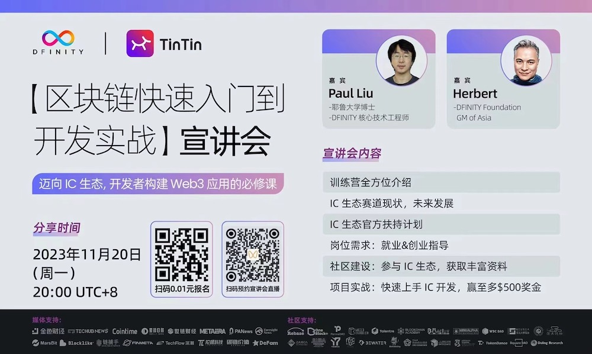

import Tabs from '@theme/Tabs';
import TabItem from '@theme/TabItem';

<!-- truncate -->

## 宣传

🌐 The first official @dfinity practical guide is here! 

🎯 Come and join the "Blockchain Fast-Track to Development Practice" Course Opening Seminar next Monday. 
👥 Get insights from @herbertyang , GM of DFINITY Foundation Asia, and Paul Liu, Core Technical Engineer at DFINITY, on #IC ecosystem trends and official support plans. 

⏰ Nov. 20th, 20:00 UTC+8 
📺 Livestream on Bilibili: http://live.bilibili.com/24784497

❤️‍🔥 Join DFINITY’s course hassle-free! Scan the QR code below - just ¥0.01 to join it!

## 视频

<Tabs>
  <TabItem value="Youtube" label="Youtube" default>
    

      <iframe width="560" height="315" src="https://www.youtube.com/embed/cVPhx2j4wMM?si=rnwtnJHVniCk9cqp&amp;start=2396" title="YouTube video player" frameborder="0" allow="accelerometer; autoplay; clipboard-write; encrypted-media; gyroscope; picture-in-picture; web-share" allowfullscreen></iframe>
    

  </TabItem>
  <TabItem value="B站" label="B站">
    

      <iframe width="560" height="315" src="//player.bilibili.com/player.html?aid=281153319&bvid=BV1mc41167Wz&cid=1339175324&p=1" scrolling="no" border="0" frameborder="no" framespacing="0" allowfullscreen="true"> </iframe>
    

  </TabItem>
</Tabs>

## 演讲

[下载PDF演讲(10MB)《互联网计算机ICP生态发展介绍》到本地](/asset/20231120_Tintin.pdf)。