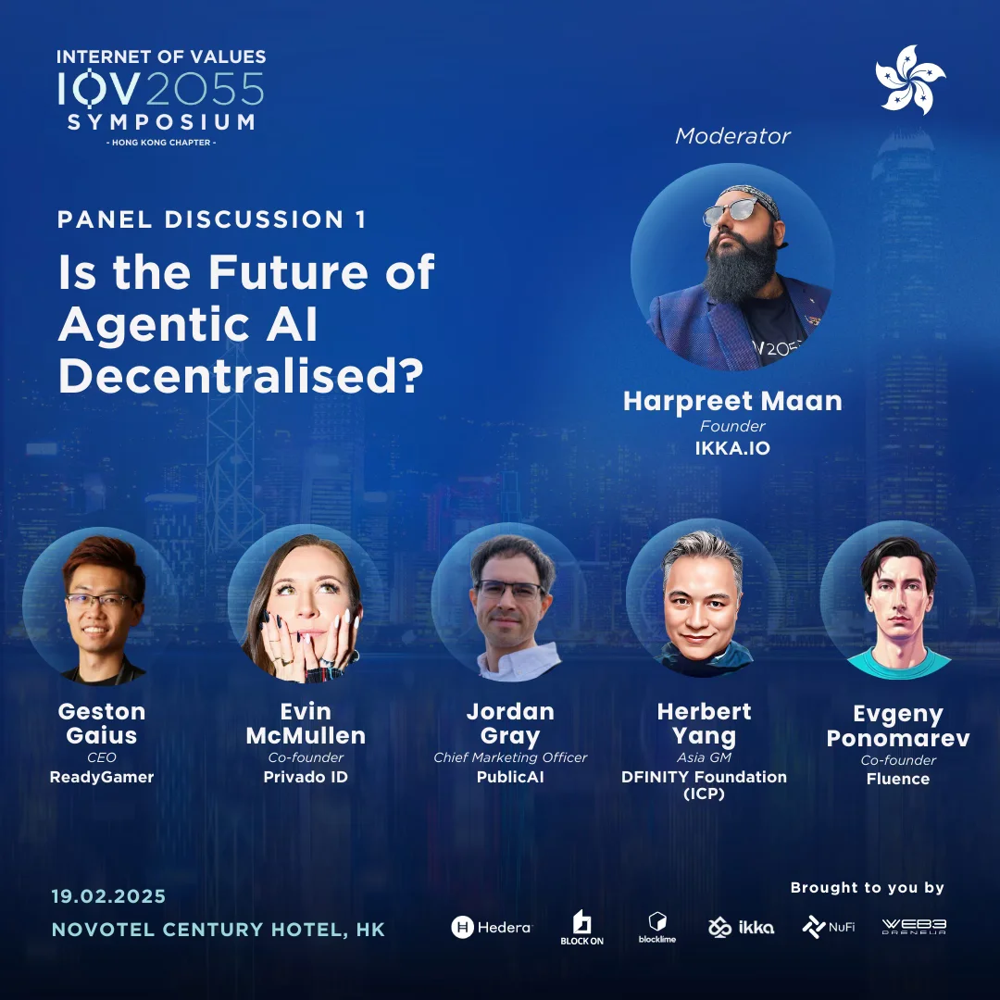

<!--truncate-->

Event Page:

[https://lu.ma/baeh8exk](https://lu.ma/baeh8exk)

Announcement:

[https://x.com/iov2055/status/1890012018499064062](https://lu.ma/baeh8exk)

Original Video Recorded by ICP Hub Singapore:

[https://x.com/icphub_SG/status/1892337949317963985](https://x.com/icphub_SG/status/1892337949317963985)
