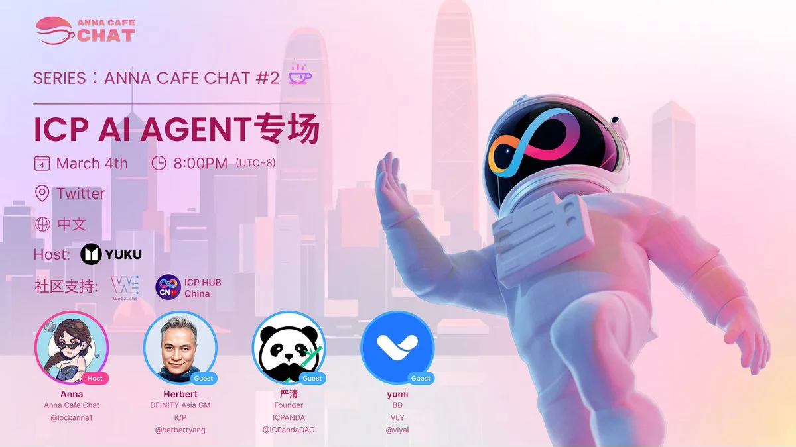

<!--truncate-->

## Event Background

Date: March 04, 2025

Length: 1h:20m

Language: Mandarin

Tune-in Audience: 462

Host: Anna of Yuku

Guests: Yan Qing of ICPanda, Yumi of Vly, Herbert of DFINITY

Announcement:

[https://x.com/lockanna1/status/1896514686637736171](https://x.com/lockanna1/status/1896514686637736171)

## Questions

1. 开场白及嘉宾自我介绍
2. ICP的作为AI基建优点是什么？相关的开发进展怎么样了？
3. 请介绍下您的项目？跟ICP做了怎样的结合？以及为什么选择ICP？
4. 您的项目有代币经济学吗？怎么跟社区互动呢？
5. 怎么看待 AI agent 市场转冷?
6. 上周发生Bybit 被盗事件，Herbert 发推 表示ICP是最安全的前端工具。能再详细为大家解读下吗？
7. 用户的资产安全是怎么办保护的？