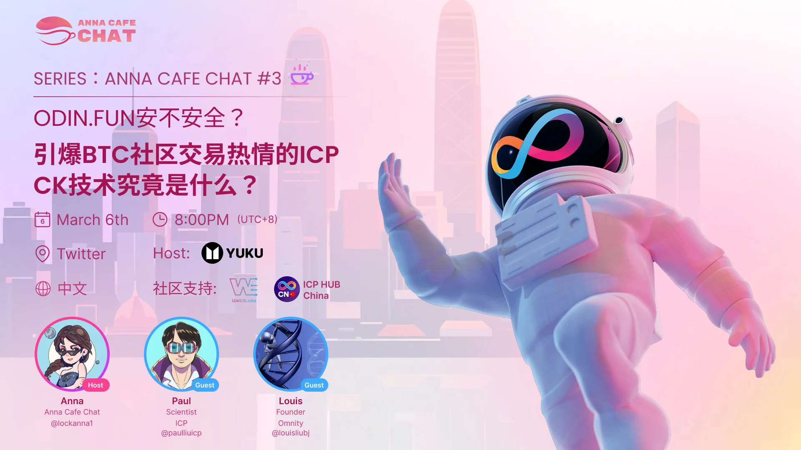

I didn’t speak on this panel other than helping the host Anna share a few relevant links. Paul is my colleague in the **[DFINITY Foundation](https://x.com/dfinity)** from the R&D team. DFINITY is the main developer studio behind L1 blockchain ICP. Louis is the founder of **[Omnity Network](https://x.com/OmnityNetwork)**, a leading cross-chain project built on ICP. Both are very experienced technical architects and developers who are widely respected in the crypto community. Anna runs BD for Yuku, a leading metaverse project on ICP.

<!--truncate-->

## Editor’s Note

**Odin.fun**, a memecoin launchpad for BTC Runes has been catching wildfire in the last few days. This AMA is to explain the Chainkey technology that makes Odin.fun, fast and secure.

It’s always a pleasure listening to Paul and Louis. I learn a ton every time.

## Event Background

Date: March 06, 2025

Length: 1h:15m

Language: Mandarin

[Tune-in Audience: 453](https://x.com/i/spaces/1MYxNwavawwKw)

Host: Anna of Yuku

Guests: [Paul Liu](https://x.com/paulliuicp) of **DFINITY**, [Louis Liu](https://x.com/louisliubj) of **Omnity**

Announcement:

[https://x.com/lockanna1/status/1897581009404940375](https://x.com/lockanna1/status/1897581009404940375)

## Host’s Questions

1. Background introduction, opening remarks, and guest self-introduction
2. What kind of public chain is ICP? What kind of technical characteristics does it have?
3. The BTC community was shocked by the fast transactions of Odin Fun. What is the reason?
4. Do other guests have any comments to add?
5. What kind of technology is Chainkey? What is its purpose, and how is it achieved? What are your plans?
6. Users in the community are very concerned about Odin's decentralization. What is the current degree of decentralization of Odin?
7. How is the security of users’ assets handled?
8. Will there be any cooperation between ICP and Odin?
9. Is there any possibility of combining ICP technology with BTC? Some people say that ICP is the best BTC L2. How do you understand it?
