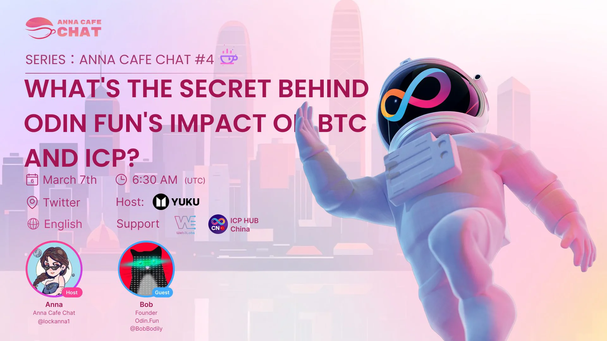

Odin.fun is a memecoin launchpad for BTC’s native Rune tokens. It’s fast, cheap, and secure. It’s turned many heads in the BTC community and attracted the attention of many crypto KOLs. Its impressive performance now begs the question - if we can trade memecoins in split seconds for Bitcoin, why do we still need to use memecoin launchpads on other L1 blockchains, such as Solana or Base?

<!--truncate-->

## Editor’s Note

This AMA with the Chinese community, featuring Bob Bodily, the founder of Odin.fun, was highly anticipated. There was a rumor circulating in various social media groups, saying there was a bug in Odin.fun, the TVL was overstated and the team ran away. For a few of us, Paul of DFINITY, Louis of Omnity, and I, who have known Bob for a long time, this was pure FUDDing (fear, uncertainty, and doubt).

The most effective way to strike down FUD is for the founder to speak to the community in public directly. After Anna the host started the Twitter Spaces at about 14:45 (UTC+8), very quickly, 1400+ users got on and waited for Bob to show up.

But after waiting for 15 minutes, Bob still didn’t show up. Anna then said she was told that Bob had to postpone this public AMA, and she had no choice but to end the Twitter Spaces. This looked really bad - it would give a lot of oxygen to the rumor that Odin.fun team ran away.

I pinged Bob on Telegram and explained to him that his presence would mean a lot to the community, and nobody else could calm down an increasingly suspicious community but himself. Bob said he would return. I called Anna and asked her to reopen the AMA right away. Anna re-opened the AMA; the online audience quickly climbed back to a few thousand. In great relief for the community, Bob came up to the mic and explained that all their assets were safe and the bug had already been fixed by the team hours before. In fact, a few minutes before Bob joined the AMA, he just released a long note on Twitter to explain everything.

This AMA was the first time for the Odin.fun founder to speak to the Chinese community, which had been a great early supporter of this memecoin launchpad. At the time of releasing this podcast (roughly 45 hours after the AMA), the panic sale of [Odin’s BTC](https://x.com/herbertyang/status/1897906112692994113) seemed to have subsided, and its TVL was stabilized at a new baseline.

Never a dull day in crypto.

## Event Background

Date: March 07, 2025

Length: 33m

Language: English

[Tune-in Audience: 28k](https://x.com/i/spaces/1dRKZYoVQVXxB)

Host: Anna of Yuku

Guests: Bob Bodily of Odin.fun

Announcement:

[https://x.com/lockanna1/status/1897710802838470681](https://x.com/lockanna1/status/1897710802838470681)
