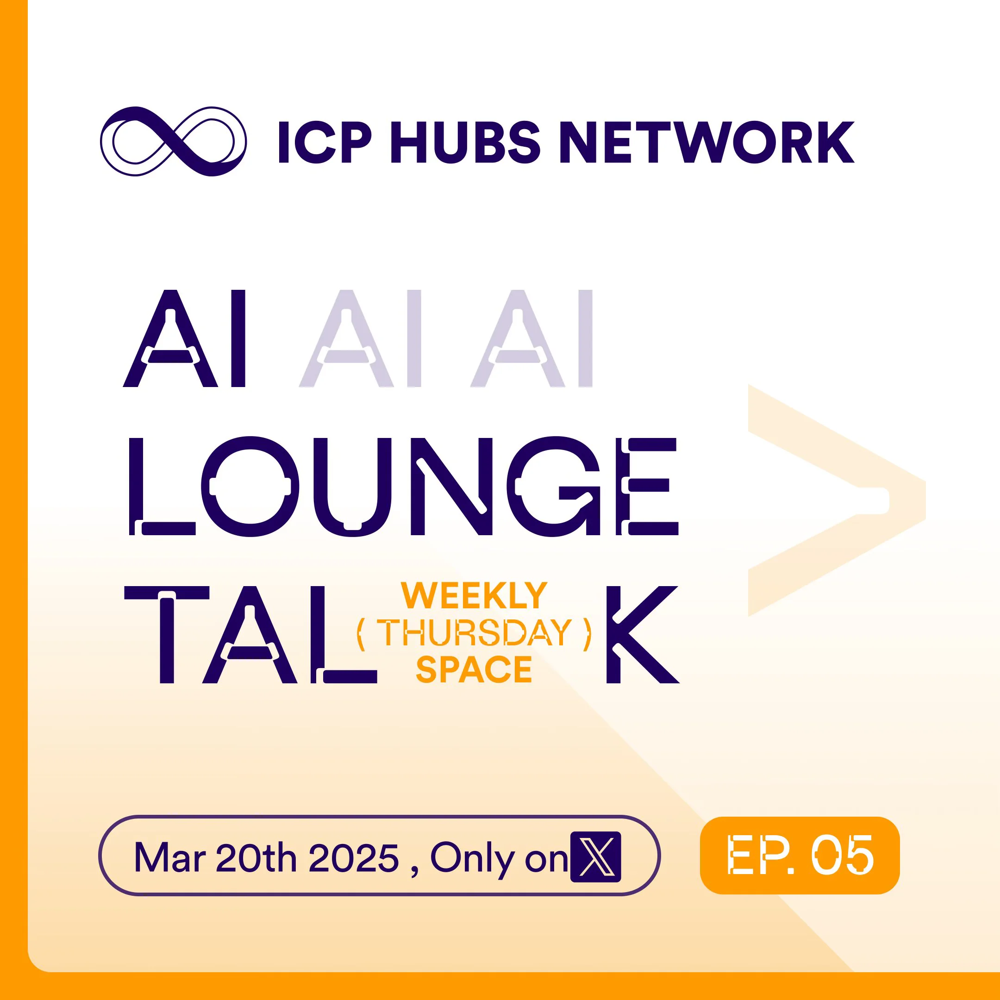

ICP Hubs Network hosts community talks on Twitter Spaces regularly. This week’s topic is AI and Bitcoin mining.

<!--truncate-->

## Event Details

* Date: March 20, 2025
* Length: 1h:35m
* Language: English
* Host: Stephen, ICP Hubs Network
* [Tune-in Audience: 8.4K](https://x.com/i/spaces/1OwxWXmjAXnKQ)
* Guests:

  * Aaron Ding, ICP.Hub Singapore
  * NobleBlocks
  * Harpreet Singh Maan
  * Eric Alexandre
  * Kyle, DFINITY
  * [Herbert, DFINITY](https://x.com/herbertyang)
* Announcement: [https://x.com/icphub_SG/status/1902583744000880667](https://x.com/icphub_SG/status/1902583744000880667)
