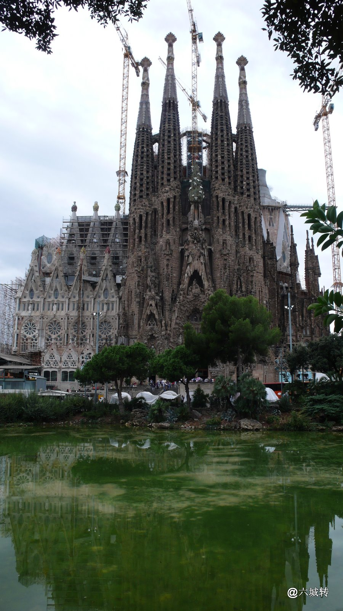
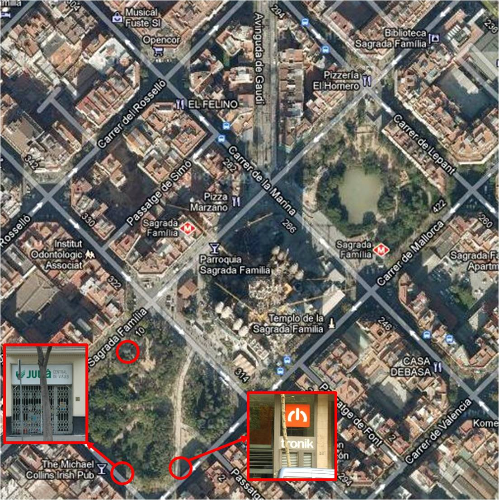
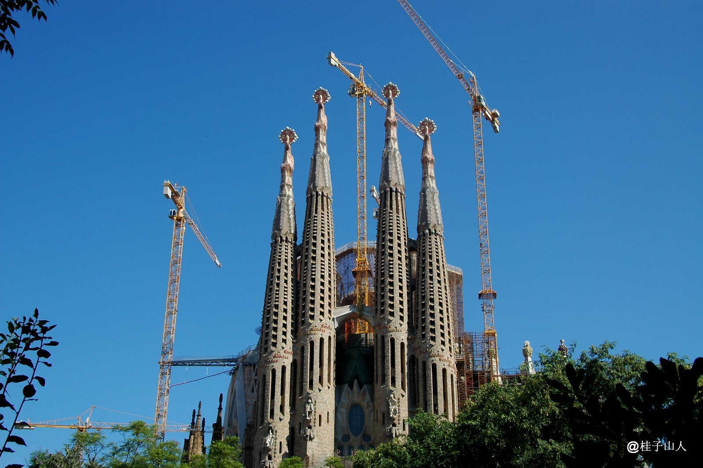
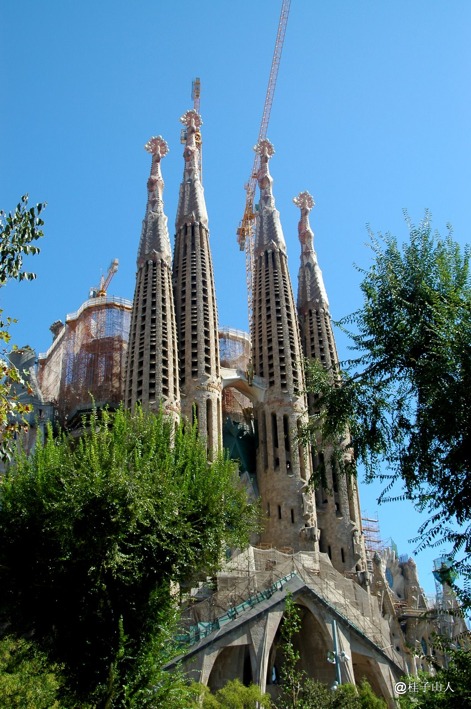

Title: 西行漫记04之拍摄Sagrada Familia的推荐地点
Date: 2011-09-28 08:34
Tags: 中文
Category: Travel
Slug: journey-to-Spain-04-photography-location-sagrada-familia
Summary: Sagrada Familia是巴塞罗那最著名的地标，是高迪最惊世骇俗的建筑作品，是摄影爱好者绝对不能错过的地方。要拍摄它需要注意时间，方位和地点。

上篇：[03之无人之境](http://www.guizishanren.com/journey-to-Spain-03-no-mans-land)

Sagrada Familia是巴塞罗那最著名的地标，是高迪最惊世骇俗的建筑作品，是摄影爱好者绝对不能错过的地方。要拍摄它需要注意时间，方位和地点。

Sagrada Familia的东西两面（其实是东北面和西南面）乍一看有点像，而且两面还各有一个长得有点像的公园，很多游客稍不注意可能就把两个侧面搞混了（坑爹呀，有池塘的公园是在东北面，没有池塘的在西南面）。显然，早上适合去拍东北面，下午/傍晚适合拍西南面。拍摄Sagrada Familia的难点之一就是不容易找到一个可以拍摄全景的位置（从下往上的仰拍不算，这里指的是从侧面的正拍）。我觉得西南面的拍摄效果更好。它的东北面是这个样子（拍摄地点是那个池塘的一点半方位）：

它的西南面有三个比较好的拍摄位置，都在西南角那个公园边上，用红色圆圈标出，其中两个我还附有马路对面的店铺标志。

在右下角位置的拍摄效果如下：

在左下角位置的拍摄效果如下（正好站在一个遛狗场的栅栏门口）：

在左上角位置的拍摄效果如下：

下篇: [西行漫记05之雨夜的浪漫](http://guizishanren.com/journey-to-Spain-05-romance-in-rain)