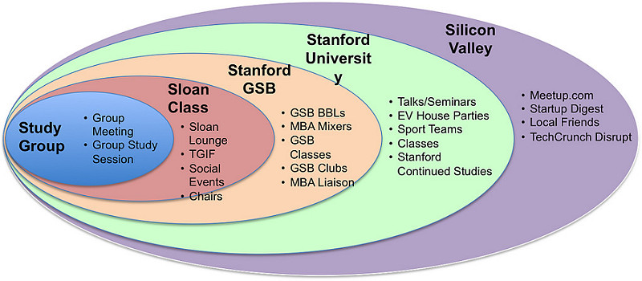

Title: COASSF#06 - Live Stanford Life to the Fullest
Date: 2012-08-28 14:44
Tags: coassf
Category: Framework
Slug: live-stanford-life-to-the-fullest
Summary: Life in Stanford comes to us like a bullet train. Before we know it's already two months into the program. For all the Sloans, it's unlikely we will ever come back to universities in a lengthy classroom setting again. How to make the most out of this 12-month campus life is the overarching question for all.

Life in Stanford comes to us like a bullet train. Before we know it's
already two months into the program. For all the Sloans, it's unlikely
we will ever come back to universities in a lengthy classroom setting
again. How to make the most out of this 12-month campus life is the
overarching question for all.

## Study Group

-   The least we can do is to make a few friends we can always fall back
    to in the 5-person study group

-   Some groups study together (reading textbooks/doing homework); some
    groups only meet for discussion. Whichever way is choose, don't
    overkill on doing the coursework. They're necessary to fulfill
    course requirement and internalize the new knowledge, but after a
    certain point you'll only see diminishing return. Most of the cases
    are pretty interesting and I can easily dive into them for ten hours
    without boring myself but that's probably not the reason why I came
    to Stanford.

## Sloan Class

-   The easiest way to make more friends in the class is to hang out in
    the GSB Sloan Lounge, and keep the door open (so far my observation
    is that most Sloans tend to keep the door closed). We are lucky to
    have this lounge area with 6-7 study rooms for Sloans' exclusive
    use. Make the best use of them while we can.

-   Attend TGIF (Thanks-God-It's-Friday). From a pure utilitarian
    perspective it has probably the highest benefit-to-cost ratio.

-   Attend social events organized by your hard-working social chairs

-   Run for Social Chairs

## Stanford Graduate School of Business

-   The GSB-wide BBLs(Brown Bag Lunch) could be a good venue to meet
    with the MBAs.

-   There will be two mixer events for the Sloans organized by the MBA
    Liaison Chairs

-   Starting from Fall Quarter, some classes will be a mixer of Sloans
    and MBAs, while some classes will be strictly for Sloans. Talk to
    Academic Operation to find out which classes will have MBAs.

-   Join GSB student clubs. MBA is the main driving force behind all the
    GSB-wide clubs.

-   Run for MBA Liaison Chairs (2 position) if you're single.

## Stanford University

-   There are many talks/seminars throughout the campus.

-   There are many house parties organized by each EV apartment. Our
    neighbors are students from other schools. Stanford has a beautiful
    campus and most students choose to live on campus. University of
    Chicago, Columbia, or Yale can never compete with Stanford in this
    area. After living in Cambridge, MA for four years, I think MIT and
    Harvard also pale in comparison to Stanford's campus community.
    Somehow I always miss the ice cream party of Hoskins Midrise. What a
    shame.

-   Play sports (like pick-up basketball games) in Ford Center
    or Arrillaga Center.

-   Choose courses from other schools like Engineering, Design or Law

-   [Stanford's Continued
    Studies](http://continuingstudies.stanford.edu) offers amazing
    classes to the public (for a fee). Sloans can attend them for free.
    I wish I had 48 hours a day just so that I could attend those
    wonderful and fascinating courses (many are non-business-related).

## Silicon Valley

-   This is the main reason many students come to Stanford Sloan.
    [Meetup.com](http://www.meetup.com) is striving and used by many
    local interest groups from technology start-ups to investments to
    karaoke parties.

-   [Startup Digest](http://startupdigest.com) is the one everybody
    reads. Go subscribe it. It's free. Its daily email lists out all the
    events around the valley.

-   Rekindle relationship with local friends, long-lost
    class/school-mates. In Beijing the startup circle is rather
    hierarchical. You need to be senior enough in the company
    (director/VP and above) to break into circles that matter. In the
    valley it appears to have a flatter pecking order. Many people are
    engineers/coders, but they can still be very well connected.

-   Attend [TechCrunch's Disrupt](http://techcrunch.com/events/) event.
    This is one of the biggest events in the valley with the most stellar
    line-up of speakers. Usually its ticket (for 4-5 day) goes for
    nearly \$3,000, but for students it has a discounted price of only
    \$300. Take advantage of this.