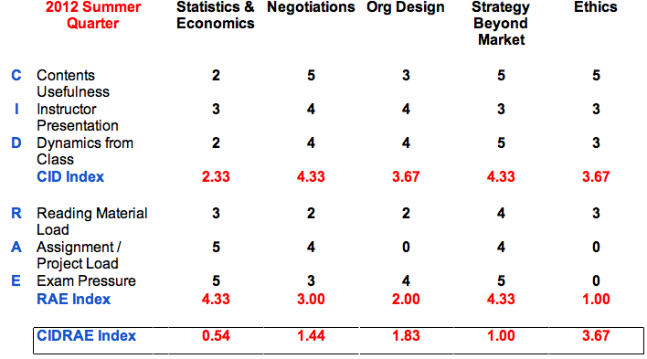

Title: COASSF#25 - Summer Quarter Course Evaluation
Date: 2012-10-18 22:14
Tags: coassf
Category: Stanford
Slug: summer-quarter-course-evaluation
Summary: continued from the explanation of CIDRAE Framework, here is the evaluation for the courses I took in the summer quarter of Stanford 2012-2013 in the Sloan Program.

... continued from the explanation of [CIDRAE Framework](../../../2012/10/evaluate-course-with-CIDRAE/), here is the evaluation for the courses I took in the summer quarter of Stanford 2012-2013 in the Sloan Program.

