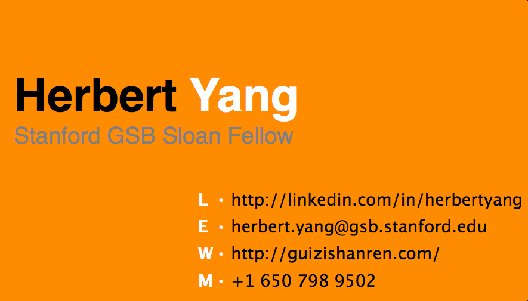
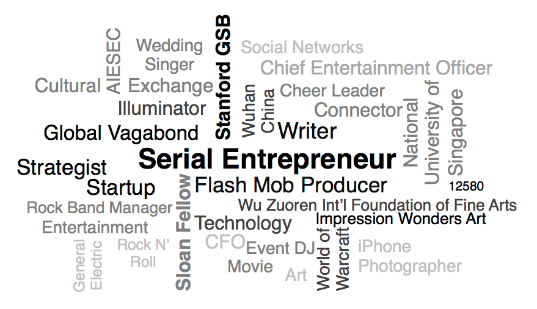

Title: A New Business Card
Date: 2012-12-10 01:13
Tags:
Category: Journey
Slug: business-card-in-Stanford-GSB
Summary: Usually when I procrastinate on something, I'll try to find ways to amuse myself and keep myself motivated. As I was procrastinating on the preparation for the upcoming Accounting and Global Strategy final exams over the weekend, I thought it would be fun to design my own business cards for the Seattle trip next week. The staff at Palo Alto Fedex office on California Ave was extremely helpful and gave me all the necessary instructions. So I came up with this design using good old PowerPoint. It worked well. The proof sample looked pretty sleek. I shall receive the actual cards by Monday.

Usually when I procrastinate on something, I'll try to find ways to amuse myself and keep myself motivated. As I was procrastinating on the preparation for the upcoming Accounting and Global Strategy final exams over the weekend, I thought it would be fun to design my own business cards for the Seattle trip next week. The staff at Palo Alto Fedex office on California Ave was extremely helpful and gave me all the necessary instructions. So I came up with this design using good old PowerPoint. It worked well. The proof sample looked pretty sleek. I shall receive the actual cards by Monday.

When I first came to Stanford GSB Sloan Program, I did not feel business card was going to be of much use here in Stanford/the Bay area. The use of business cards is not as prevalent as in China. Most people seem to be content with getting a phone number/email by the end of a pleasant conversation. It's not common to see people give out business cards hard-selling themselves, at least not on Stanford campus.

Having said that, many Sloans still ordered the standard business cards from Stanford Sloan Program, which has a nice Stanford logo. Occasionally it's still useful, during info sessions or networking events like Tailgate parties.

During our Seattle company visit trip next week, more than 60 Sloans will be meeting with alumni and executives from various companies. The thought of so many of us giving out almost identical business cards to the same VIP made me wonder, maybe this is the time to get creative. I need to figure out a way to distinguish myself from others, and I should use my business card as the most potent vehicle for my personal branding - a subject that has been the center of attention among me, my brother [Steve](http://www.steve-qing-yang.com/), and some old and new friends.

So here it is. The font is primarily Helvetica. The color for the cover is tangerine. The "cloud" on the back took some painstaking effort to complete - it was done manually by aligning every textbox into the right
position with the right color and font size, all in PowerPoint. PowerPoint does a rather appalling job in rendering fonts. Some fonts looked pretty goofy when the size was below 8. Fortunately PDF saved the day. When I saved the PPT file as a PDF (on my Macbook Air), magically PDF rendered all the fonts in their 100% glory and accuracy. Voila!
