Title: Photo#01 - Dancers In the Park 公园中的舞者
Date: 2012-12-25 10:48
Tags: 中文
Category: Photography
Slug: dancers-in-the-park
Summary: came across a group of elderly people in the Zhongshan Park in Shanghai (上海中山公园), China on a winter day in 2012. They were some serious dancers.

Zhongshan Park, Shanghai, China, iPhone4s

小时候我们经常玩这个跳绳的游戏。现在想想，减肥肯定效果超高。

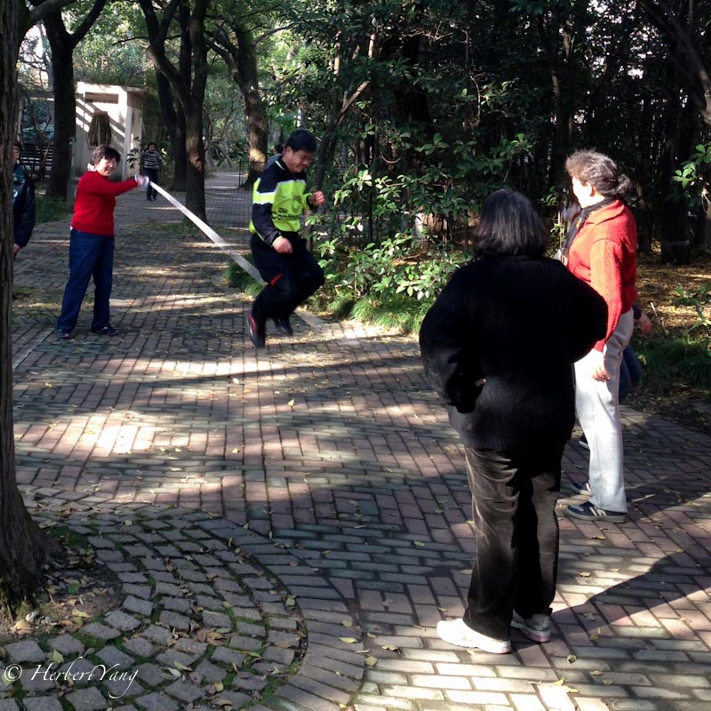

以前的赵丽蓉style的一步一回头

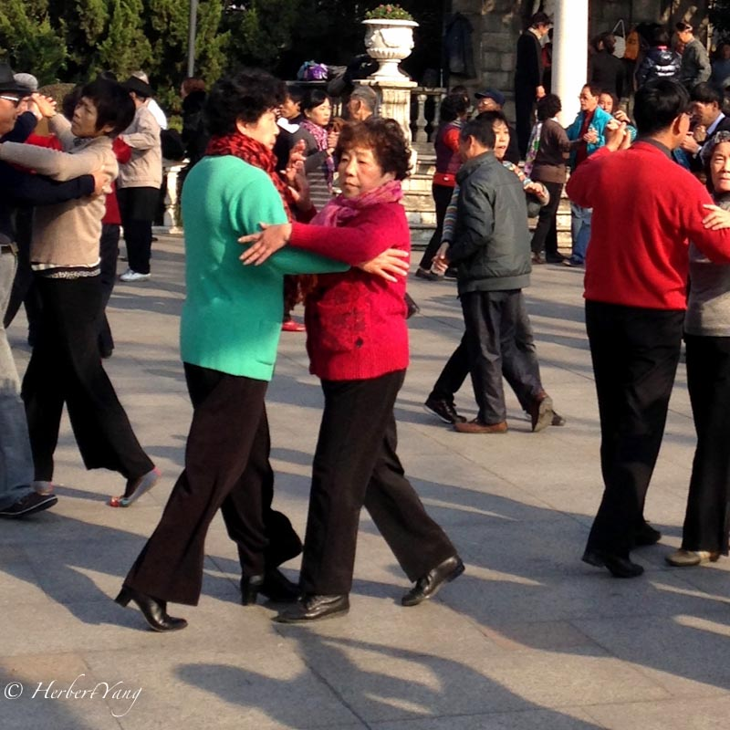

上海老克拉的腔调

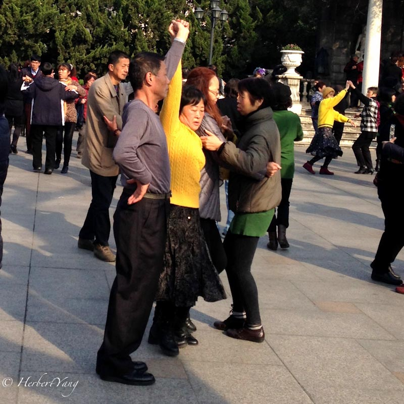

这也是一种闺蜜

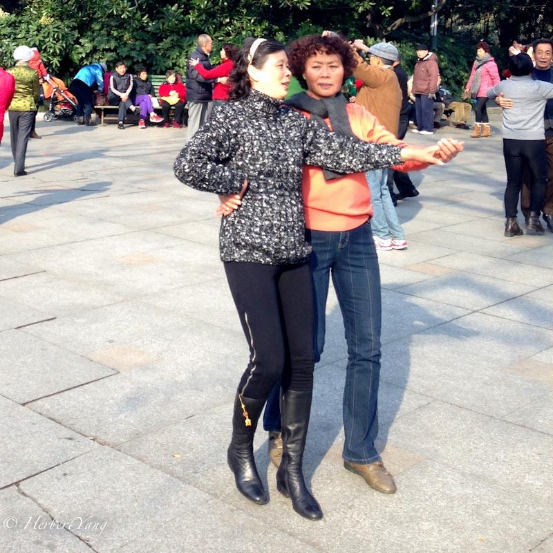

沉浸其中，不能自己

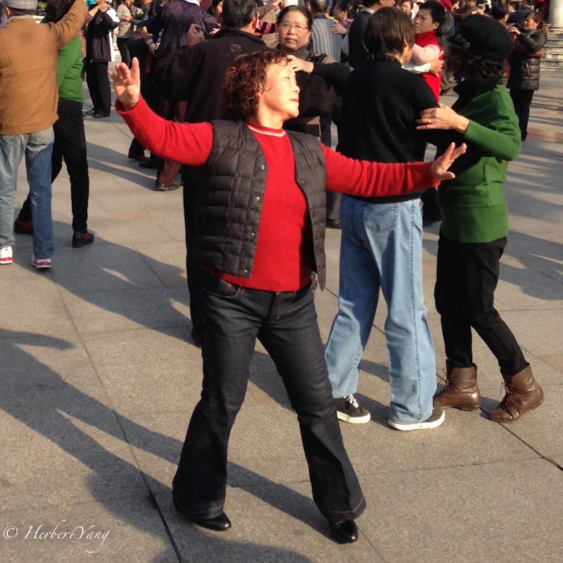

不能被生活压低了头

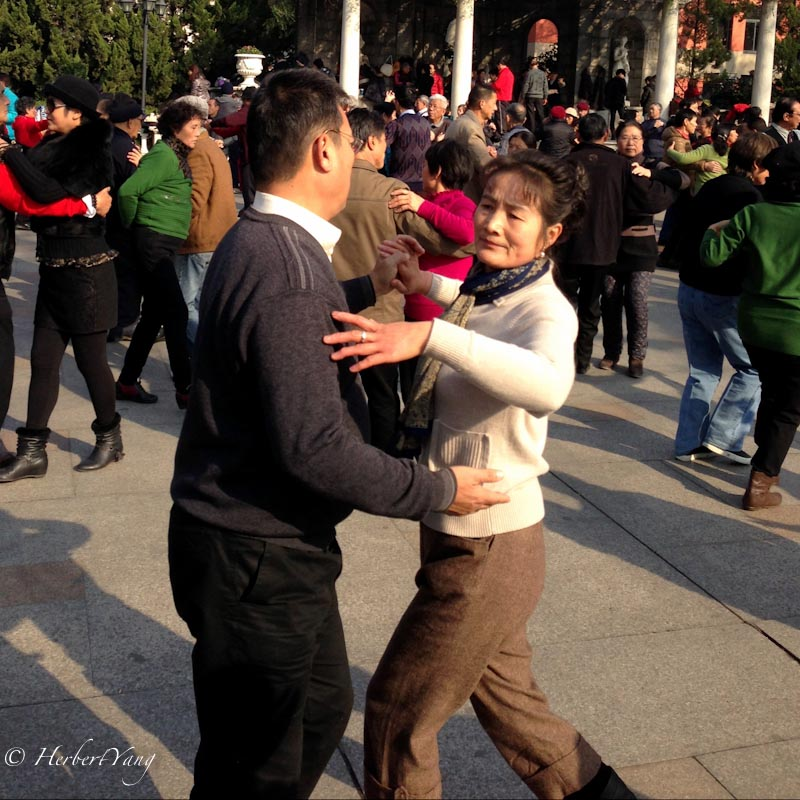

颤颤巍巍地开始新生活

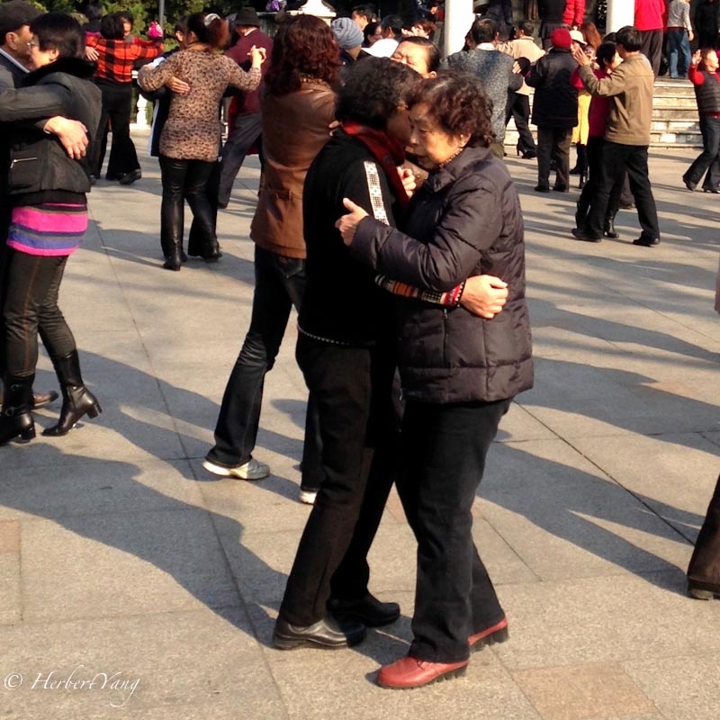

老少同乐

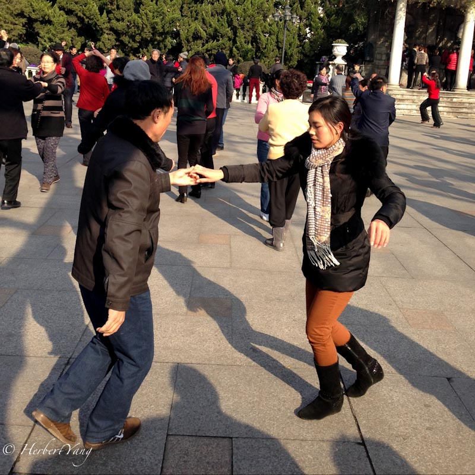

挑战高难度

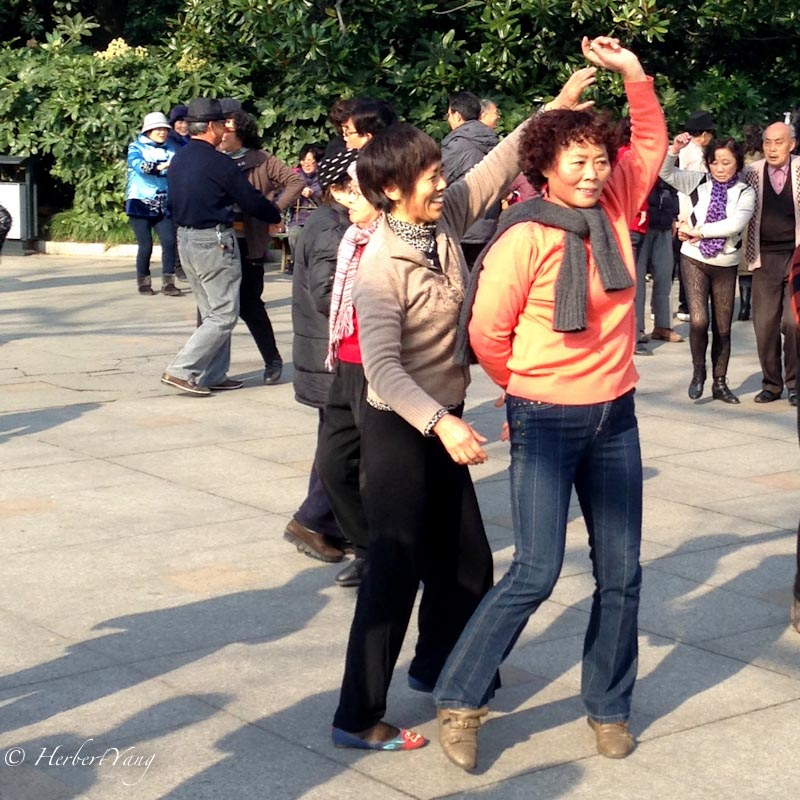

吾乃佘太君是也！

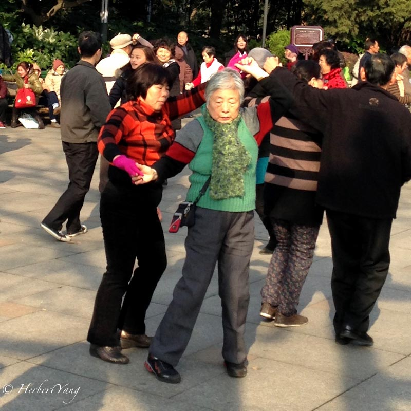

二人转

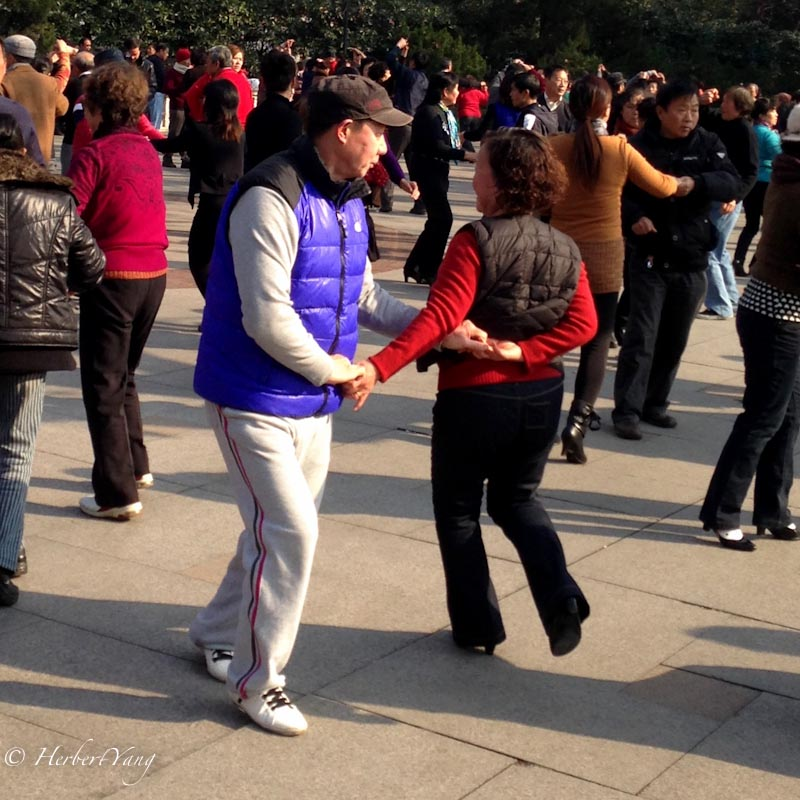

