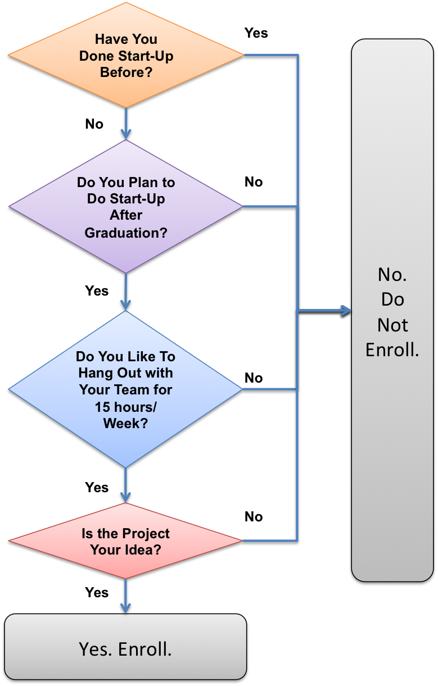

Title: COASSF#45 - Should You Do Stanford's Famous Startup Courses?
Date: 2013-02-19 16:48
Tags: coassf
Category: Stanford
Slug: should-you-do-stanfords-famous-startup-courses
Summary: As my prior article "15 Things to Know in Strategizing Your Stanford Courses" mentioned, doing one of those startup-themed courses (E245, S321) feels almost like a rite of passage for many Stanford MBA/Sloans. So, should you just go and do it?

As my prior article "[15 Things to Know in Strategizing Your Stanford
Courses](../15-things-to-know-in-strategizing-your-course-portfolio/)"
mentioned, doing one of those startup-themed courses (E245, S321) feels
almost like a rite of passage for many Stanford MBA/Sloans. So, should
you just go and do it?

It depends. Here's the decision tree I'd recommend. If you need more
insight, contact me in private. I don't pass isolated judgement on any
GSB course in public.

