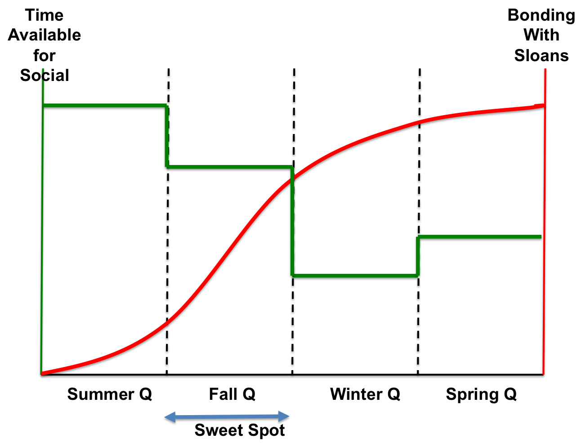

Title: COASSF#47 - Sloan Fellow Life Cycle & How To Make The Most Out Of It
Date: 2013-03-04 20:36
Tags: coassf
Category: Stanford
Slug: sloan-fellow-life-cycle-how-to-make-the-most-out-of-it
Summary: Before we know, 8 months have flown by and now we're 4 months away from graduation. All good things will come to an end, and our wonderful journey at Sloan Fellow Program in Stanford GSB is of no exception. The question is: how can we make the most out of this 12-month period? I think the Fall Quarter from October to December is the "sweet spot" that we should take the most advantage of.

Before we know, 8 months have flown by and now we're 4 months away from
graduation. All good things will come to an end, and our wonderful
journey at Sloan Fellow Program in Stanford GSB is of no exception. The
question is: how can we make the most out of this 12-month period?

I think the Fall Quarter from October to December is the "sweet spot"
that we should take the most advantage of.

When it comes to forming relationship and bonding with our fellow
Sloans, there are two dominant factors that will influence how much we
can put in and how much we can get out. One is *time available for
socializing* with the classmates, and the other one is our *desire to bond*
with others in the class.

By my observation and analysis, our desire to bond with other Sloans
roughly follows a curve (red one in the diagram) where: 1) overall it's
always increasing (of course); 2) it's accelerating in the first half
and decelerating in the second half. That convection point occurs
somewhere in Fall Quarter or Winter Quarter.

In *Summer Quarter*, we take all the classes together and we're the only
one on campus (MBAs are out doing internships). So the classic grouping
dynamic plays out - we're curious to find out everyone's background and
try to stack ourselves against the group to find out where we stand.
This is the period where personal reputation is built from the classroom
discussions and group projects. On average a Sloan may not be able to
call out everyone else's name yet in the class, but we're getting there.

In *Fall Quarter*, the accumulative social activities have gradually been
adding up to a critical mass to enable most Sloans to remember everyone
else's name in the class. The most aggressive alpha males (or females)
have already identified themselves and stepped up to take some class
officer roles to serve the class and make their presence felt. Sloans
still take most of the classes together. A variety of personality types
are flashing out and bumping with each other. We still take study groups
pretty seriously and try to get decent scores. The MBAs have arrived in
Knight Management Center but they are preoccupied with orientation and
neither camp has the bandwidth to reach out to the other side yet.
Dinners with Sloans are still possible.

In *Winter Quarter*, things are getting really hectic as
academic curriculum is taking a hefty toll and the daunting prospect of
finding that dream job is looming on the horizon. Sloans on average are
in 3 - 4 study groups working on different projects. Most people seem to
be taking around 20 units. Two streams of classes are killing people
left and right: 1) hard-core investment/finance classes; 2) startup
classes. We are only taking Marketing and Finance together and it feels
like we never get to see certain classmates in this quarter. This is
also when we start taking many classes with MBAs. Stanford MBAs are
pretty solid and sometimes more fun. Some Sloans start hanging out with
MBAs and spending even less time with each other. At the same time, many
Sloans begin their job search and cut down the time in holding hands
with other Sloans singing jambalaya.

This is where we stand now. Looking forward at *Spring Quarter*, I can see
Sloans will be struggling to strike a balance between two competing
forces: 1) the singular goal of finding a job and stay in the Bay area;
2) the desire to solidify friendship and spend more time with Sloans as
every day that goes by reminds us that the clock is ticking and we're
walking out of a beautiful fantasy dreamland.

Besides the desire for bonding, time available for social activities is
another important factor that will shape the group dynamics. Summer
Quarter looks like a walk in the park now - we even had regular weekly
basketball games! It's hard to believe we had so much free time then! It
certainly didn't feel that way when we were in it - maybe because we
were still taking the courses pretty seriously and reading every case
assigned. Fall Quarter's Accounting class alone will usher many people
into recurring nightmares and reduce their social drive, but it is still
not too bad as we still have a sizable group that goes to Wednesday's
ETL regularly. In Winter Quarter people start disappearing all together,
or simply just go different ways into various BBLs, seminars,
conferences, across-the-street classes, endless market-research
interviews for startup projects, etc. People are worrying less about the
qualify of academic work and just want to finish the work and move on.
People are exploring Stanford/Bay area at large and paying much less
attention to Knight Management Center. Very few people can afford to
attend the ETL series. Dinner time with Sloans becomes a luxury. In
Spring Quarter, the key focus for the self-sponsored Sloans will be job
search and job search. We might see a slight rebound in time put aside
for social activities, but I doubt it's going to be anything
substantial.

So, given all the forces in the universe that are pushing us into
various directions, it seems that Fall Quarter is the "*sweet spot*" where
Sloans still have considerable desire to social and are able to afford
the time. Carpe diem!
