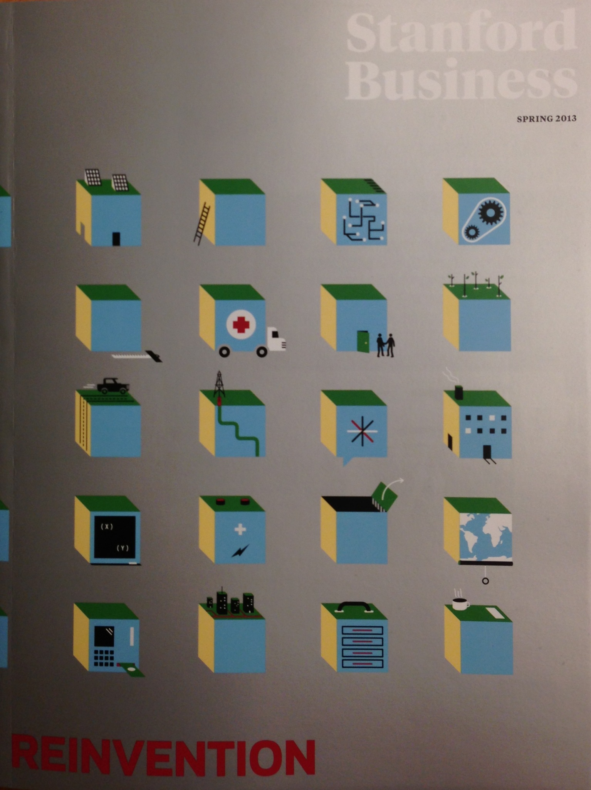
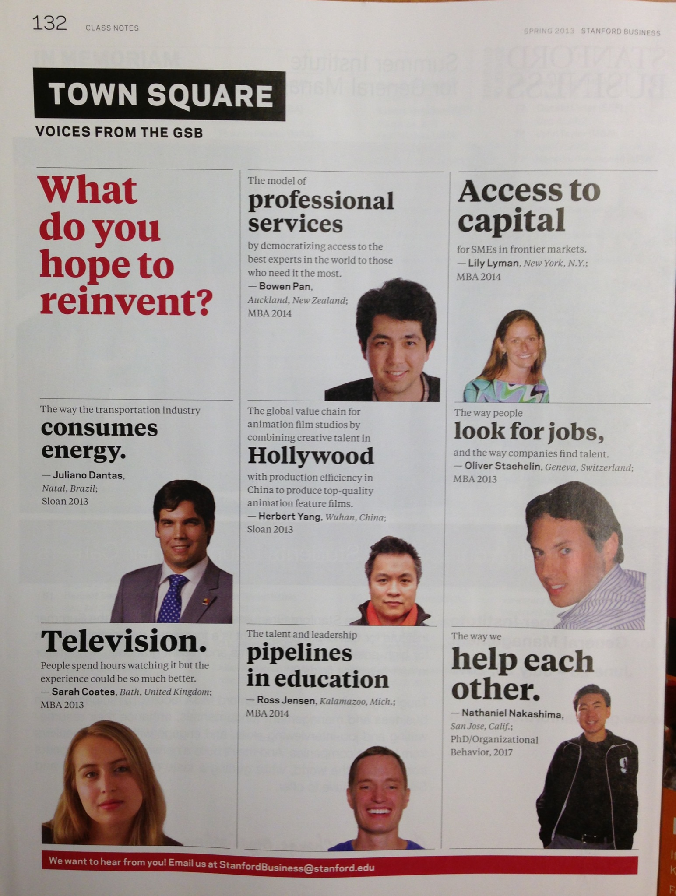

Title: COASSF#52 - Stanford Business Magazine Quote
Date: 2013-03-17 14:03
Tags: coassf
Category: Stanford
Slug: stanford-business-magazine-quote
Summary: It was a very pleasant surprise when I read the back page of 2013 Spring Issue of Stanford Business Magazine. Surprise #1, this was actually a very accurate quote from me, though I have no idea how the magazine got it. Surprise #2, the editor thoughtfully used my previous Facebook profile photo instead of the current Jack Sparrow one ... nice touch there.

It was a very pleasant surprise when I read the back page of 2013 Spring
Issue of [Stanford Business
Magazine](http://www.gsb.stanford.edu/news/bmag). Surprise \#1, this was
actually a very accurate quote from me, though I have no idea how the
magazine got it. Surprise \#2, the editor thoughtfully used my previous
Facebook profile photo instead of the current Jack Sparrow one ... nice
touch there.

To the mysterious friend out there who tipped this off to the magazine
staff, thank you!

