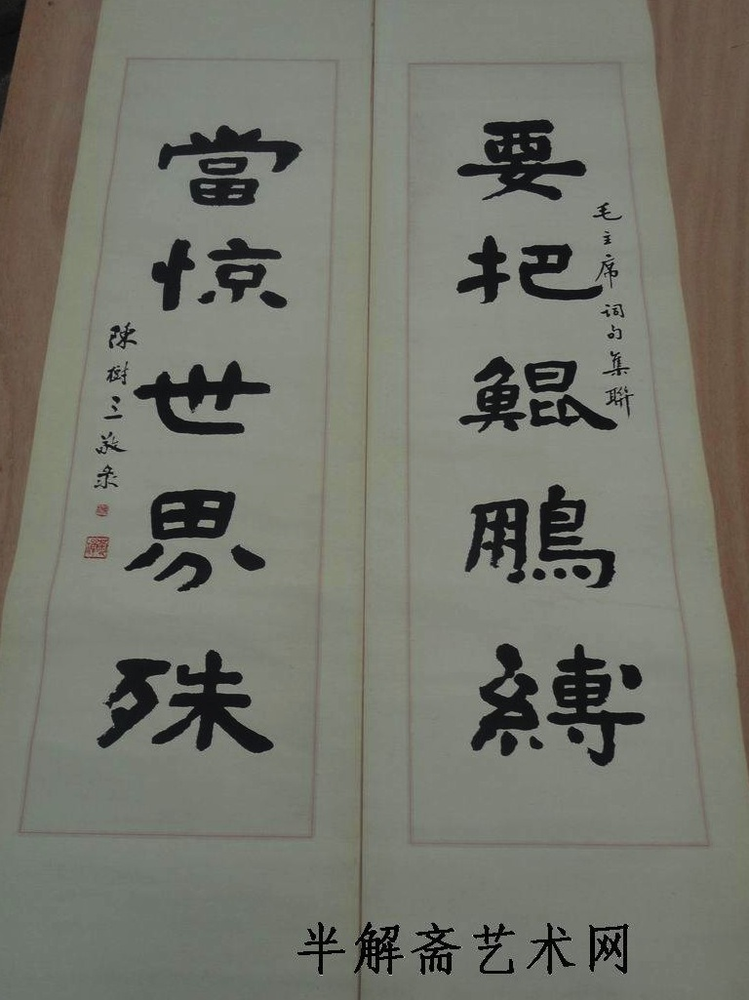
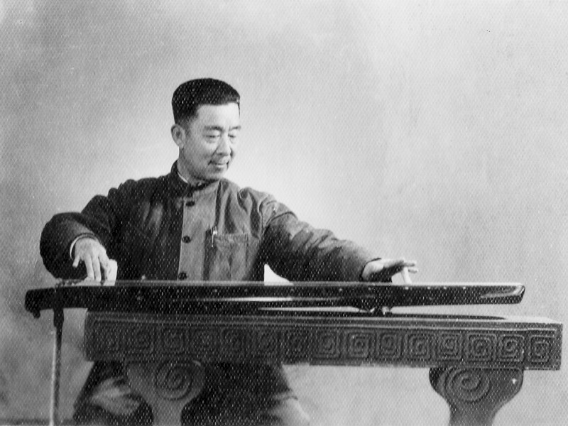

Title: 武汉往事
Date: 2013-05-19 08:00
Tags: 中文
Category: Journey
Slug: once-upon-a-time-in-wuhan
Summary: This article marks an exception to my website, which contains entirely original content created by me. It's an important piece that unlocks part of our family's history and sets the record straight.

This article marks an exception to my website, which contains entirely original content created by me. It's an important piece that unlocks part of our family's history and sets the record straight.

## [陈树三，百度百科](http://baike.baidu.com/view/4955891.htm)

陈树三（1908-1974），湖北省文史馆馆员，省政府参事室参事，省政协二届委员、三届常委、四届副主席，全国政协三、四、五届委员，民革中央委员，省民革副主任等职。

武汉“陈太乙”的第二代传人，国内赫赫有名的古琴家，琴棋书画无所不通。对于古琴艺术的贡献在于他自创的“三线谱”，它将古谱转换成现代曲谱，更方便于后人弹唱，这一贡献曾引起业内轰动，时任中国古琴会会长的查阜西曾专程来汉切磋探讨。

## 与陈树三论《幽兰》指法书， 1953年12月5日，《查阜西琴学文萃》P52

汉口陈树三作三线古琴谱，书示以琴不普及，弊由门户之见，创新谱定其节拍，使天下一律，可以解结。月前偶语吕骥漫谈及此，曾列举清咸同间祝桐君按拍谱，民初杨时百四行谱，昨年候作吾横谱，今春吴振平四式谱，撰文《怎样克服古琴谱的缺点》正其错觉。

踵余发动研习《幽兰》之后，树三又来书云：“今将《幽兰》第一奏，长操，无论初练熟谱，均可置之琴前，以免脱误。较之原以书谱练者，实有方便与呆板之不同，不知以为何如？”因复之如次：“奉手书及《幽兰》首段三线谱已成一家之言矣，深为钦佩。《幽兰》一谱，民初杨时百先生系就当时所见文献考其指法，在当时为仅有之考据，时百先生已竭缒幽洞奥之能，五十年来几成定论。惟近十余年中，古琴文献又颇有发现，例如明中叶戚里蒋氏《琴书大全》所辑唐宋指法集解，于、蹴、、扶、转指、却转均有别训，则杨氏所释即不可不再深入探讨矣。顷已提请中央音乐学院民族音乐研究所将杨氏及其他有关文献一并复印，工竣之后，即将分赠各地琴坛参考也。惟杨氏《幽兰》自序中‘此《幽兰》一曲恐亦非万遍不为功’之语，强调必经苦习，询是名言，乃吾曹圭臬也。”。。。。。。

## [已故古琴演奏家陈树三精品联，雅昌艺术网论坛，2012-03-30](http://bbs.artron.net/forum.php?mod=viewthread&tid=2609530)

陈树三（1900-1974），湖北省文史馆馆员，省政府参事室参事，省政协二届委员、三届常委、四届副主席，全国政协三、四、五届委员，民革中央委员，省民革副主任等职。

武汉“陈太乙”的第二代传人，国内赫赫有名的古琴家，琴棋书画无所不通。对于古琴艺术的贡献在于他自创的“三线谱”，它将古谱转换成现代曲谱，更方便于后人弹唱，这一贡献曾引起业内轰动，时任中国古琴会会长的查阜西曾专程来汉切磋探讨。

对于老武汉人来说，“陈太乙”的名号几乎无人不晓。作为一家老字号中药店，它曾承担起“济苍生，安黎民”的重任。可有谁知道，“陈太乙”的第二代传人陈树三，曾是国内赫赫有名的古琴家。在他身上，打破了自古商人和文人“风马牛不相及”的定论。

回溯这段历史，源于著名评书表演艺术家何祚欢最近主持开展的《武汉城市记忆工程——武汉工商业家族口述史》项目；讲述这段历史的，是陈树三当年收下的徒弟、曾任省歌剧团团长的作曲家熊敏学；勾起这段尘封历史的，则是一本30年前的老词谱。

昨日，何祚欢与熊敏学一起翻看陈树三留下的遗墨。熊敏学回忆，自己从小爱好民乐，1958年在武汉一中读高中时，常常跑到武汉市群众艺术馆里偷师学艺，偶然结识了经常去那里与乐友切磋技艺的陈树三：“那年他刚过50岁，为人和蔼，琴棋书画无所不通。”

因为对音乐的共同热爱，两人结下忘年交，陈树三开始向熊敏学传授古琴技艺。令熊敏学记忆犹新的，是每天傍晚在陈家宅院中召开的“雅集会”——几位爱音乐的人聚集一堂，有的抚筝，有的吹萧，老师焚香操琴，口中吟一曲《阳关三叠》，那情景正应了一句诗：“七弦为益友，两耳是知音。心静声即淡，其间无古今。”

了解古琴艺术的人都知道，古琴谱像天书一样难懂，当时国内熟悉它的人寥寥无几，陈树三为其中一人。熊敏学说，老师对于古琴艺术的贡献在于他自创的“三线谱”，它将古谱转换成现代曲谱，更方便于后人弹唱，这一贡献曾引起业内轰动，时任中国古琴会会长的查阜西曾专程来汉切磋探讨。“遗憾的是，文革开始后，雅集会被取缔，古琴也被砸了，老师在1974年黯然辞世，这本名为《歌颂新武汉》的老词谱，算是他留下的最后墨宝。”熊敏学说，时隔30年后，他于2004年偶然在收藏品市场淘得这本手迹，上面抄录的《前进忆江南》、《人民皆兵醉太平》等十余首自创歌词，正是一代古琴大家“古为今用”的写照。

回忆中，熊敏学情不自禁吟诵起当年他考取上海音乐学院后，老师为他庆祝而写下的一首七律：“友生同好鼓琴筝，陶醉丝桐乐有余。妙曲早传花月夜，希声叠奏牧樵渔……”

注：古琴又称七弦琴，其音韵优雅，集中体现了中国音乐体系的基本特征，构成了汉族音乐审美的核心。2003年11月7日，具有千年历史的中国古琴入选“人类口头和非物质遗产第二批代表作名录”，是继昆曲之后被联合国教科文组织列入该名录的第二个中国文化门类。

（图：陈树三对联）

## [两把传世古琴，两把知音缘，楚天金报，2012-05-22](http://news.cnhubei.com/ctjb/ctjbsgk/ctjb29/201205/t2076048.shtml)

【初识】

大师陈树三送她明朝古琴

17岁那年，还是“资本家”女儿的金德华踏入古琴大师陈树三老师家，一下子就被古琴的声音吸引了。“有一种奇怪的感觉，跟其他的音乐不一样，听起来飘飘然的。”注意到这个姑娘，陈树三先生立刻问她，“小姑娘，想学古琴吗？”还给她放了一段卫仲乐的《阳关三叠》，这也成了她学习的第一支古琴曲。“那个年代，有几个人知道古琴啊。”如今已70多岁的金德华回忆起与古琴结缘的第一刻，仍然满脸放光。

也许是因为“知音难觅”，古琴大师陈树三先生竟然主动“招徒”，还让她写下“保证书”，不迟到、不早退、认真学琴不放弃……后来，陈树三先生带过的20个学生里，只剩金德华和另外一位同学刘庆义坚持了下来。上世纪六十年代，夜深人静，金德华点着蜡烛弹古琴，古琴声音穿透力强，传得悠远。“我父母都嫌我吵。”

过去，古琴是不卖的，只代代相传。作为陈树三先生的得意弟子，金德华曾经受到老师赠送的两把古琴。一把是明代宁王朱权曾使用的古琴，名“曲仙”，可惜在文化大革命时被摔断。另外一把，金德华使用至今，叫做“松风水月”，这一把古琴，有人曾给金德华估价千万。

【琴缘】

“180元”偶得宋朝古琴

“人家说500年一断，木料上的断文显示的正是古琴的年龄。”金德华向记者展示了她那把“松风水月”上的“断纹”，像水波一样，所以也叫“流水断”。一把古琴，穿越几百年，经过不同的朝代、历经战火，辗转传递，至今竟然仍能发出苍凉悠远的琴声，可谓奇迹。

上世纪八十年代，金德华曾经花费180元从一位落魄老先生那里购得一把宋朝古琴，“刚见到琴时，我心凉了半截，用一块破布裹着，没有琴弦，脏得要命。”老先生说，“姑娘，我劝你买下，这绝对是把好琴。”语气甚是不忍。现在，这把琴成了金德华的宝贝，据行家估计，这把宋琴年代更久远，价值超过“松风水月”。尽管有人开价千万，金德华一直舍不得卖。

金德华介绍，几十年前，古琴几乎无人知晓，是一门被遗忘的乐器，所以她今天拥有的两件“让人眼红”的古琴，得来时却全是因为“情分”或“缘分”。陈树三先生收徒弟、赠送古琴，都不收钱。为了在文革时保住古琴，他曾下跪“留琴”，其他家产都不要。时隔几十年，传世古琴身价不可同日而语，古琴大师们却已然不在。

伯牙子期“高山流水”的传世故事，让古琴与江城结下不解之缘，武汉古琴界也涌现出黄松涛、陈树三、范文远、王忠贞等前辈大师。“上世纪50年代，全国弹古琴的恐怕都不到一百人，很萧条。”金德华介绍，为了弘扬古琴文化，上世纪五十年代，几位前辈曾在如今的江汉公园举办了第一场简陋的古典音乐演奏会，之后也经常举办一些雅集。但古琴毕竟“曲高和寡”，学习起来费时费心，长期以来都很“边缘”。金德华说，古琴是一种需要耐得住寂寞的乐器，一学几十年，没有止境。琴社希望将古琴文化和中国传统的养生文化结合起来，迎合忙碌的现代人的身心需要。

（图：陈树三弹琴）

