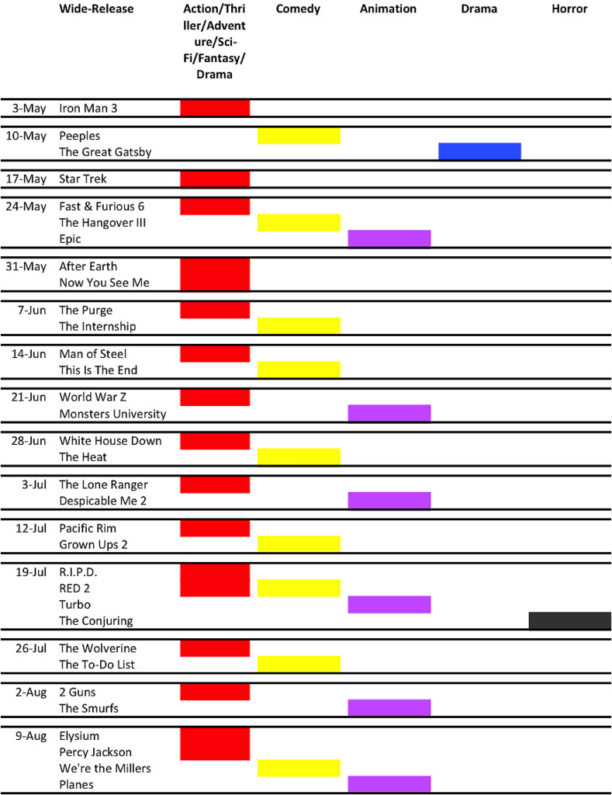

Title: Analysis of 2013 US Summer Tentpole Movie Release Schedule
Date: 2013-06-02 14:06
Tags: 
Category: Business
Slug: 2013-US-summer-tentpole-schedule
Summary: As I was actively procrastinating on one of the final papers for the quarter, I did what I do most naturally - checking out movies. When I was in China during the past five years, one of the things I missed the most about America was its summer time, when exciting tentpole event movies came out one after another, one-upping each other on box-office records. It's the quintessential  American cultural immersion experience. At times of feeling down in January - April, I would cheer myself up by thinking, it's OK, the summer is coming, there will be many great movies to watch and plenty fantasies to live in.

As I was actively procrastinating on one of the final papers for the
quarter, I did what I do most naturally - checking out movies. When I
was in China during the past five years, one of the things I missed the
most about America was its summer time, when exciting tentpole event
movies came out one after another, one-upping each other
on box-office records. It's the quintessential  American cultural
immersion experience. At times of feeling down in January - April, I
would cheer myself up by thinking, it's OK, the summer is coming, there
will be many great movies to watch and plenty fantasies to live in.

Despite of my intimate knowledge of US box-office and movie release
schedule, I have never studied its distribution in an analytical fashion
- until now. For Hollywood's major movie studios, there is a whole
science about staking your flag on the most coveted weekends and scaring
away competitors, though many times they do have to learn to cohabit.
It's a very interesting chess game where game theory and various tactics
are played to the fullest. Here's a simple analysis of all the
wide-release (more than 3,000 cinemas) movies for 2013 summer season by
genres.

There are a few observations and takeaways, some of which must be
obvious to industry veterans.

-   Rule #1, balance, balance, balance. Always balance the mix. Never
    over-saturate screens with one single genre.

-   Any deviation from Rule #1 spells trouble. For example, Will Smith
    (After Earth) is on the way of losing its opening weekend box-office
    champion title to Now You See Me, which will raise some eyebrows. I
    think Smith was a bit over-confident of his box-office draw. R.I.P.D
    and RED2 on July 19 are both cross-over between action and comedy,
    which is kinda a rare phenomenon. It might just work well for both.
    Matt Damon's Elysium is pitted against Percy Jackson, which targets
    slightly younger audience but will still bring considerable
    challenge to Damon. Maybe Elysium's distributor TriStar just doesn't
    have enough confidence in this movie to stake it in a more
    competitive weekend.

-   Technically speaking, there are only two event movies for this
    summer: Iron Man 3 and Star Trek, both of which are well-established
    sci-fi franchises. When they opened, every other studio stayed away
    to avoid being burned alive. Iron Man 3 has lived up to industry
    expectation while not so much for Star Trek (though personally I
    like it a lot).

-   Action-comedy is the most frequent combo (duh...). "Action" includes
    action, adventure, thriller, sci-fi, fantasy, basically pop-corn
    movies that do not exhaust too much brain power, movies that can
    help you just "let go".

-   Every other week studios throw family-themed animation flicks into
    the mix to keep the kids interested, so that their parents can earn
    some "chips" to go to cinema next week without them.

-   Horror movie is just not for summer time.

-   Wide-release drama is a hard-sell. It takes some gravy ingredients
    like Fitzgerald and DiCaprio to open a serious drama movie. Most
    other drama movies (Before Midnight) in the summer are just opening
    bands to the major headliner rock superstars (action/comedy), from a
    commercial standpoint.

-   There are three weekends with 3-4 wide-release movies. May 24 is the
    memorial day weekend, when Hollywood has the highest
    single-day box-office gross for the entire year. I'm not quite sure
    what's going on with July 19 and Aug 9. They look like dumping
    ground to me, or maybe studios just try to screw up each other.

-   Distribution-wise, Pitt's World War Z and Depp's Lone Ranger have
    both been set up to perform (with only one animation to hold hands
    with on their opening weekends). If they fail, well, then they're
    meant to fail.

