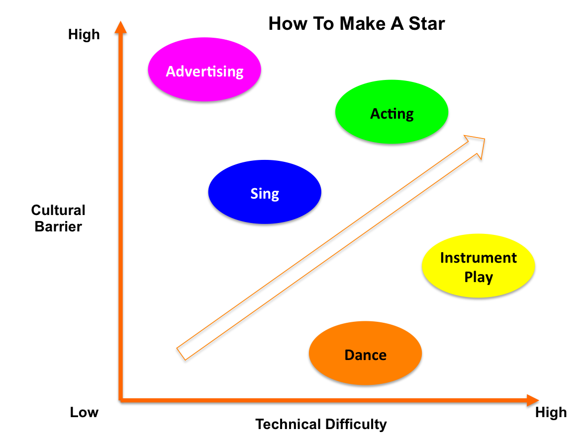

Title: COASSF#56 - How To Make A Star
Date: 2013-06-05 17:01
Tags: coassf
Category: Framework
Slug: how-to-make-a-star
Summary: From a recent project in my favorite course of the quarter: OB388 Leadership in Entertainment Business, my group researched and analyzed the success of K-Pop. During this exhilarating intellectual process, I came up with this graph that illustrates how to find the optimal path of nurturing a star from scratch. The horizontal dimension, from low to high, represents the technical difficulty of acquiring certain skills (which are also the cultural products those stars will eventually produce) for a star in an entertainment business. The vertical dimension, from low to high, represents  the cultural barrier those cultural products will encounter when they are delivered to a foreign culture (like from South Korea to America).

From a recent project in my favorite course of the quarter: OB388
Leadership in Entertainment Business, my group researched and analyzed
the success of K-Pop. During this exhilarating intellectual process, I
came up with this graph that illustrates how to find the optimal path of
nurturing a star from scratch. The horizontal dimension, from low to
high, represents the technical difficulty of acquiring certain skills
(which are also the cultural products those stars will eventually
produce) for a star in an entertainment business. The vertical
dimension, from low to high, represents  the cultural barrier those
cultural products will encounter when they are delivered to a foreign
culture (like from South Korea to America).

That's why for K-Pop stars, they all start with dancing and singing.
It's called Audiovisuality. It gets more difficult after that.
