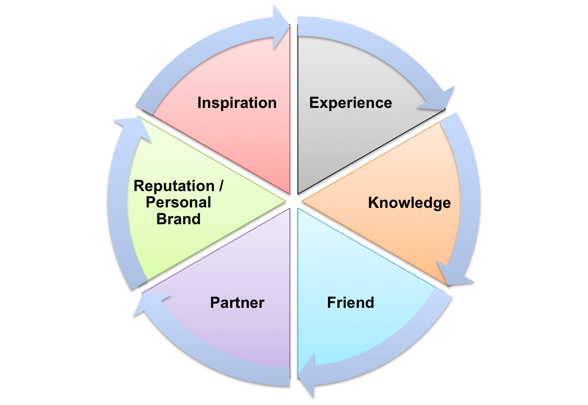

Title: COASSF#61 - What Do You Want to Get in Stanford - PFIKER Model
Date: 2013-07-05 08:00
Tags: coassf
Category: Framework
Slug: goals-in-stanford
Summary: When I look back at the past year in Stanford/GSB/Sloan Fellow Program and reflect what was it that we tried to get out of this incredible experience, I think our goals fall into six mutually exclusive and collective exhaustive categories, namely, PFIKER. It is important for us to know what our goals are, from Day One into the community, so that we can strategize priorities, plan our academic and social life accordingly, to get the most out of our time in Stanford. 12 months go by really, really fast. Without clear goals in mind, it's easy to let the time and opportunities slip through our fingers before we know it.

When I look back at the past year in Stanford/GSB/Sloan Fellow Program
and reflect what was it that we tried to get out of this incredible
experience, I think our goals fall into six mutually exclusive and
collective exhaustive categories, namely, **PFIKER**. It is important
for us to know what our goals are, from Day One into the community, so
that we can strategize priorities, plan our academic and social life
accordingly, to get the most out of our time in Stanford. 12 months go
by really, really fast. Without clear goals in mind, it's easy to let
the time and opportunities slip through our fingers before we know it.

1.  **P**artner

	Some of us are looking for partners, in business or in life. For
business partners, spend more time with alumni, in study groups, social
gatherings and pay attention to those who tend to take initiatives/run
for class officers. Take one of the four major startup-themed classes to
interact with students from Computer Science (CS) and Engineering, who
are the real movers and shakers of the Silicon Valley. For life
partners, spend more time with MBAs starting from the Autumn Quarter.
It's ok to date another Sloan, but it might get tricky.

2.  **F**riend

	Some of us are looking for new friends, from new cultures, from new
industries, from new interest areas. Regularly hang out in the Sloan
Study Rooms ("Slounge") and make sure to leave the door open, attend all
the TGIFs, join all the study trips (the Seatle one, the East Coast one,
and the self-organized international one), and take the initiatives to
organize small-party dinners (six person is the ideal size). Running for
social chairs will also help you make friends quickly.

3.  **I**nspiration

	Some of us are looking for inspirations that connect dots, bridge
isolated domains of knowledge, expand our horizon, or provide that
"eureka" moments. Attend [Wednesday's ETL](http://etl.stanford.edu/) in
Engineering School religiously, attend as many seminars, talks, BBLs in
and around GSB as possible. Take some classes outside of GSB. Attend
industry conferences around Silicon Valley by taking advantages of
student discounts. Read the blog by [Sten](http://sten.tamkivi.com/) and
[me](http://guizishanren.com/).

4.  **K**nowledge

	Some of us are looking for knowledge, things that we have never been
exposed to in prior jobs. Max out the cap level of 22 credits
Autumn/Winter/Spring and audit as many classes as schedule allows. If
your Sloan classmates can still remember your name by Spring Quarter,
you should consider yourself a big failure in this regard - OK.. that's
a bad joke. The point is that if you're so academically inclined, you
can never study hard enough and Stanford has enough interesting courses
to keep you intellectually stimulated.

5.  **E**xperience

	Some of us are looking for the quintessential "Stanford" experience and
try to experience as many actions as possible that Stanford can offer.
Run for a class officer role - whatever it is, as long as it helps to
serve the Sloan class and GSB community. Attend all the sports events in
the summer and the autumn (the football season is only in the
summer-autumn quarter I think). Take some physical exercise classes in
Winter and Spring Quarter, like golfing, horse-riding, yoga, or
swimming. Join some student's clubs. Participate in a flash mob if
someone in your class has the balls and guts to actually organize that.

6.  **R**eputation

	Some of us are looking to establish a personal brand that people can
remember us by. I think the importance of reputation cannot be
overstated. However it seems to have been ignored by many. GSB
(including 80+ Sloans and around 800 MBAs) is a very competitive
environment (duh....) and Sloans have only one year to leave our marks.
If you don't do something to put your name out there, people will not
remember you, and you don't want people at the end of
day to comment you along the lines of "yeah, he's a really nice guy...".
There are just too many overachievers around the campus in all
disciplines. Since you've already made it all the way up here, you might
as well just try a bit harder to get more mileage out of this journey.

For me, the top 3 priorities are **Inspiration**, **Reputation**, and **Partner**.
That pretty much explains why and why not I did certain things when in
Stanford, for whoever is curious about it. I come from a very heavy
business/finance background with extensive global trails and mix of
corporate/startup experience. Not too many courses in GSB are completely
new to me, nor do I really want to refresh my memory in Accounting,
Economics, or Statistics. So I tried to minimize my study load and free
up myself to do other things. I've lived in too many countries before to
care about checking all the boxes to make sure I've "been there, done
that", not to mention I [was planning to settle down in the Bay
area](http://guizishanren.com/why-here-why-now-why-again/) even before I
came to Stanford.  Why Inspiration, Reputation, and Partner? [My
BBL](http://guizishanren.com/confession-of-a-stanford-sloan-fellow_35_my-bbl/)
has explained it all. Now it feels like a full circle is completed.

Carpe diem!
