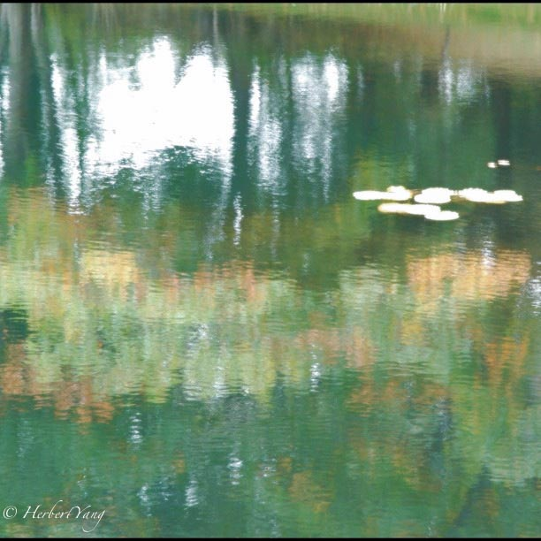
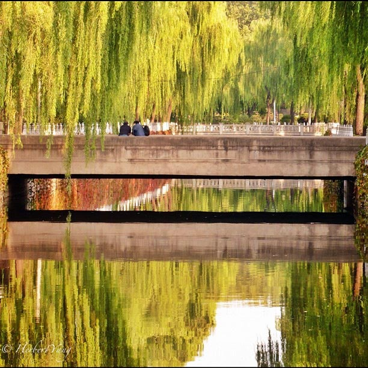

Title: Photo#03 - Tribute to Masters 向大师们的致敬
Date: 2013-10-11 12:34
Tags: 
Category: Photography
Slug: photo-series03-tribute-to-masters
Summary: This album pays tribute to some famous artworks by famous artists such as Claude Monet, Vincent van Gogh, 吴冠中, 刘海粟 and Andreas

Tribute to ["Water Lilies" by Claude Monet](https://www.google.com/search?q=Water+Lilies%22+by+Claude+Monet&newwindow=1&espv=210&es_sm=119&tbm=isch&tbo=u&source=univ&sa=X&ei=TfoxU9ucH8LkoATGn4LwDQ&ved=0CDwQsAQ&biw=1443&bih=952#facrc=_&imgdii=_&imgrc=rYl_OasW_wqHrM%253A%3BCKELpU0LUjUdOM%3Bhttp%253A%252F%252Fglobal.fncstatic.com%252Fstatic%252FMonetauction.jpg%3Bhttp%253A%252F%252Fwww.foxnews.com%252Fus%252F2012%252F11%252F09%252Fwork-from-monet-water-lilies-fetches-over-43m-at-nyc-auction%252F%3B660%3B371), shot in 2007, Acadia National Park, Maine, USA

Tribute to [Mt Yellow by Liu Hai Su
(刘海粟)](http://cn.bing.com/images/search?q=%E5%88%98%E6%B5%B7%E7%B2%9F+%E9%BB%84%E5%B1%B1&go=&qs=n&form=QBIR&pq=%E5%88%98%E6%B5%B7%E7%B2%9F+%E9%BB%84%E5%B1%B1&sc=2-6&sp=-1&sk=), shot in 2011-4, Mt. Yellow, Anhui, China

Tribute to [Almond Blossom by Vincent van
Gogh](http://cn.bing.com/images/search?q=Almond+Blossom+by+Vincent+van+Gogh&go=&qs=n&form=QBIR&pq=almond+blossom+by+vincent+van+gogh&sc=0-0&sp=-1&sk=), shot in 2011, Beijing, China

Tribute to [Spring Wind, Peach & Willow (春风桃柳) by Wu Guanzhong
(吴冠中)](http://cn.bing.com/images/search?q=%E6%98%A5%E9%A3%8E%E6%A1%83%E6%9F%B3+%E5%90%B4%E5%86%A0%E4%B8%AD&qs=AS&sk=&FORM=QBIR&pq=%E6%98%A5%E9%A3%8E%E6%A1%83%E6%9F%B3%20&sc=1-5&sp=1&qs=AS&sk=), shot in 2010, Summer Palace, Beijing, China

Tribute to [Rhein II  by Andreas Gursky](http://cn.bing.com/images/search?q=Rhein+II++by+Andreas+Gursky&go=&qs=n&form=QBIR&pq=rhein+ii+by+andreas+gursky&sc=0-0&sp=-1&sk=), shot in 2009, Qinghua University, Beijing, China

