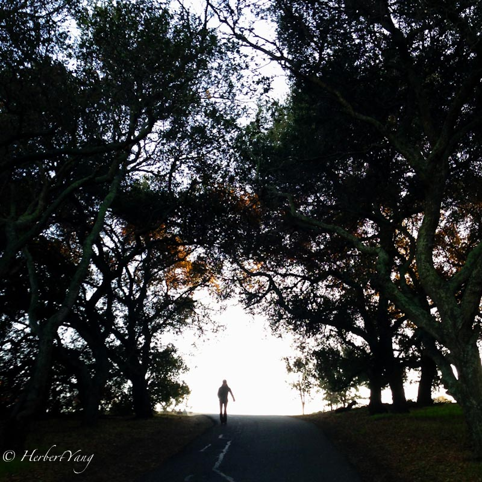
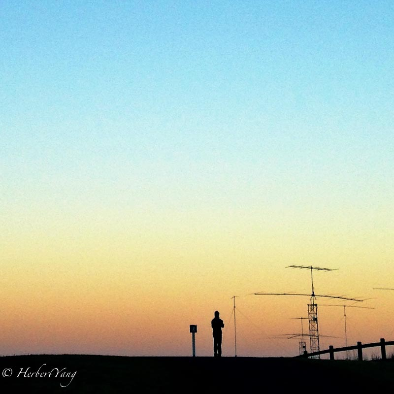
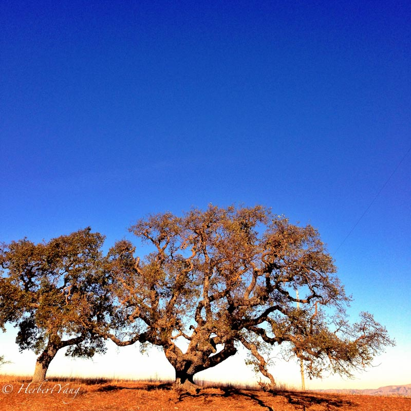

Title: Photo#02 - Stanford Dish at Sunset
Date: 2013-10-14 12:34
Tags:
Category: Photography
Slug: stanford-dish-at-sunset
Summary: Dish Foothill Park is a hidden gem in Stanford, a favorite spot for Stanford people to walk and jog. It's a 4-mile loop, with a paranormal view of the entire Stanford campus and the west Bay Area. 

2012/6-12, The Stanford Dish, Stanford, CA, USA, iPhone 5

Conversation 对话

Perseverance 坚韧

Seeker 寻者

Linger 徘徊

Company 伴侣

