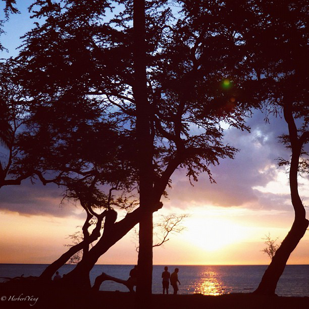
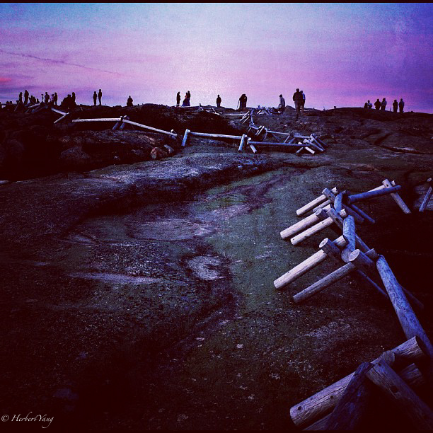

Title: Photo#06 - Twilight of the Gods 诸神的黄昏
Date: 2013-10-24 20:00
Tags:
Category: Photography
Slug: twilight-of-the-gods
Summary: dawn at different parts of the world
 
Golden Gate Bridge, San Francisco, USA, 2012, iPhone 5

Half Moon Bay, USA, 2012, iPhone 4s

Big Sur, USA, 2012, iPhone 4s

Mt. Mauna Kea, The Big Island, Hawaii, USA, 2009, Nikon D-70

Acadia National Park, Maine, USA, 2007, Leica D-Lux 3

