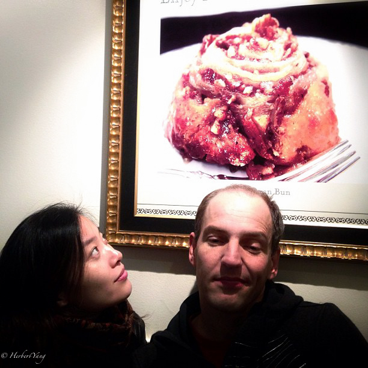

Title: Photo#09 - Here's Looking At You
Date: 2013-11-14 20:00
Tags: 
Category: Photography
Slug: heres-looking-at-you
Summary: Here's looking at you, Humphrey Bogart says to Ingrid Bergman in "Casablanca" (1942). Since then this famous and confusing line has been subject to multiple interpretations by fans all over the world. Here's my take, in a visual way.

Seattle, WA, USA, 2012, iPhone 5

Hong Village, Mt. Yellow, China, 2010, Nikon D-70

Peking University, Beijing, China, 2011, iPhone 4s

Zhangbei Prairie, Hebei, China, 2008, Nikon D-70

The Big Island, Hawaii, USA, 2009, Nikon D-70

