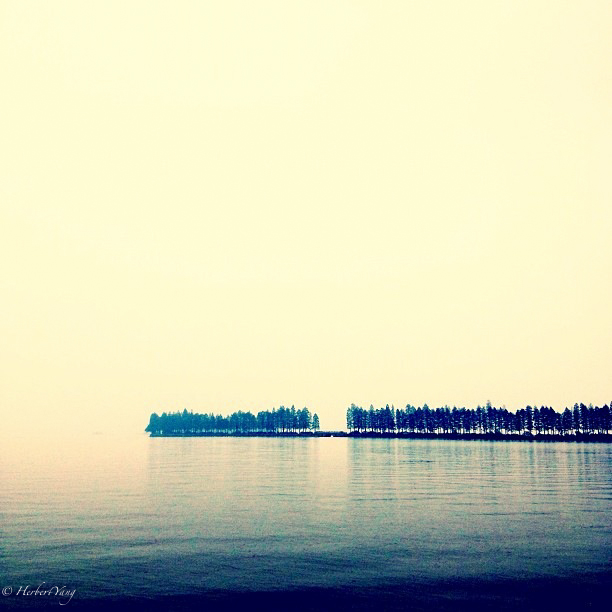
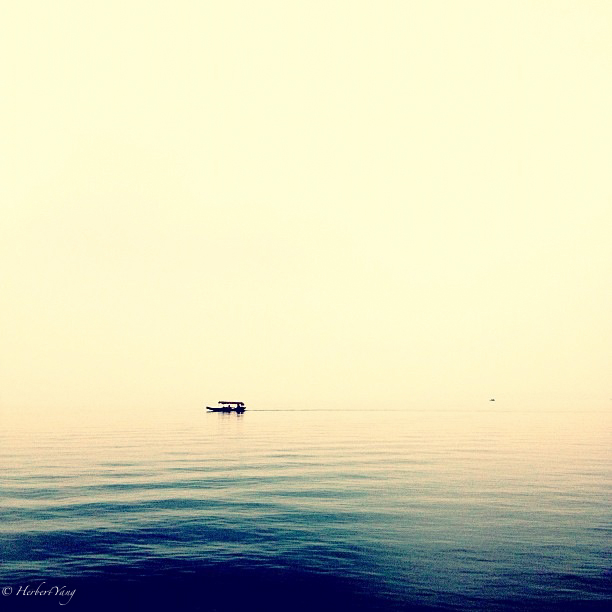
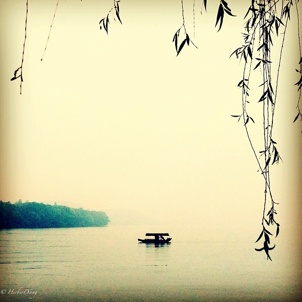
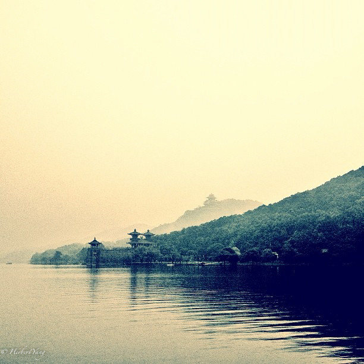

Title: Photo#10 - East Lake 东湖
Date: 2013-11-21 20:00
Tags: 
Category: Photography
Slug: photo-series10-east-lake
Summary: East Lake is where my family usually went for sightseeing, picnic and hiking on weekends when I grew up in Wuhan, China. It's not as well-known as the world-famous "West Lake" in Hangzhou, China, but it's charming in its own right.

East Lake is where my family usually went for sightseeing, picnic and hiking on weekends when I grew up in Wuhan, China. It's not as well-known as the world-famous "West Lake" in Hangzhou, China, but it's charming in its own right.

杭州有西湖，武汉有东湖。比起喧嚣的西湖，东湖其实更有侘寂之美，因为她的湖面更加开阔，视野更加空旷。我从小在桂子山长大，离东湖就隔了一个武汉大学，周末经常和爸爸妈妈哥哥骑自行车，穿过武大的桂园和水果湖的长堤去东湖游玩。夏天的东湖人也不少，都是来游泳纳凉的，但我好像一直不怎么敢下水。爸爸年轻时经常在东湖游个来回，这手泳技我只能神驰想象，自己一直没学会。东湖旁的磨山，是武昌各小学中学春游必去的场所，那个时候磨山上还没有修建气势雄浑的楚天阁，似乎也就是一座山花烂漫的野山而已，但并不妨碍武昌长大的孩子们乐此不疲地探索山野之乐。

长江横跨武汉三镇，在汉口和武昌的江边，以前有很多轮渡码头。每到过年时，我们挤上熙熙攘攘的轮渡，从武昌去拜访汉口的亲戚。现在江边两岸的码头仍在，不过多了国内规模首屈一指的滨江公园，宜跑步，嬉戏，怀古，离别。

黯然销魂者，唯别而已矣。

