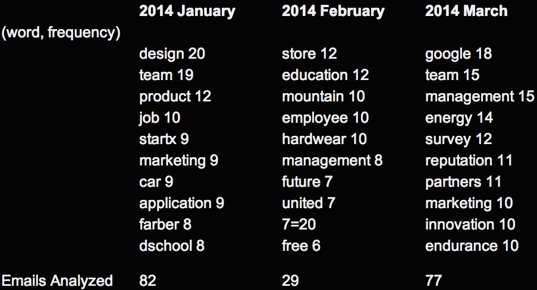

Title: Buzz Words from Stanford GSB BLAST Mail
Date: 2014-03-21 12:52
Tags: 
Category: Stanford
Slug: buzz-words-stanford-gsb-blast-mail
Summary: This program aims to analyze the most common buzz words from Stanford Graduate School of Business (GSB)'s BLAST mailing list, which is subscribed by all GSB students (MBA, MSx and PhD) and used heavily by the student community to broadcast news, seeking help, etc. The idea is similar to Google Keyword Trend, except that it's applied to a very specific environment and audience.

This program aims to analyze the most common buzz words from Stanford
Graduate School of Business (GSB)'s BLAST mailing list, which is
subscribed by all GSB students (MBA, MSx and PhD) and used heavily by
the student community to broadcast news, seeking help, etc. The idea is
similar to Google Keyword Trend, except that it's applied to a very
specific environment and audience.

The program is written in Python 2.7.5 and [the source code is on Github](https://github.com/zire/buzzInStanfordGSB).

Steps:

1.  Download all the BLAST emails

	Fortunately Google provides a very handy Datatool to download emails
with specific labels. It's available from the Account Settings page.
This archive has emails from 2012 (I recovered them from Trash), 2013,
and 2014. Emails in 2012 and 2013 were not preserved universally and
consistently so they will not be part of this analysis. Emails in 2014
are of better quality though I'm sure I've missed/deleted some BLAST
messages already. Going forward I will keep all the BLAST emails and the
data quality will be considerably better in more recent update

2.  Extract emails and dates from the email archive

	Google archives Gmail messages in mbox format - one single large file.
Python's mailbox.mbox library provides an effective way to extract
contents from it.

		Python 1_mbox2csv.py

	There are three steps that need to be performed here:
	
    1. figure out where is the email body with get\_payload()

		It turns out that all the BLAST emails are of multipart (so get\_payload() will return a list, not a string). The email body is hidden in the first part of the first part in a message from mbox (quite nested).

	2.  clean up the date field

		The raw date field needs clean-up. It's not in the standard ISO format
and the day field is not zero-paddled. Datetime.strptime is used to deal
with it. Eventually a raw date like "5 Nov 2013" is converted into
"20131105" (YYYYMMDD) for easy sorting in the next step.

	3. sort data by date

		Self-explanatory. After this program is run, a cleaned up email archive
will be created in csv format with only date and email body information,
and is sorted by date.

3.  Run the word frequency analysis

		Python 2_wordcount.py

	After all the maneuvers to get the data into the right format, the real
crunching on word frequency is quite easy relatively speaking. The true
magic that embodies both science and art is the exception list of words
to ignore (words\_to\_ignore). A lot of time was spent to grow this list
so that all the un-informational words are filtered out such as "when",
"where", "to".. etc. There are A LOT of those.

	It's only after filtering out those exception words, the real buzzwords
for Stanford GSB will float to the surface, as you can see from above.

Do they reveal something useful? Maybe, but I'm not sure. Maybe I just
need to continue to tinker with the exception word list to make more
sense out of it.
