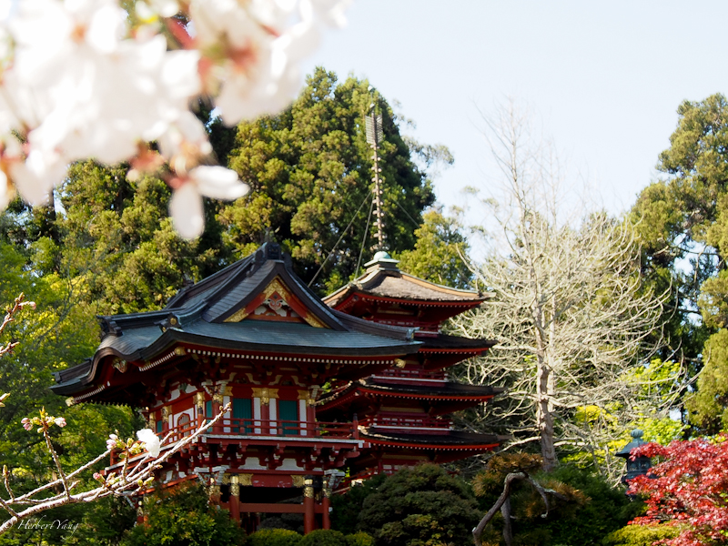
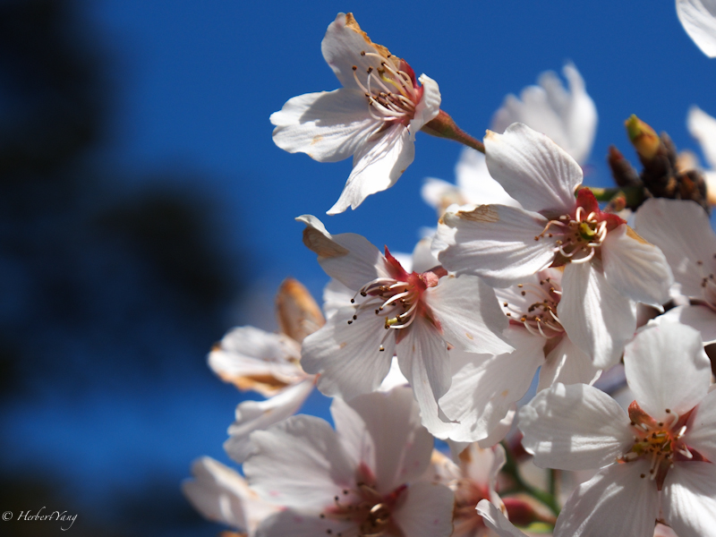
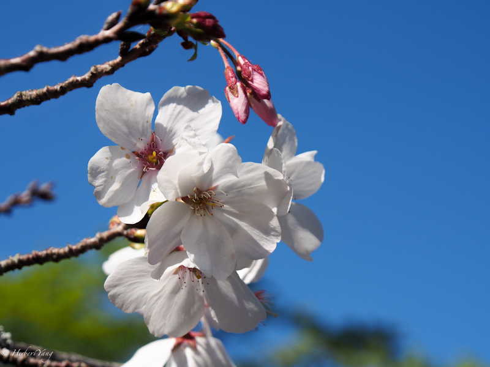
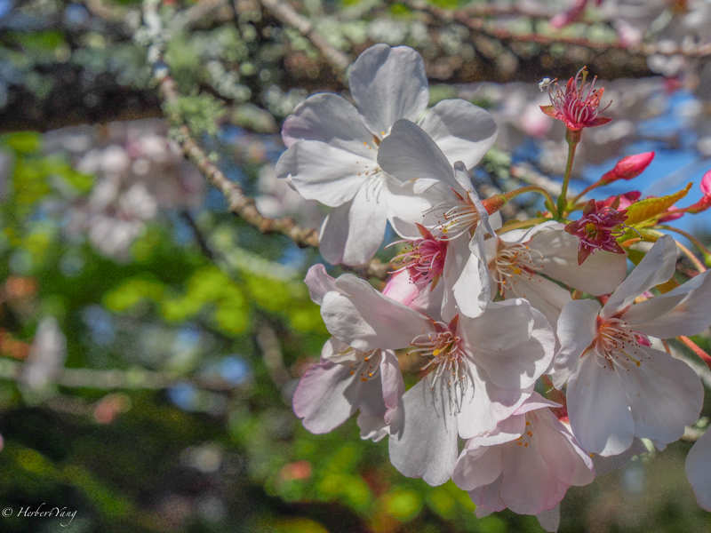
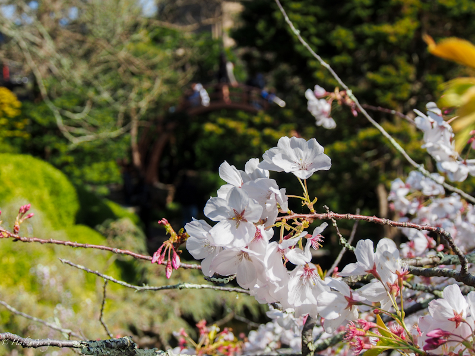
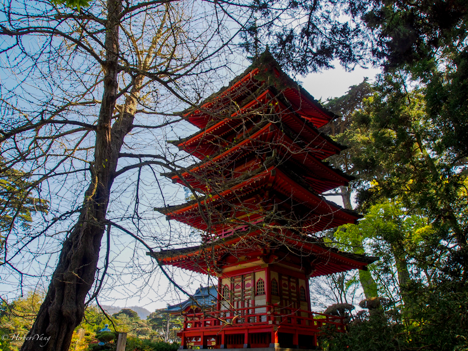
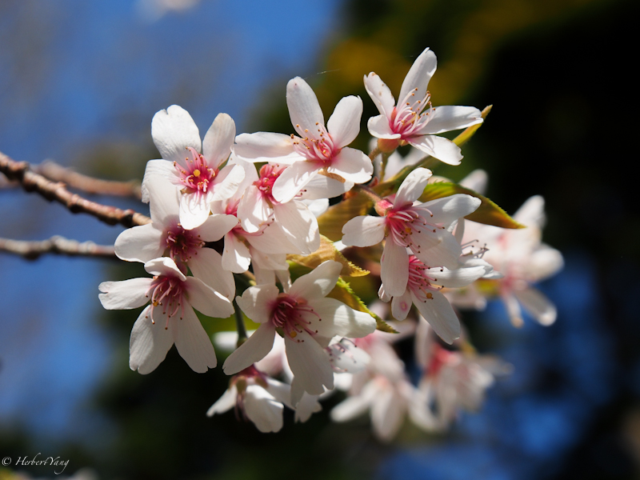

Title: Photo#14 - Japanese Tea Garden's Cherry Blossom
Date: 2014-04-02 11:58
Tags:
Category: Photography
Slug: japanese-tea-garden-cherry
Summary: cherry blossom in the famous Japanese Tea Garden in Golden Gate Stake Park on an early spring day

三藩市金门大桥公园里的日本茶花园的樱花开了，正好被我们赶上。

