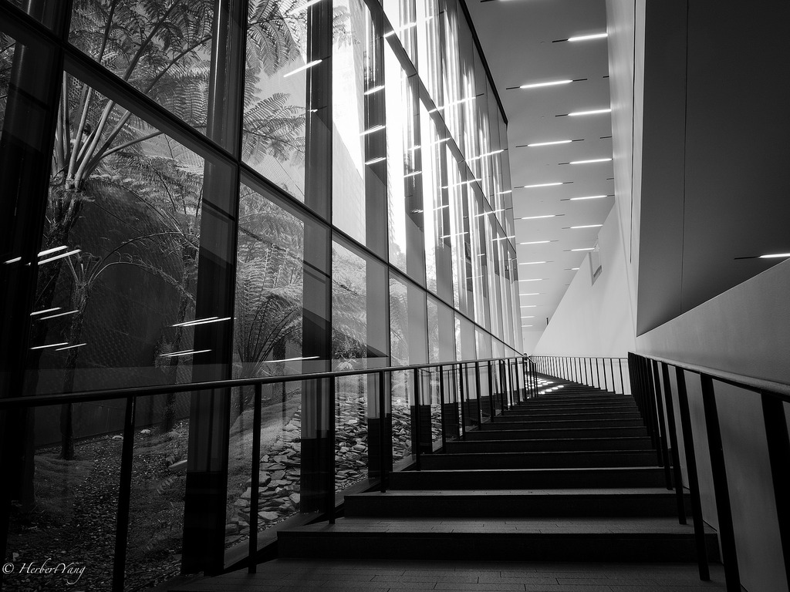
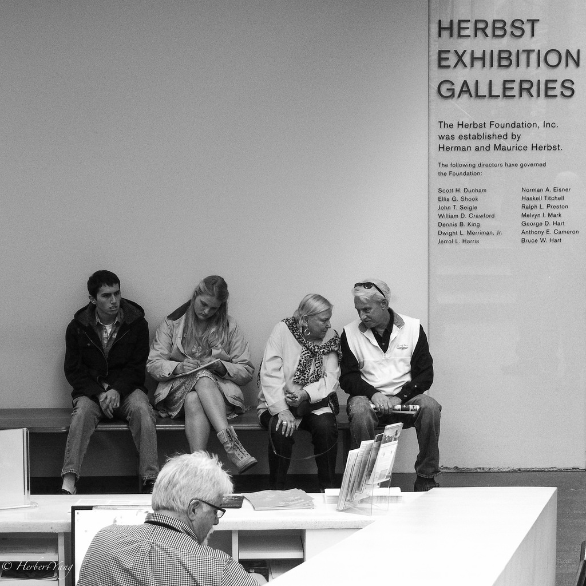
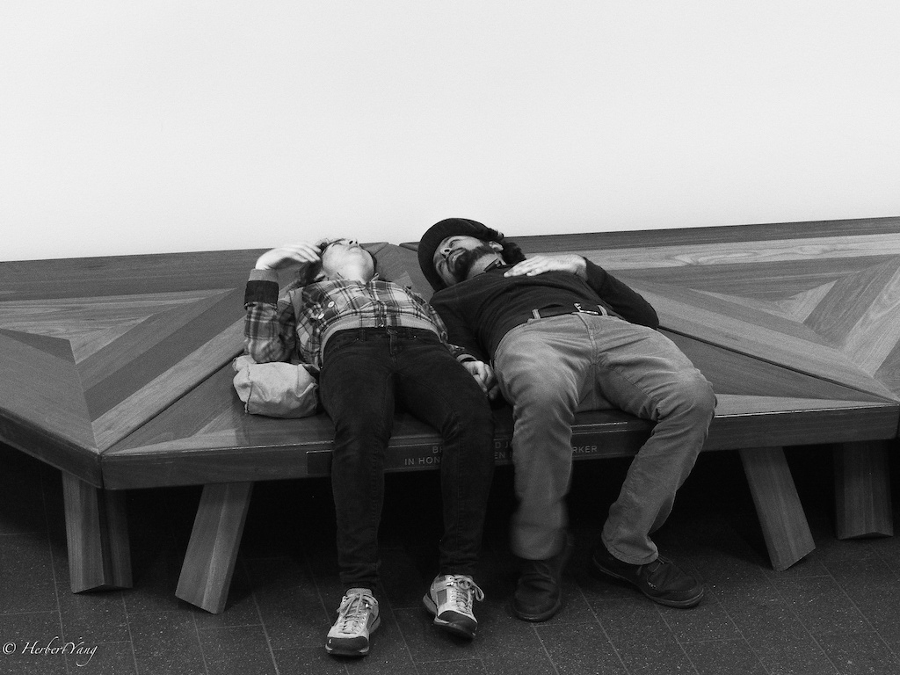
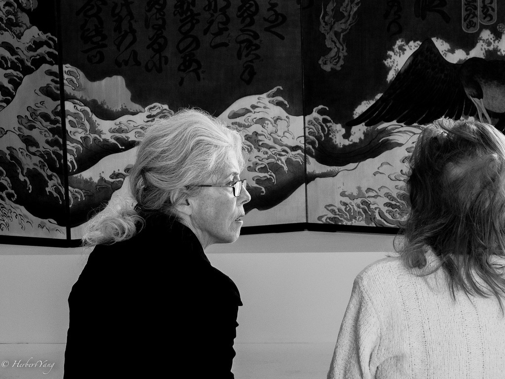
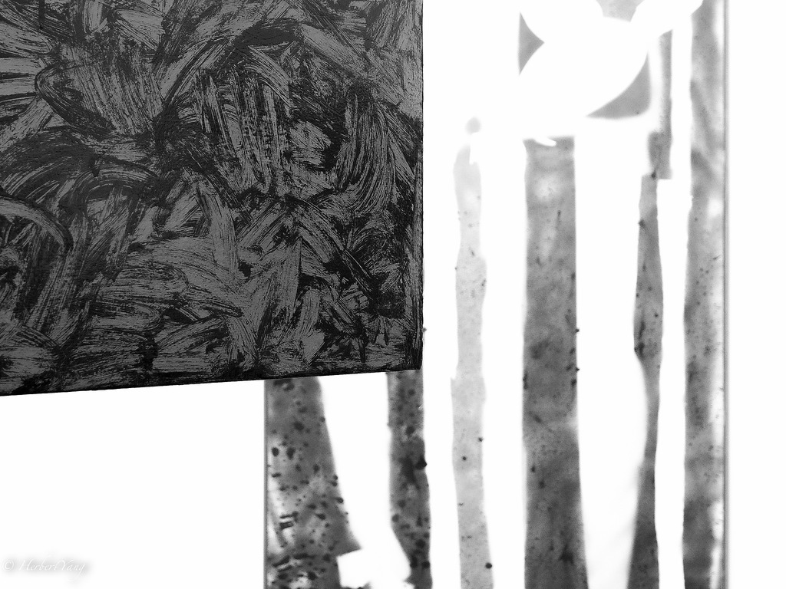
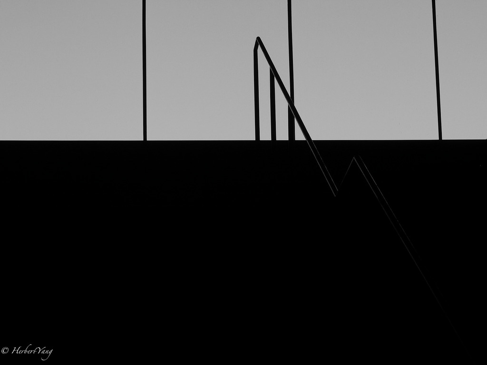
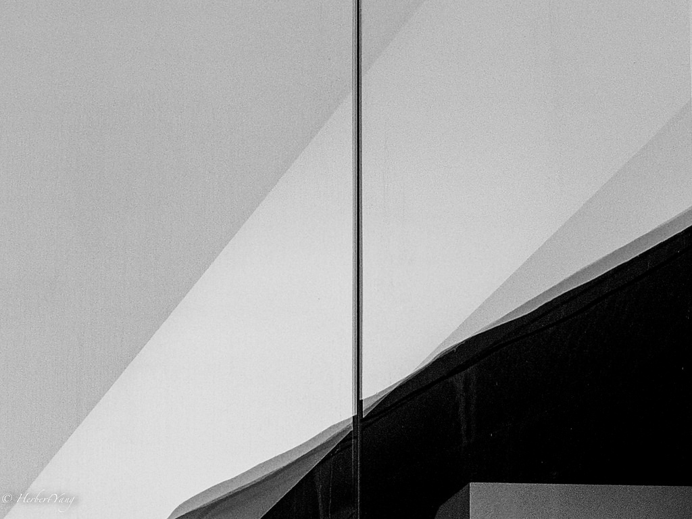
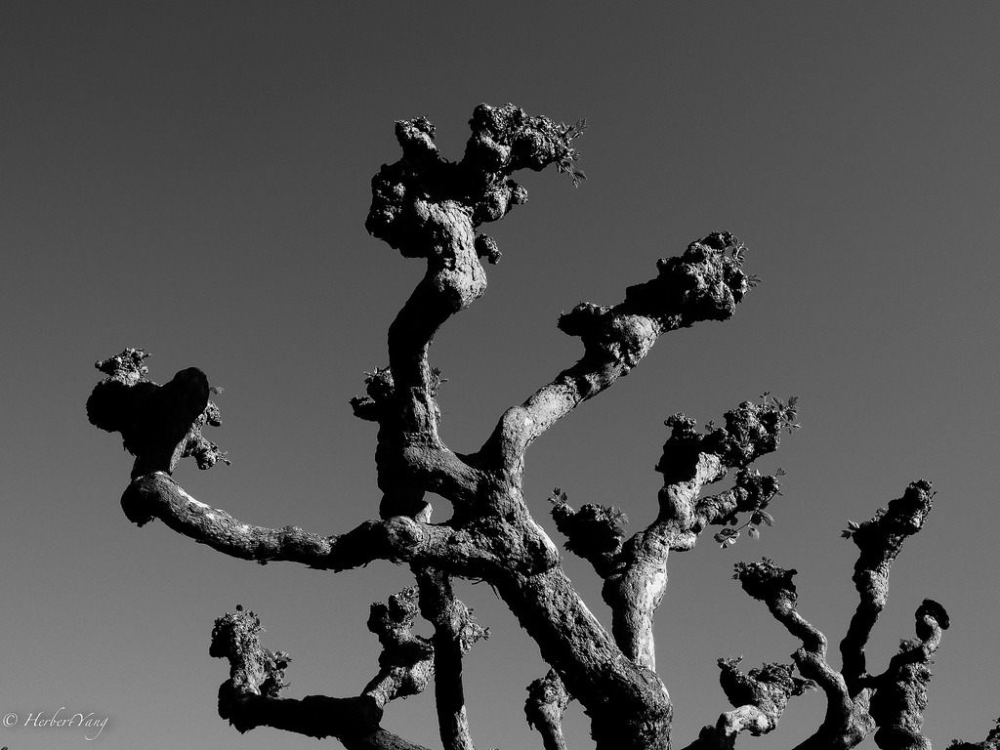
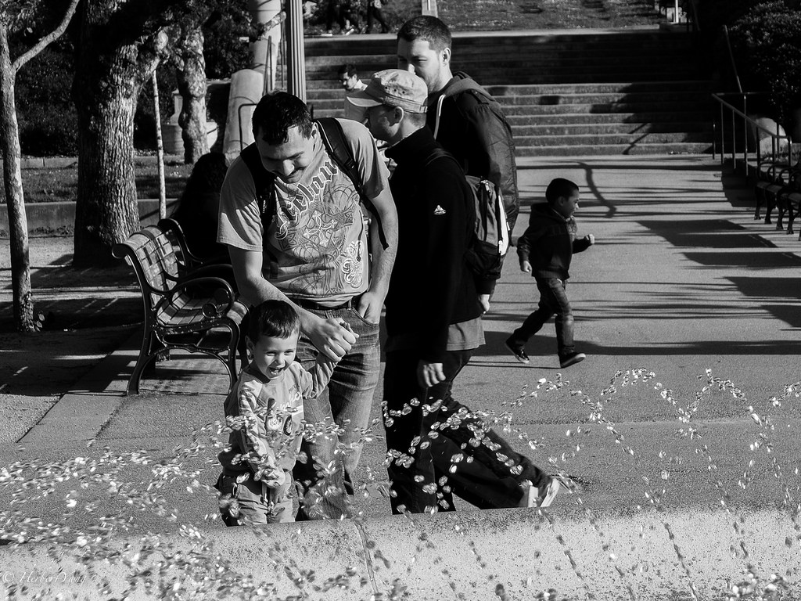

Title: Photo#15 - de Young Museum in Golden Gate Park
Date: 2014-04-03 15:17
Tags: 
Category: Photography	
Slug: deyoung-museum-spring
Summary: Last time we visited de Young Museum in Golden Gate Park in San Francisco, it was almost closed and the security guard was kind enough to allow us sneak in for half an hour before they cleaned up the space. We got in earlier this time and happened to catch a great exhibition for [Georgia O'Keeffe](http://en.wikipedia.org/wiki/Georgia_O'Keeffe). Inspired by O'Keeffe and her famous husband [Stieglitz](http://en.wikipedia.org/wiki/Alfred_Stieglitz), I'm going black and white too.

Last time we visited de Young Museum in Golden Gate Park in San Francisco, it was almost closed and the security guard was kind enough to allow us sneak in for half an hour before they cleaned up the space. We got in earlier this time and happened to catch a great exhibition for [Georgia O'Keeffe](http://en.wikipedia.org/wiki/Georgia_O'Keeffe). Inspired by O'Keeffe and her famous husband [Stieglitz](http://en.wikipedia.org/wiki/Alfred_Stieglitz), I'm going black and white too.

Stairway

Waiting

Whisper

Perplexed

Chaos

Climb

Division

Fallen Angel

At Fountain

