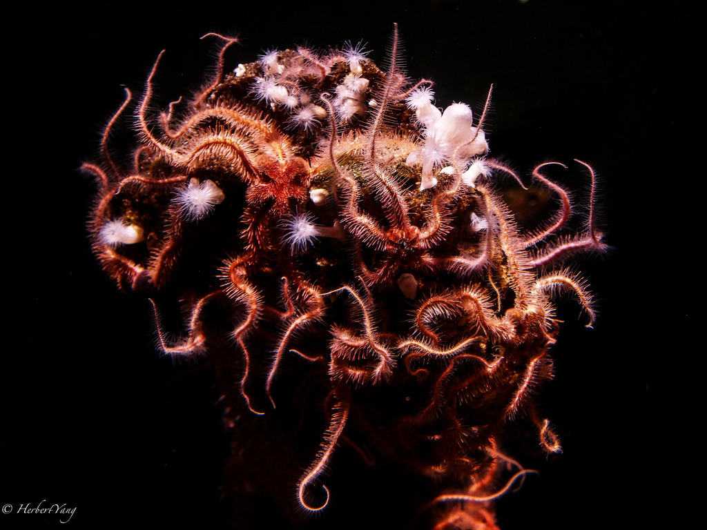
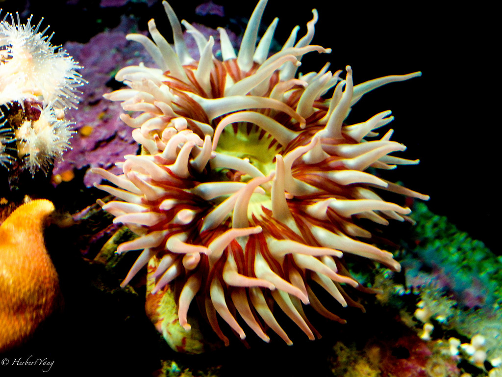
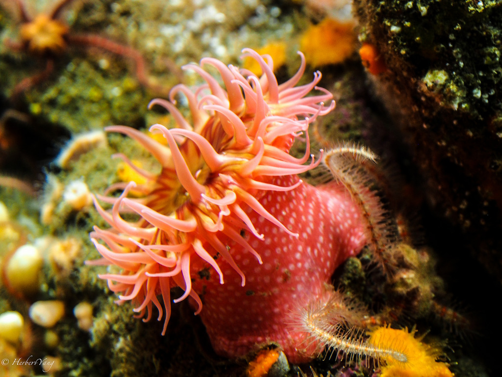
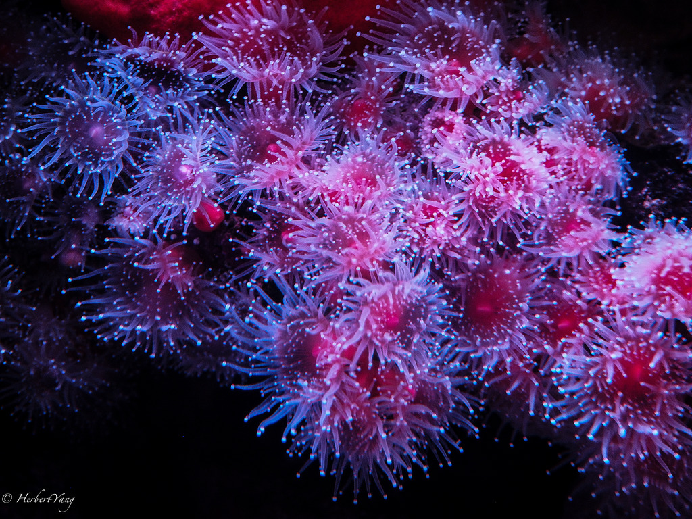
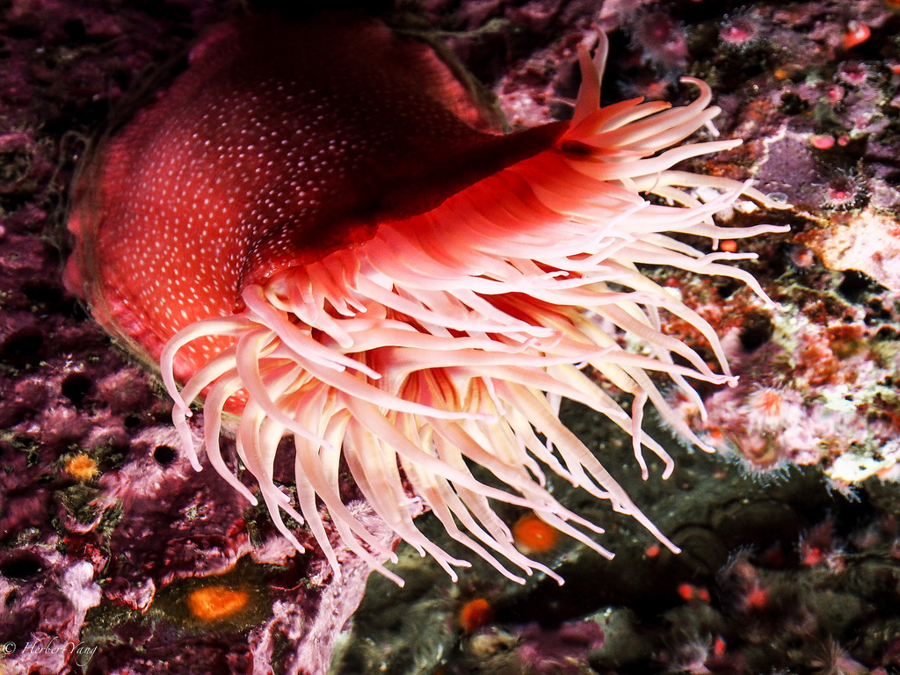

Title: Photo#16 - Lives Under the Sea (part 1)
Date: 2014-04-06 08:00
Tags: 
Category: Photography
Slug: lives-under-the-sea
Summary: Monterey Bay Aquarium has some amazing exhibitions of sea lives! I always know about this famous aquarium in the sea-side town of Monterey, CA, and I know all my friends have visited there. I was like, how impressive can an aquarium get? Well, it turns out, it's a total knock-out. 

Monterey Bay Aquarium has some amazing exhibitions of sea lives! I always know about this famous aquarium in the sea-side town of Monterey, CA, and I know all my friends have visited there. I was like, how impressive can an aquarium get? Well, it turns out, it's a total knock-out. 

