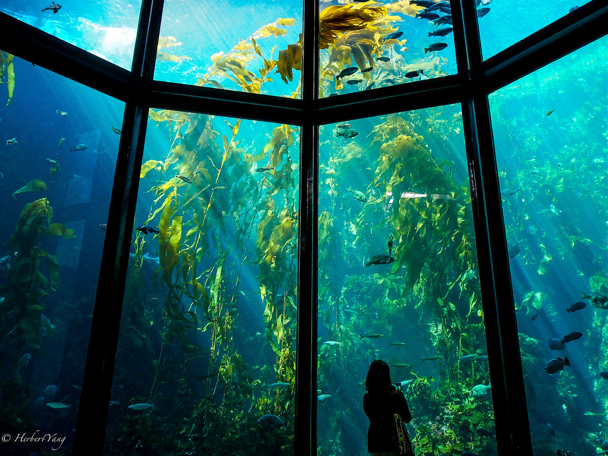
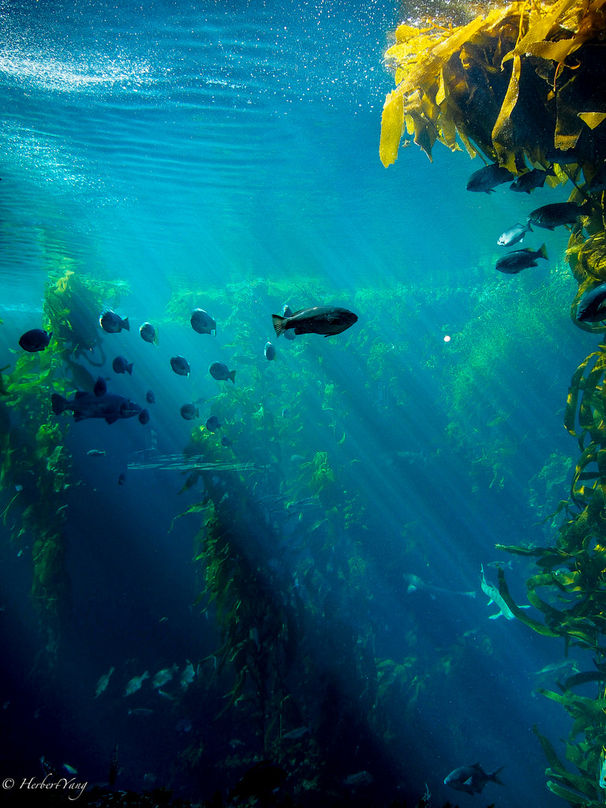
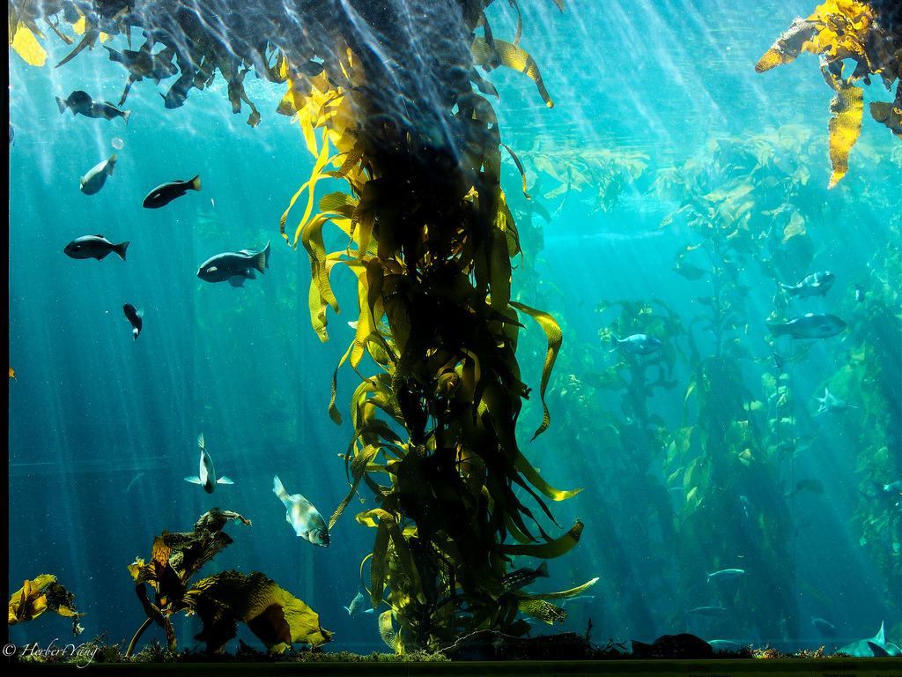
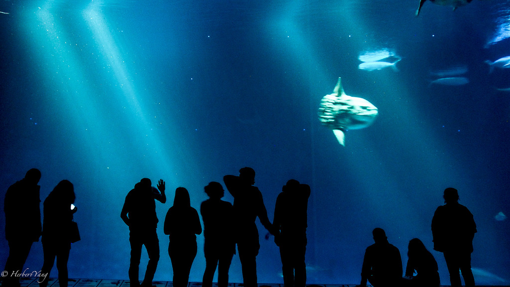
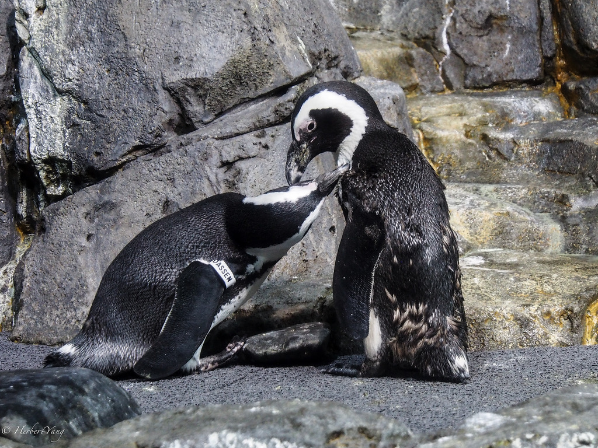
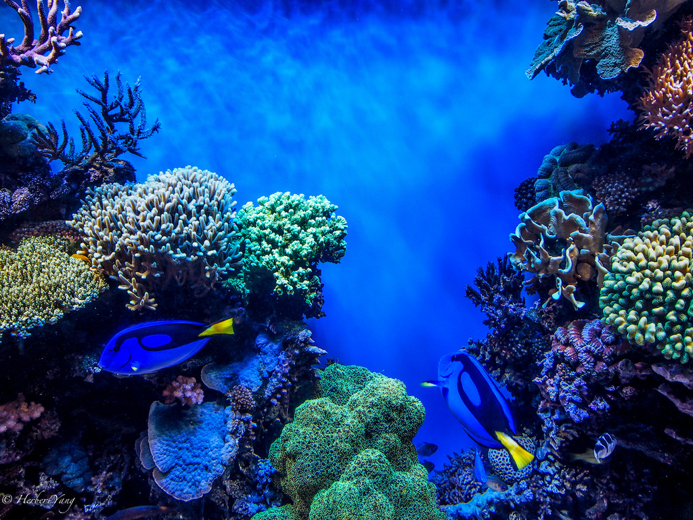
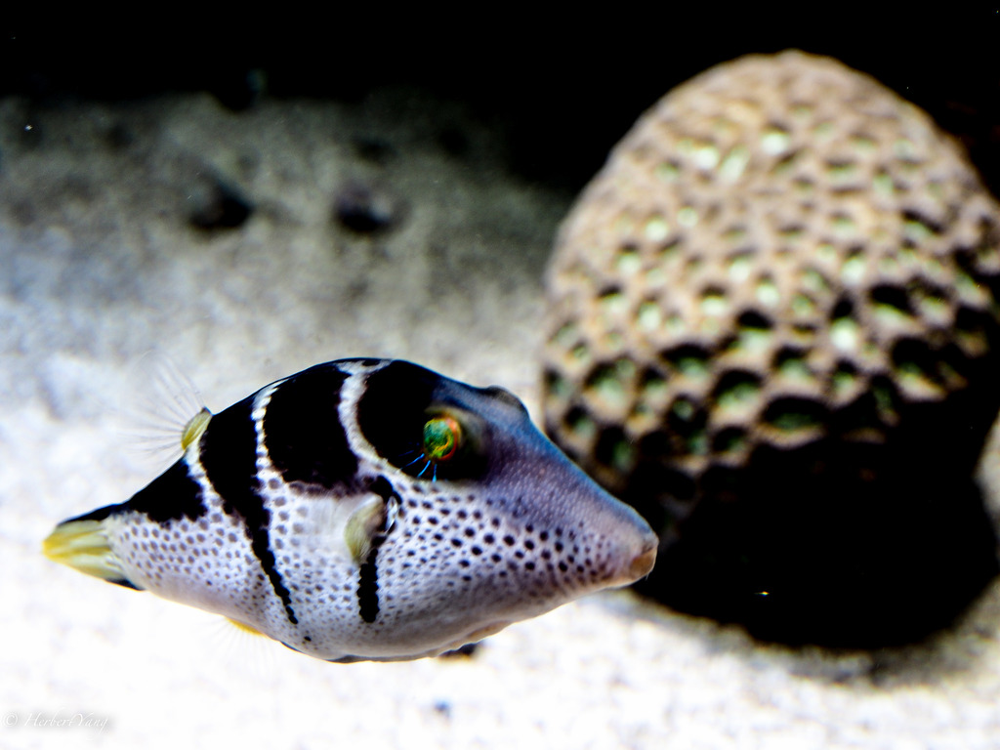
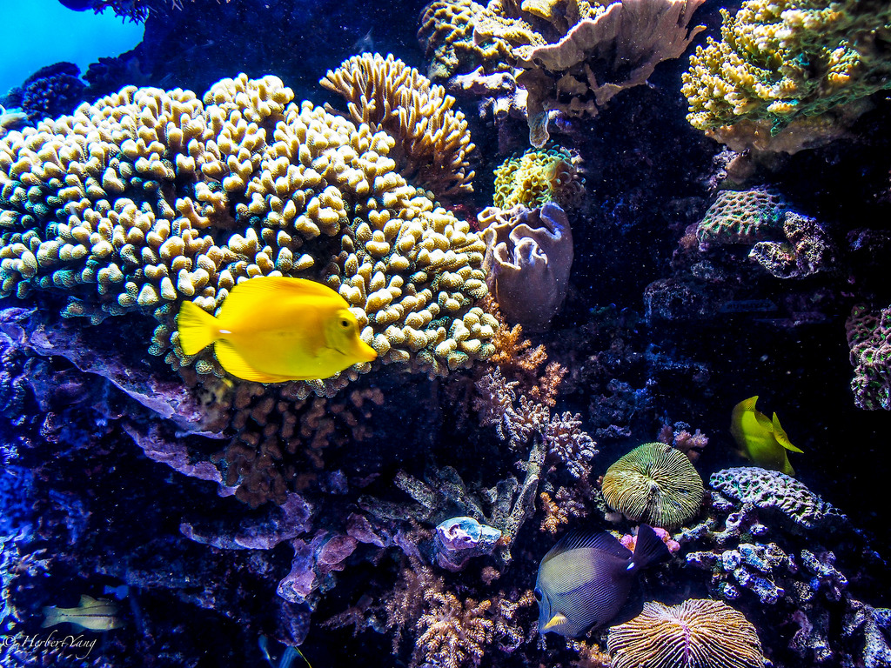

Title: Photo#17 - Lives Under the Sea (part 2)
Date: 2014-04-07 08:00
Tags: 
Category: Photography
Slug: lives-under-the-sea-continued
Summary: In order to keep a reasonable download speed, I try to limit the number of photos in my each photo post to less than ten. In this age of information fragmentation, it's hard to assume anyone, no matter how close he/she is, to have enough patience to look at over more than ten photos at a time. If an event has more than ten photos that are worth sharing, like this Monterey trip, I'll break it down into multiple posts.

In order to keep a reasonable download speed, I try to limit the number of photos in my each photo post to less than ten. In this age of information fragmentation, it's hard to assume anyone, no matter how close he/she is, to have enough patience to look at over more than ten photos at a time. If an event has more than ten photos that are worth sharing, like this Monterey trip, I'll break it down into multiple posts.

The aquarium was founded by the famous Packard family.

It is a remarkable engineering feat to recreate the sunlight, the wave, and the entire under-sea eco-system.

Though some fishes might exist in different levels of food-chain, they will be fed properly so that the big ones won't just eat up the smaller ones. Their aggression behaviors are much reduced in this environment.

This hall is awe-inspiring, a great venue for late-night kids sleep-over parties and late-afternoon wine tasting events. The big fish in sight, has an enormous head that seems to come from a much bigger body. It looks like a big fish-head without body. 

After mating, they keep each other in good company.

Windows wallpaper?

Shooting tropical fish is a physically-exhausting job, because they move too fast and it's vey difficult to focus. Once in a while, some more stupid ones just float there still.

Wish it were swimming slower

