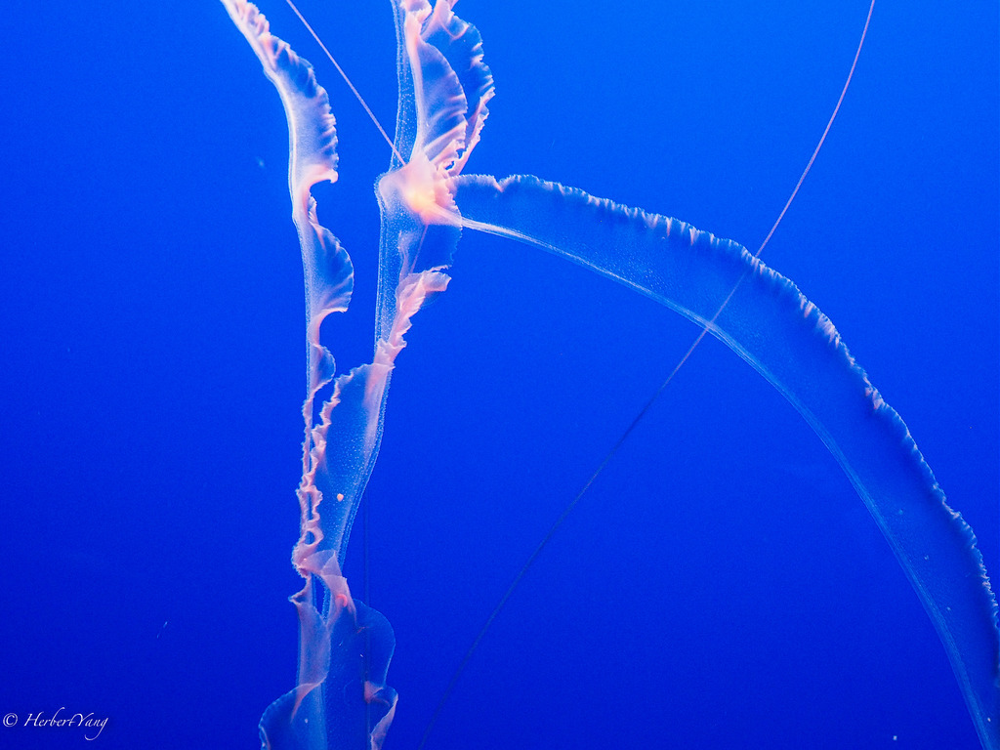
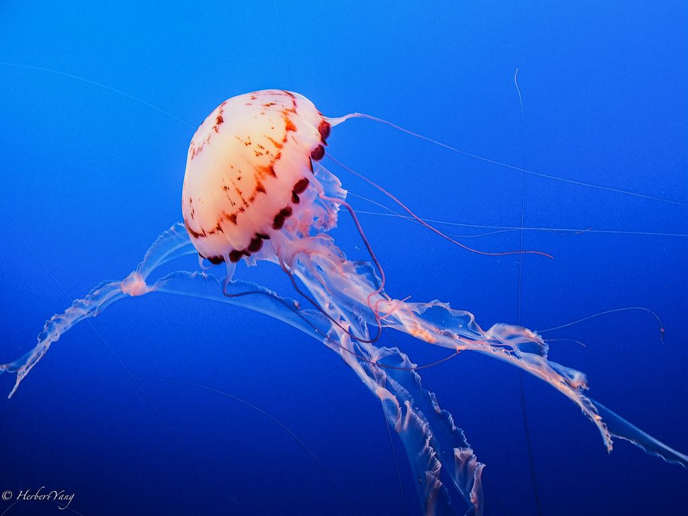
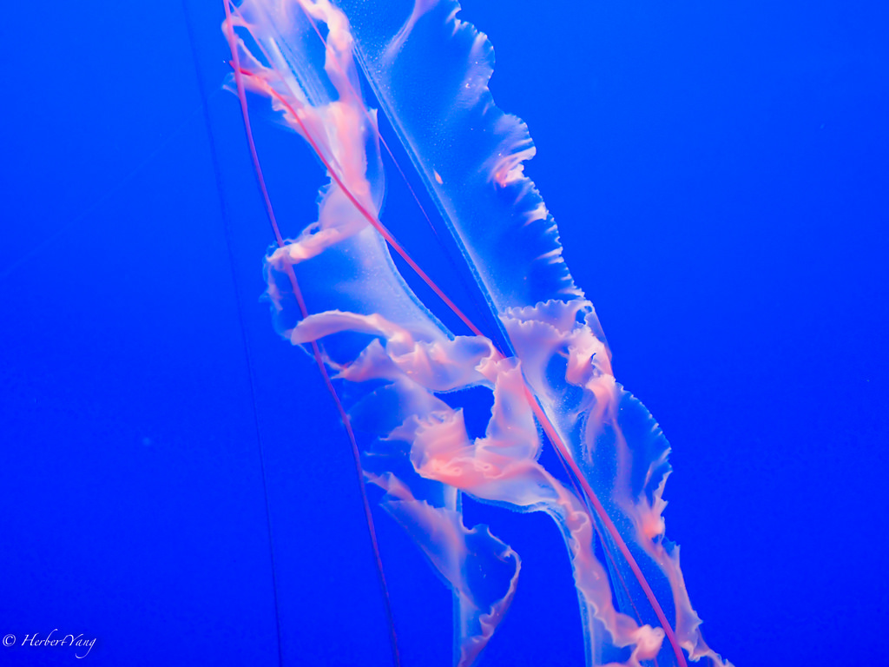
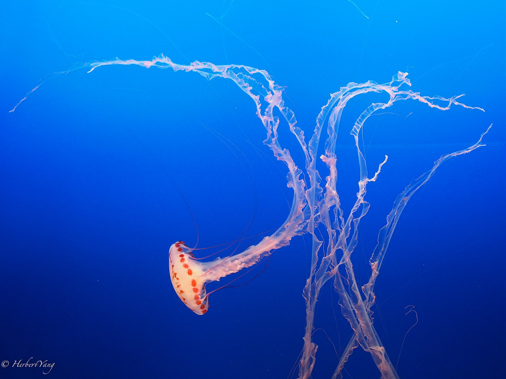
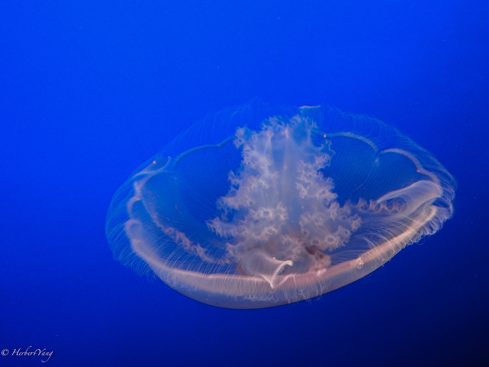
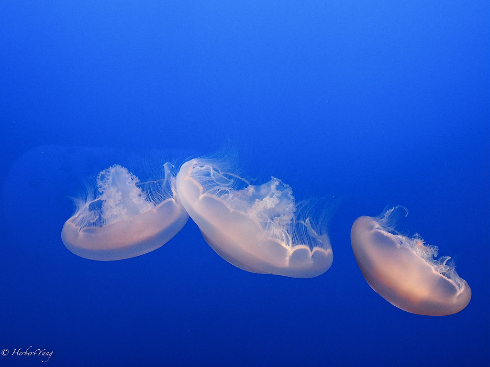
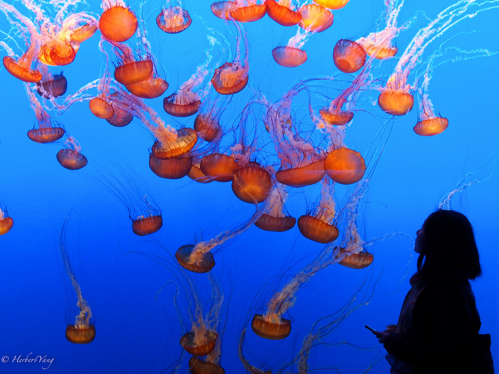
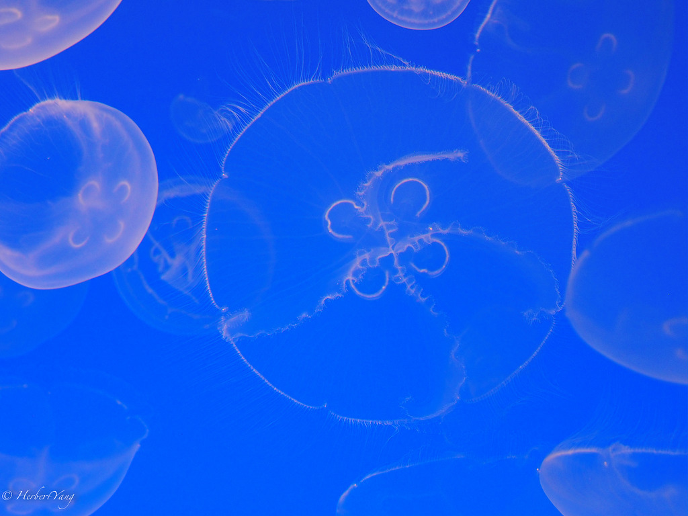
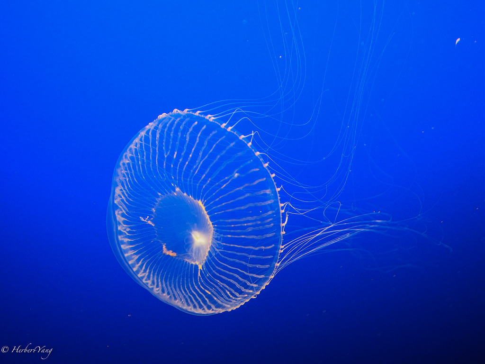

Title: Photo#18 - Lives Under the Sea (part 3)
Date: 2014-04-08 08:00
Tags: 
Category: Photography
Slug: blue-is-the-warmest-color
Summary: This hall has the crown-jewel of Monterey Bay Aquarium, jelly fishes. Boy, they look like a fantasy dream, a very blue one. Is this how Flickr got inspiration for its pink-on-blue logo?

This hall has the crown-jewel of Monterey Bay Aquarium, jelly fishes. Boy, they look like a fantasy dream, a very blue one. Is this how Flickr got inspiration for its pink-on-blue logo?

