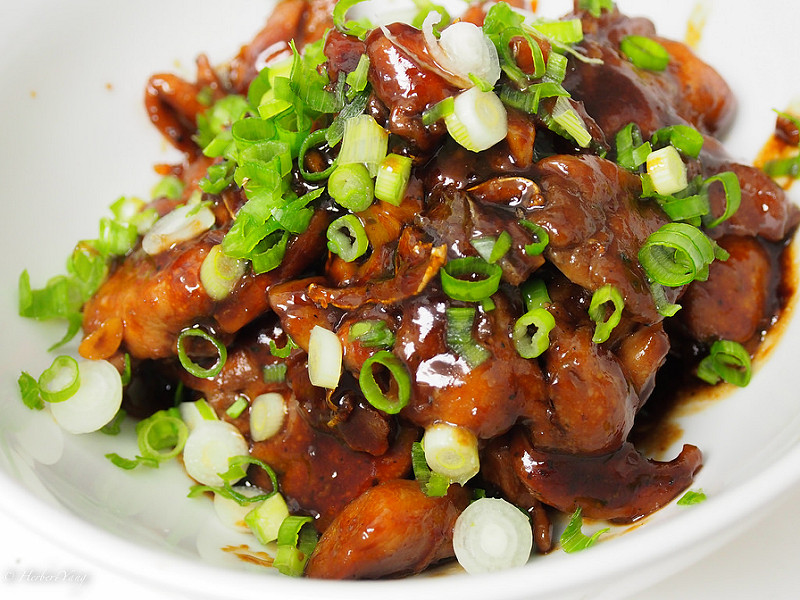
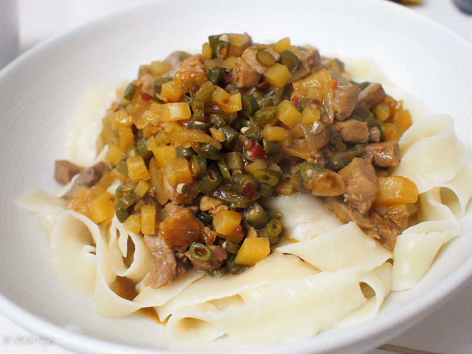
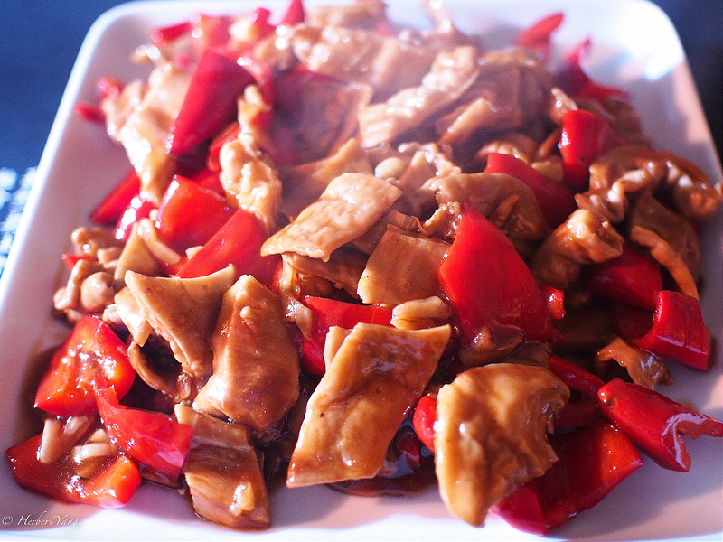
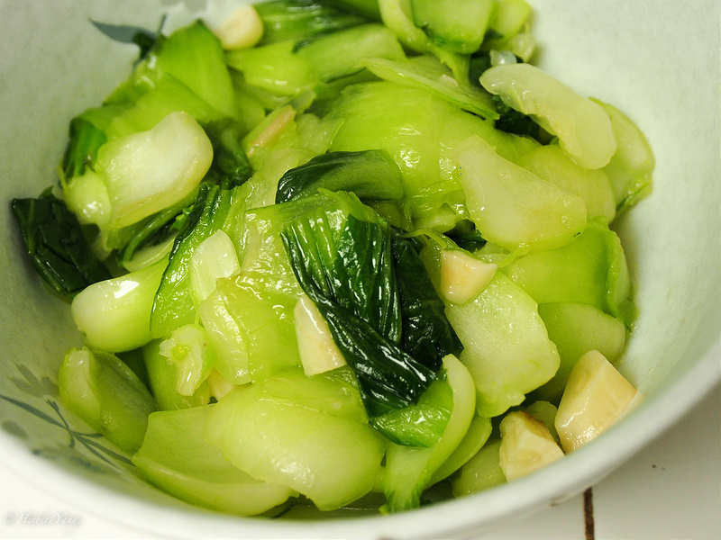
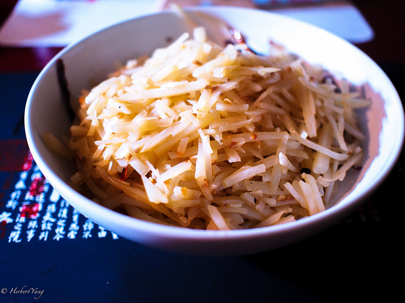
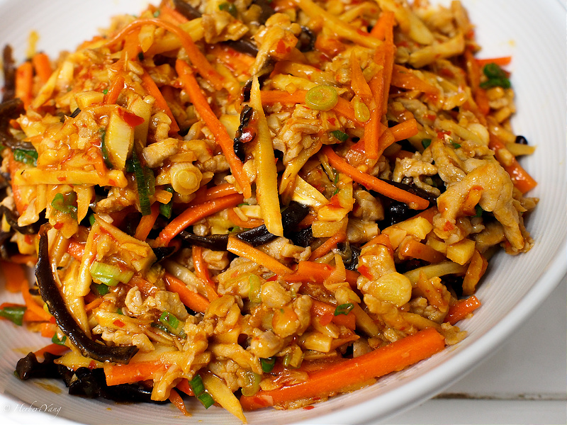
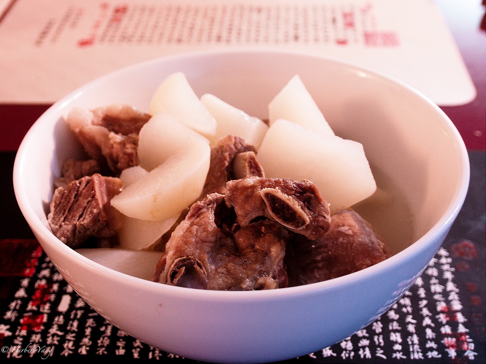

Title: 杨记美食四月篇
Date: 2014-04-09 08:00
Tags: 中文
Category: Gourmet
Slug: my-cooking-journal
Summary: 在2014年3月初的某一天，我正在经受[Pressed Juice](http://www.pressedjuicery.com/)三天program的煎熬。饥肠辘辘之间，心有顿悟，觉得自己动手，丰衣足食。于是，我就在下面的几周里，做了几盘小菜。

在2014年3月初的某一天，我正在经受[Pressed Juice](http://www.pressedjuicery.com/)三天program的煎熬。饥肠辘辘之间，心有顿悟，觉得自己动手，丰衣足食。于是，我就在下面的几周里，做了几盘小菜。

## 照烧鸡腿

一开始想了半天“照烧”是什么东西？后来在网上一查恍然大悟，就是teriyaki啊！这道菜的关键是照烧汁。我有用一点从超市买的Teriyaki Sauce，但因为量不够了，就自己按照生抽：料酒：蜂蜜 = 3：3：1的比例另外配置了一些。一开始除去鸡腿骨稍有麻烦，有把好使的剪刀会省很多力。鸡腿的腌制花了一个多小时，但我觉得时间还不够，下次得更加提前开始腌制。最后的味道稍微咸了点儿。

## 哨子面

大家都喜欢吃，很少有人喜欢做，因为配料太麻烦了。还好，越麻烦的菜，我越喜欢做。这道菜需要切很多菜，还好我继承了妈妈的基因，擅长切菜。自己做的哨子面，原料都是organic的，不含任何味精，味道比餐馆里的好很多。

## 溜肥肠

大概是这季里难度最高的一道菜，有两个技术门槛。第一是把肠子洗干净；第二是把肠子煮熟。第一次洗肠子，不大看得出来哪些是肥肉，哪些是淋巴，只能一边洗一边摸索。用水来不停地冲洗就能把淋巴/肥肉比较容易地分离出来了。豆果网上的各种溜肥肠菜谱都不能很清楚地说明白到底需要煮多长时间，后来我从百度上搜索才发现需要煮一个小时之久！难怪后来吃的时候觉得嚼得不够烂。

## 蒜炒上海青

按照爸爸的嘱咐，盐要在最后快要起锅的时候再放 - 否则蔬菜出水太早。果然很灵验，上海青青翠欲滴。不过，为什么这道菜叫上海青，而不是武昌青呢？

## 炝炒土豆丝

我从小就喜欢吃土豆丝。小时候吃的土豆丝，包括后来我在新加坡做的土豆丝，都比较重口味。现在口味清淡了，改作炝炒土豆丝。很容易，土豆丝切细就可以了。

## 鱼香肉丝

本季最为惊艳的作品，做了两次，都很成功。也是需要切无数的菜，但很值得，看来会成为杨记的保留主菜之一了。

## 排骨萝卜汤

本季早期作品，具体的做法已经不可考，反正结果不错。

