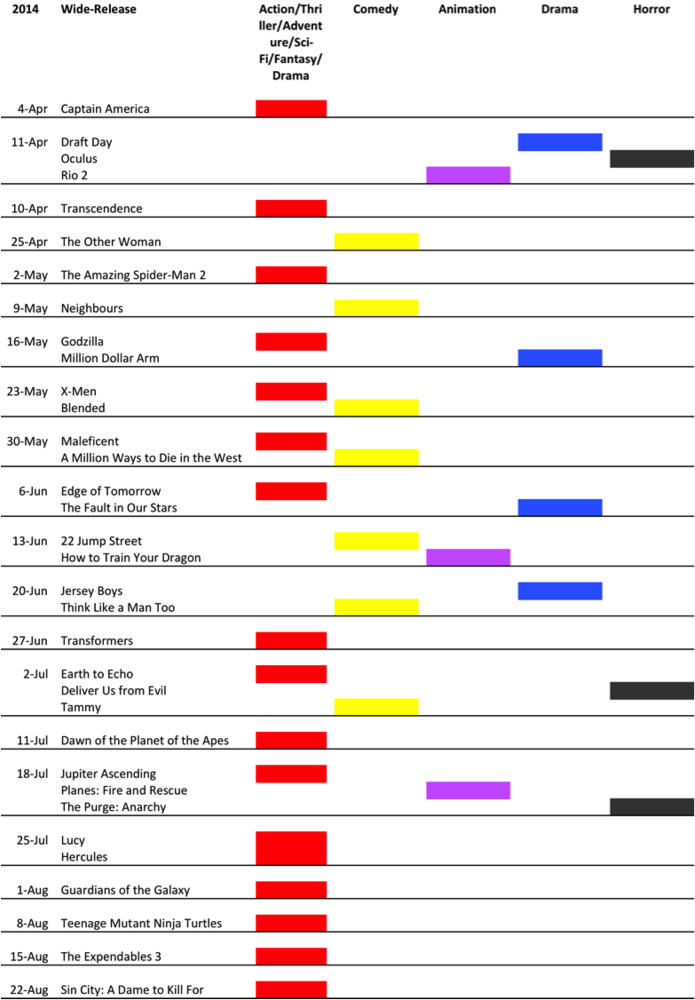

Title: Analysis of 2014 US Summer Tentpole Movie Release Schedule
Date: 2014-05-24 08:00
Tags: 
Category: Business
Slug: 2014-US-summer-tentpole-schedule
Summary: Here's my annual analysis of US summer tentpole movie release schedule. The 2013 one is [here](../2013-US-summer-tentpole-schedule/). 

Here's my annual analysis of US summer tentpole movie release schedule. The 2013 one is [here](../2013-US-summer-tentpole-schedule/). 

-   Overall, 2014 is really not that exciting for US summer movie market. Most of the tentpole releases feel like cover bands to warm up the stage for the real headliners like The Rolling Stones. With "Avengers 2", "Star Wars", "Fast & Furious 7", "Mission Impossible 5", "Jurassic Park", "Mad Max", 2015 is poised to be a banner year for Hollywood.

-  The most remarkable phenomenon in 2014 summer schedule is that Captain America chose to open on April 4, a full month ahead of the official summer season. It's become a monster hit and that will probably change the landscape for next year and beyond.

-  The boredom of this summer can be seen from the fact that there are 3 horror wide releases in the summer. Is Hollywood running out of mindless action blockbusters?

-   The release schedule suggests that "Transformers 3" is the only "event movie" that is expected to suck up the entire market demand for that frame. Nobody dares to come close to that.

-   Obviously, action-comedy is the most frequent combo (duh...)

-   Every other week studios throw family-themed animation flicks into
    the mix to keep the kids interested, so that their parents can earn
    some "chips" to go to cinema next week without them.

-   Johnny Depp has officially become a box-office poison when he's not Cap. Jack Sparrow. 

- 	We might see the last big-production movie from the Wachowskis after "Jupiter Ascending". If it fails (most likely it will), no studio executives would want to ever write a check to Wachowskis again. Mila Kunis, seriously?

