Title: Herbert's Guide to Yosemite National Park
Date: 2014-05-30 08:00
Tags: 
Category: Travel
Slug: herbert-guide-yosemite
Summary: Yosemite is one of the most popular national parks in the world, and justifiably so. The park is within 4-5 hours of driving from the Bay Area and many awe-inspiring attractions are within walking distance down the valley. It's got something for everyone, whether you are a rock climber, or a hiker, or a camper, or just hanging out with kids and elderly. It's worth repeated visits in different seasons to fully appreciate the changing face of the nature.

Yosemite is one of the most popular national parks in the world, and justifiably so. The park is within 4-5 hours of driving from the Bay Area and many awe-inspiring attractions are within walking distance down the valley. It's got something for everyone, whether you are a rock climber, or a hiker, or a camper, or just hanging out with kids and elderly. It's worth repeated visits in different seasons to fully appreciate the changing face of the nature.

Time of visit: September 2012

*Where are the top attractions?*

Driving can be a bit of hassle if not planned carefully in advance. There are three main routes for Yosemite attractions.

- Yosemite Valley, accessible from Big Oak Flat Rd, 140 and Wawona Rd
- Tuolumne Meadows, accessible from 120 only
- Glacier Point, accessible from Glacier Point Rd that breaks off from Wawona Rd

To make it an even bigger challenge for you, there are three ways to enter Yosemite, if you're driving from the Bay Area:

- 120 => Big Oak Flat Rd
- 140 => El Portal Rd
- 41 => Wawona Rd

You might want to research the map really, really carefully before planning your Yosemite trip. Where you stay for the night will significantly impact how much you can get out of Yosemite in a typical 3-day trip. 

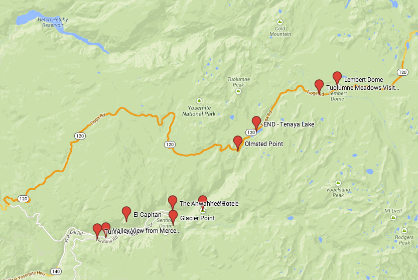

*What are the top attractions?*

## Tunnel View

The best spot for sunset-viewing
	
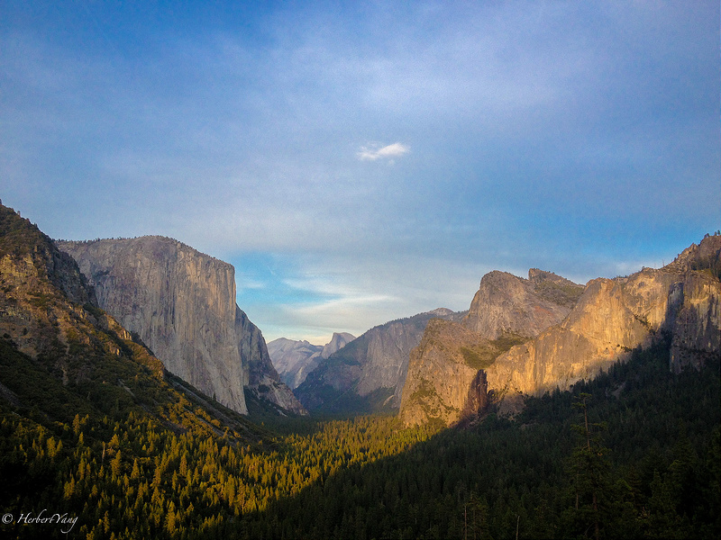

## El Capitan

One of the most famous rock-climbing spots in the world
	
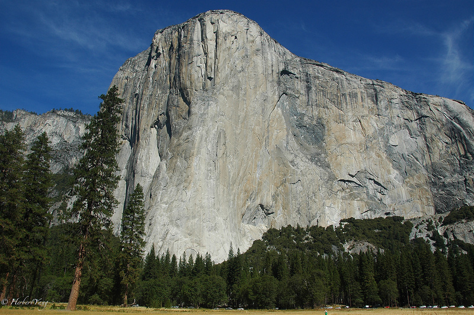

## Half Dome
	
The somewhat romantic Half Dome

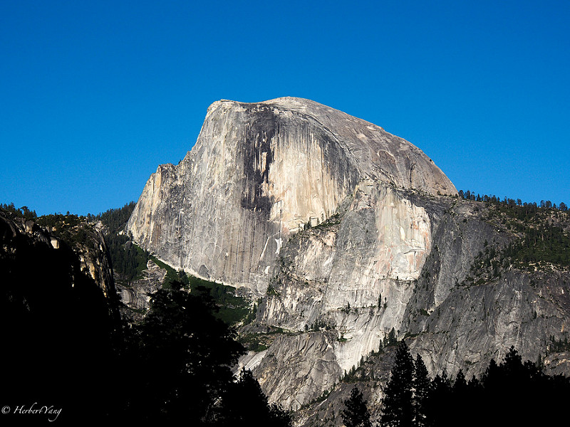

## Glacier Point

The awe-inspiring vista lookout to view Half Dome from afar
	
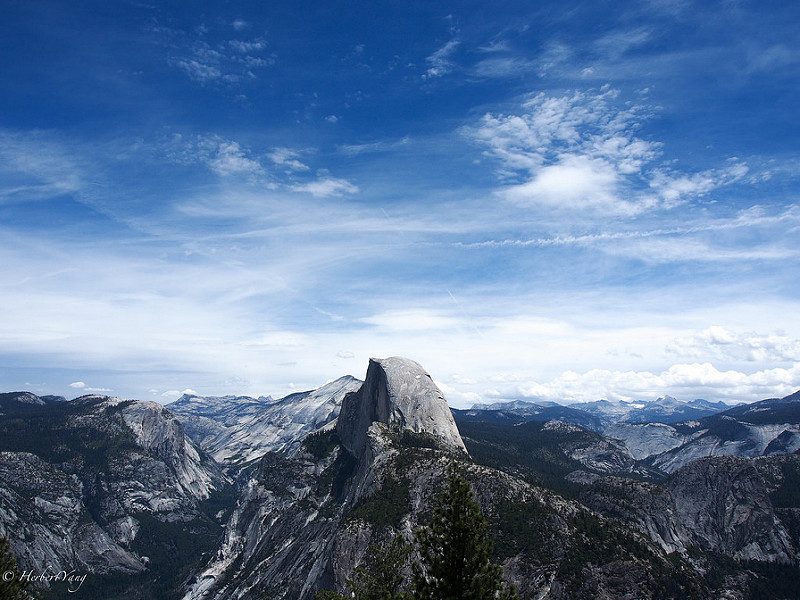
	
## Tenaya Lake

The perfect fusion of mountain, lake, meadow, woods, sky and clouds
	
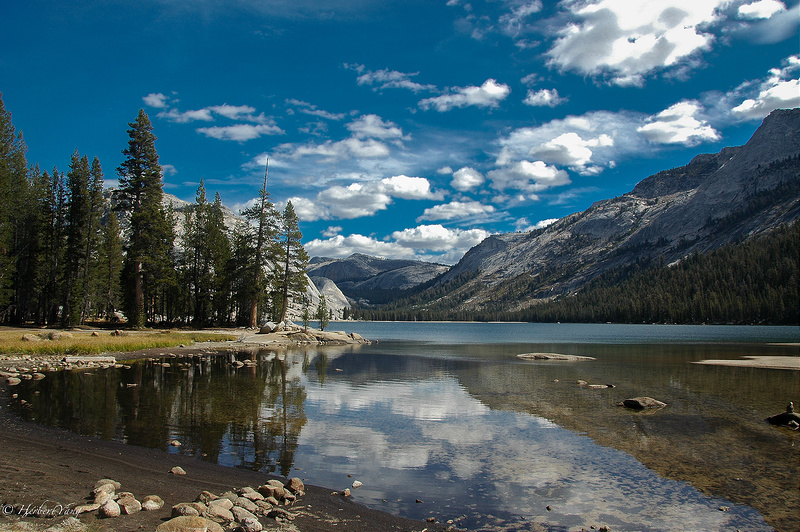
	
## Olmsted Point

A popular stop-over spot for out-of-nowhere rocks
	
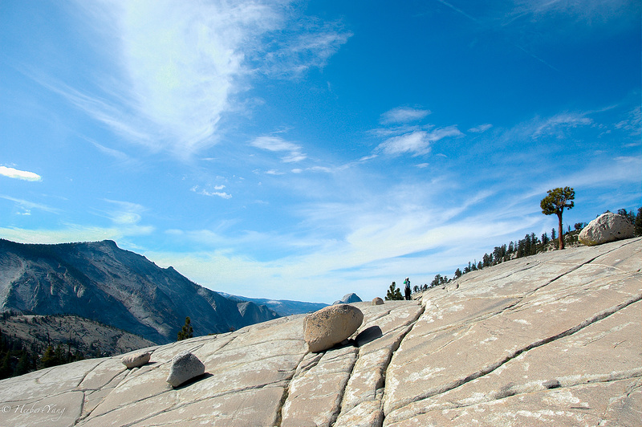
	
## Lembert Dome
	
An easily accessible 3-hour round-trip hiking trail with breathtaking panorama view
	
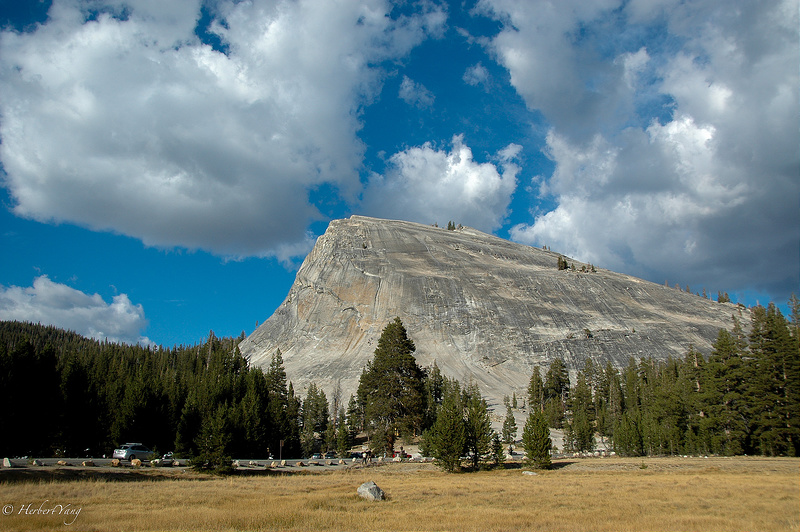

## Tuolumne Meadows
	
Paradise on top of Yosemite
	
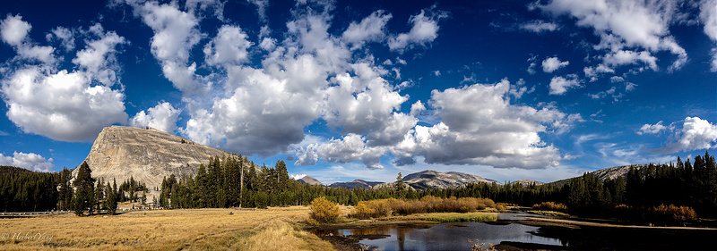

## Valley View from Merced River
	
The postcard-spot for Yosemite Valley
	
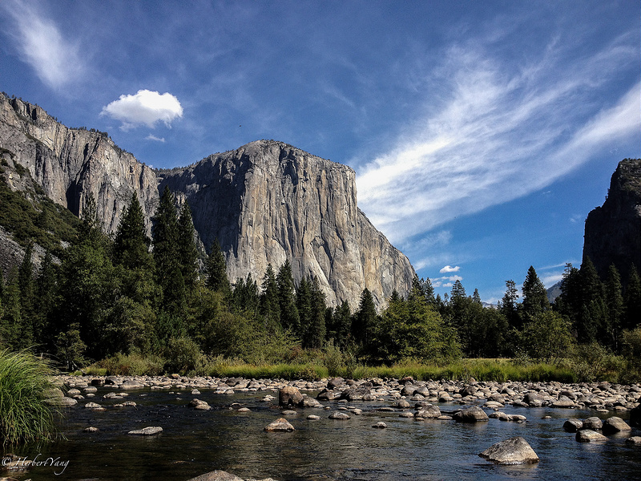

## The Ahwahnee Hotel
	
A historical hotel with an uber-luxury dining hall in Hogwarts style
	
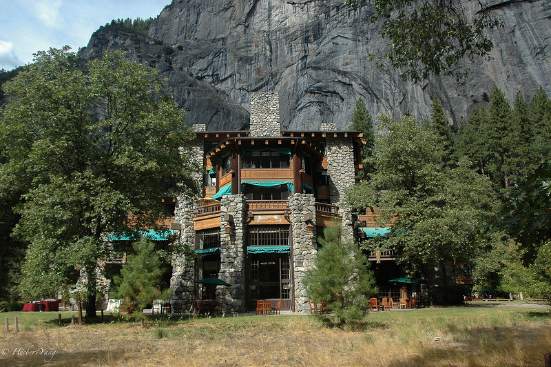
