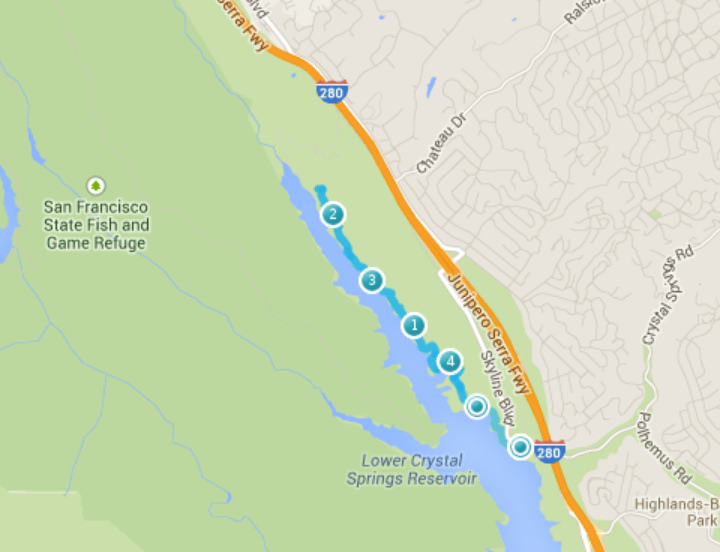
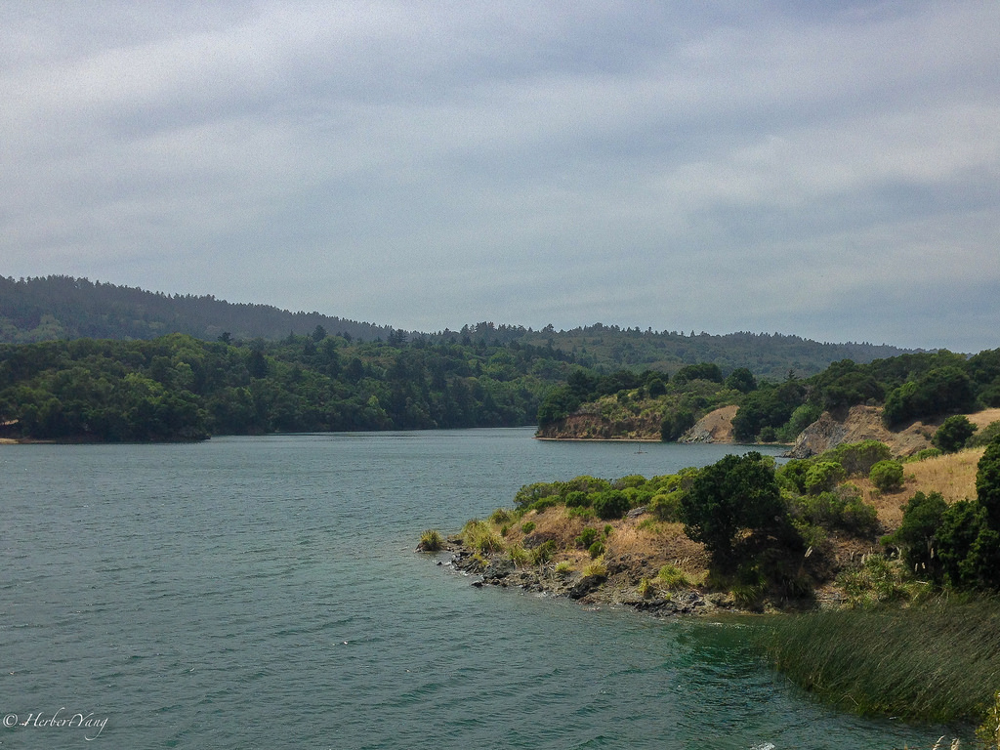
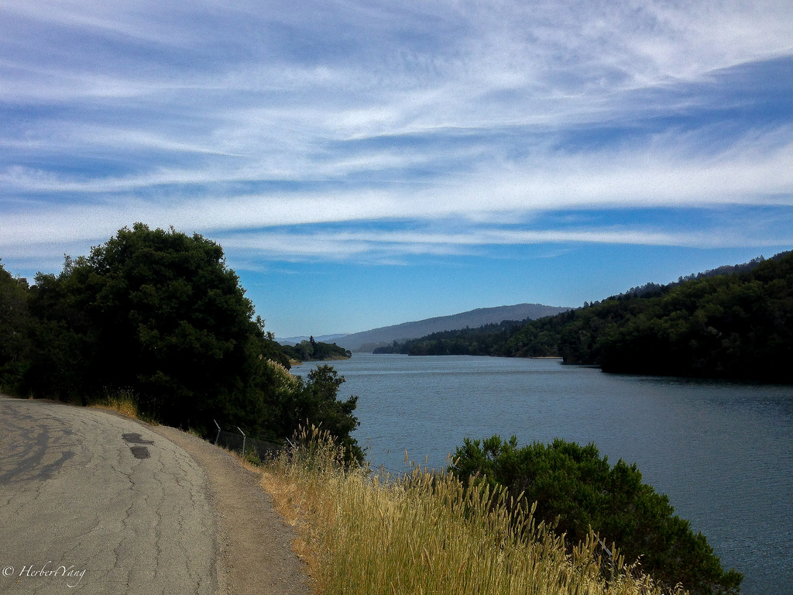
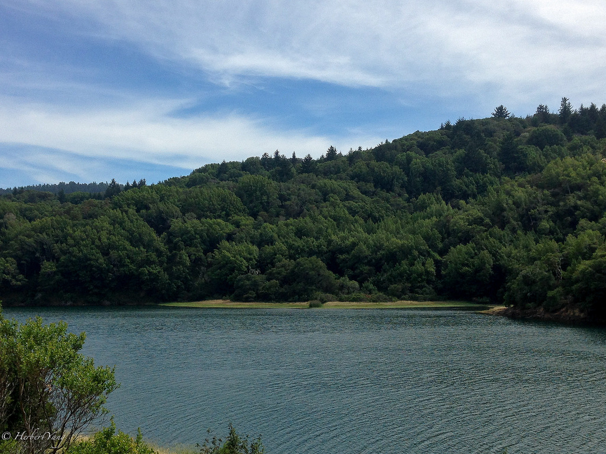
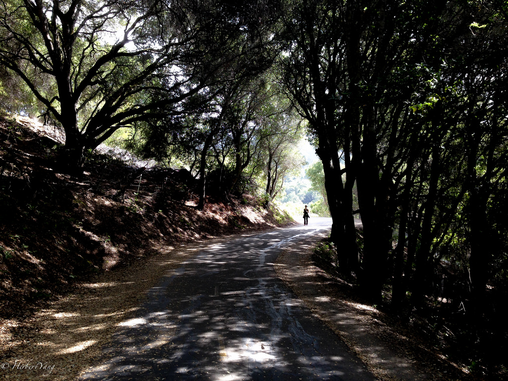
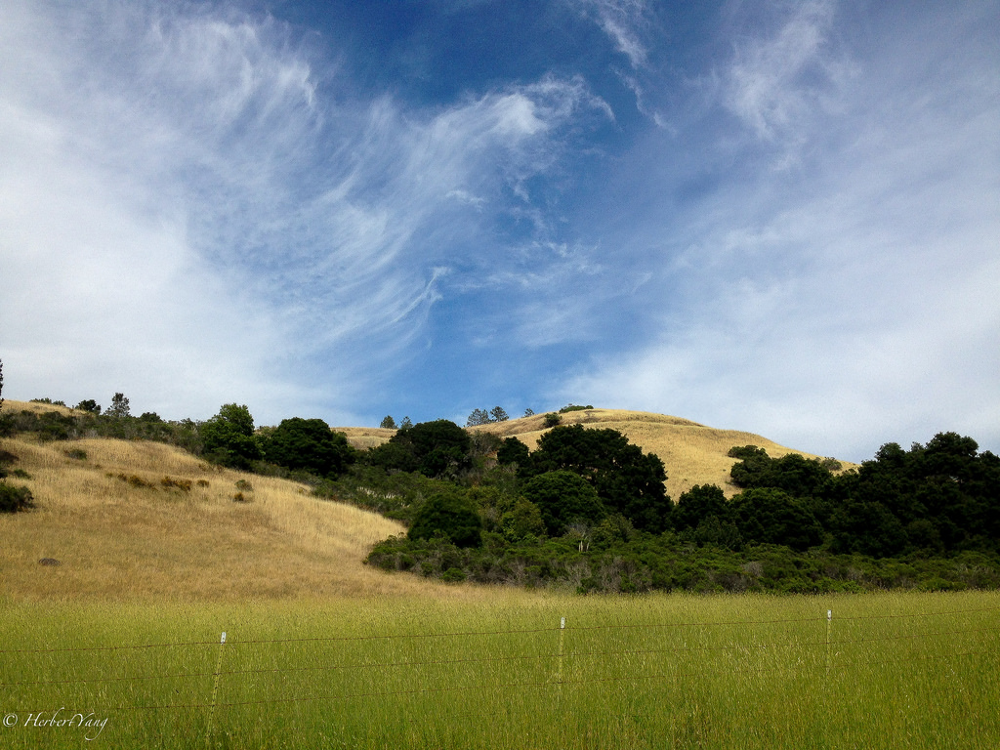

Title: Herbert's Guide to Sawyer Camp Trail
Date: 2014-06-15 08:00
Tags: 
Category: Travel
Slug: sawyer-camp-trail
Summary: Sawyer Camp Trail follows Crystal Springs Reservoir, which is one of the major sources for drinking water of the entire San Francisco Bay Area. It's regarded as one of the best jogging and walking trails in the Bay Area. Along the pristine Crystal Springs Reservoir, there are three segments of trails, San Andreas Segment in the north, Sawyer Camp Trail in the middle, and Crystal Springs trail in the south. Sawyer Camp segment is connected to San Andreas Segment via a walking/jogging trail. Currently no direction connection between Sawyer Camp and Crystal Springs due to the bridge construction.

Sawyer Camp Trail follows Crystal Springs Reservoir, which is one of the major sources for drinking water of the entire San Francisco Bay Area. It's regarded as one of the best jogging and walking trails in the Bay Area. Along the pristine Crystal Springs Reservoir, there are three segments of trails, San Andreas Segment in the north, Sawyer Camp Trail in the middle, and Crystal Springs trail in the south. Sawyer Camp segment is connected to San Andreas Segment via a walking/jogging trail. Currently no direction connection between Sawyer Camp and Crystal Springs due to the bridge construction.

The middle segment Sawyer Camp Trail is perfect for running/jogging/walking/cycling. You're greeted all the way by the beautiful reservoir and occasional deers wandering off the woods. Trees along the trail provide constant shade, which is not too common among walking trails in the Bay Area.

