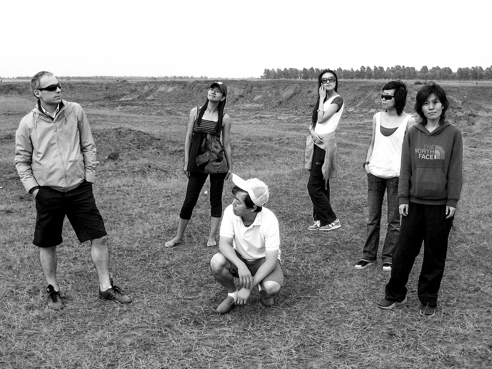

Title: Photo#19 - Flying Punk 飞扬的骚年 
Date: 2014-06-21 08:00
Tags: 中文
Category: Photography
Slug: flying-punk
Summary: 2009年8月，首届张北草原音乐节，向四十年前的Woodstock致敬，创造了当时中国室外音乐节参加人数的记录。在北京河北交界之处的张北，有一望无际的草原，有三天无休的摇滚，还有几个飞扬的骚年。

2009年8月，首届张北草原音乐节，向四十年前的Woodstock致敬，创造了当时中国室外音乐节参加人数的记录。在北京河北交界之处的张北，有一望无际的草原，有三天无休的摇滚，还有几个飞扬的骚年。

欧耶！

我飞故我在

飞龙在天

Y-M-C-A

朝阳区摇滚小分队冷酷登场

