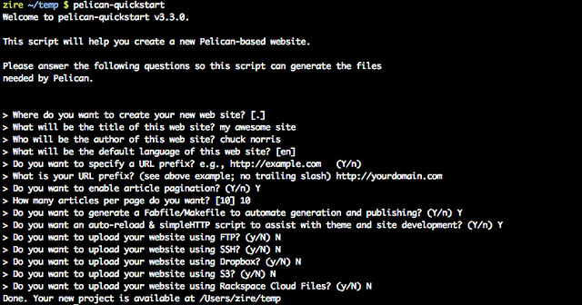

Title: A Dummy's Guide to Set Up Static Blog Site with Github Page and Pelican
Date: 2014-07-02 08:00
Tags: pelican
Category: Tech
Slug: guide-to-set-up-static-blog-site-on-github-page-and-pelican
Summary: In early March I migrated the Good, the Bad, and the Curious from the draconian Wordpress architecture to a much more elegant static site structure hosted on Github Page using a static site generator Pelican. The original conversion was quite an involving effort of a series of trial-and-error because of the respective idiosyncrasies from Github Page itself, a fast-evolving Pelican, and legacy issues from Wordpress. The second time is a charm. I managed to set up the second site within only a few hours last night. Because OC is a brand new site from scratch, I didn't have to deal with Wordpress anymore. This guide is for my own reference (in case I forget), as well as for anyone who might try to do the same - to create a new static contents site on Github Page with Python-friendly Pelican if you're more familiar with Ruby). 

In early March I migrated [the Good, the Bad, and the Curious](https://guizishanren.com) from the draconian Wordpress architecture to a much more elegant static site structure hosted on [Github Page](https://pages.github.com/) using a [static site generator](http://en.wikipedia.org/wiki/Web_template_system#Static_page_generators) [Pelican](http://docs.getpelican.com/en/3.4.0/). The original conversion was quite an involving effort of a series of trial-and-error because of the respective idiosyncrasies from Github Page itself, a fast-evolving Pelican, and legacy issues from Wordpress. 

The second time is a charm. I managed to set up the second site within only a few hours last night. Because OC is a brand new site from scratch, I didn't have to deal with Wordpress anymore. This guide is for my own reference (in case I forget), as well as for anyone who might try to do the same - to create a new static contents site on Github Page with Python-friendly Pelican (you can also use [Jekyll](https://github.com/jekyll/jekyll) if you're more familiar with Ruby). 

This dummy's guide assumes the reader knows nothing and has nothing, with only a MacBook Air/Pro. Naturally it will not be useful for most people. If you are a programmer this is a walk in the park for you and you know how to do most of the steps from high-school. If you are not a programmer you probably won't be crazy enough to even give it a try - it's just too daunting a task for someone with no CS training.

# 1. Install iTerm

Download and install [iTerm2](http://www.iterm2.com/#/section/home) to replace the default command-line tool Terminal from OSX. It's much more powerful and versatile than Terminal.
	
In iTerm2's preferences, go to Terminal=>Terminal Emulation, make sure Character Encoding is *Unicode (UTF-8)* and Report Terminal Type is *xterm-256color*. 
	
iTerm will provide the command-line interface to execute all the shell commands that you will need to use for github and pelican. 

Let's make a few adjustments on your shell environment:
	
	cd ~
	vi ~/.bashrc
	# press "i" to enter into edit mode
	alias ls="ls -G"
	# turn on color display in shell
	PS1='\[\e[0;32m\]\u\[\e[m\] \[\e[1;34m\]\w\[\e[m\] \[\e[1;32m\]\$\[\e[m\] \[\e[1;37m\]'
	# change the format of your cursor prompt
	# press Esc key to switch into command mode
	:wq
	# save the change and exit the file
	

# 2. Install Python and git

There are two primary static site generators for Github Page. If you're familiar with Ruby, Jekyll is recommended by Github team; if you're more familiar with Python, Pelican is the most popular choice. 

Pelican is written in Python so you need to install Python first. Download the latest version of Python [here](https://www.python.org/download/) first. 
	
You can also manage your Github Page site without relying on any SSG (static site generator), but using a SSG will be much more productive. 

Before starting with Github, you need to install Git, the most widely used version control system. Download and install from [here](http://git-scm.com/).

# 3. Sign up with Github

Sign up an account with [Github](https://github.com/). It's free (thanks to [Andreessen Horowitz](http://a16z.com)'s $100 million investment]). In recent years, Github has become the Linkedin for geeks/programmers/developers, and the world's largest hosting platform for computer codes.

In your Github page, go to Account Settings (top right corner), from the left-hand menu, go to SSH Keys. You need to link up your SSH key from the local machine to your github page so that you can push contents from local to github. Follow [this guide](https://help.github.com/articles/generating-ssh-keys) to set it up:

Open iTerm, you should be at the root of your home directory. Type the following commands:
 
	cd ~/.ssh
	# enter into a hidden directory that stores ssh information
	ls -al
	# list the files in your .ssh directory
	ssh-keygen -t rsa -C "your_email@example.com"
	# create a new ssh key, using your email as a label
	eval `ssh-agent -s`
	# start the ssh-agent in the background
	ssh-add ~/.ssh/id_rsa
	# add the ssh info into a file id_rsa in directory .ssh
	pbcopy < ~/.ssh/id_rsa.pub
	# copy the contents of the id_rsa.pub file to your computer's clipboard

Following the rest of the steps as laid out in [github's help](https://help.github.com/articles/generating-ssh-keys) to complete the "hand-shake" setup.

# 4. Create a Github repo

Next step (create the repository) is easy for pros but often confusing for dummies. The critical question is: where this folder of your website should be? This folder can be anywhere in your home directory on your local machine. I usually just create a folder right in the root of my home directory. Open your iTerm, then:

	cd ~
	# enter into my home directory
	mkdir myblog
	# create an empty directory called "myblog" 
	cd myblog
	# enter into this blog folder. All subsequent commands will be carried out in this path
	
When the local folder is set up, go to your [github account](https://github.com/new) to create a new repository (sort of the mirrored folder of your local one). Only check the box for "public". The name of this repo can be anything for your own benefit and doesn't need to be related to your website. I just named it "blog". 

Once the repo is set up, you will see a set of commands on screen and you're ready for your first commit.

	cd ~/myblog
	# make sure you are in the right path by entering into your blog folder
	touch README.md
	# create an empty file for the first git commit
	git add README.md
	# add this file to the pipeline of your next git push
	git commit -m "first commit"
	# exciting moment huh?
	git remote add origin https://github.com/yourname/blog.git
	git push -u origin master
	
Now you've got a repo on your Github account. We need to turn this repo into a Github Page.

# 5. Create a Github Page project site

Go to [Github Page](https://pages.github.com/) to create your project site. 

When choosing between User/Organization Site and Project Site, I picked *Project Site* to give myself more flexibility in the future. On your Github account, you can have multiple Project Sites, but only one User/Organization Site. 

Next, choose *Start from scratch* for your new project site. 

Next, create a gh-pages branch. No need to dwell into the fine differences between "master" and "gh-pages branch" here. Just follow the below instructions if you want to get up running quickly. This step is only possible AFTER you have committed the first git push into your newly created Github repo. 

Follow the on-screen guide to create a *gh-pages* branch for your repo "blog" and make gh-pages the default branch for this repo. 

Create your version of Hello World file as the on-screen guide suggests. 

Voila, your Github Page project site is now up and running at [http://yourname.github.io/blog](http://yourname.github.io/blog). It'll take up to 10 minutes for the website to come alive at the first time. In the future, the changes are almost instantaneous. 

# 6. Get a domain name

Go buy a domain name for your website. I use [GoDaddy](http://www.godaddy.com/). Buying and managing domain name is very much of a commodity business and there are many competing companies. Just pick one that is reputable and large enough, like godaddy.

No need to pay for any other "enhancements" other than the domain name itself. Start with a one or two-year subscription. You probably don't want to spend more than $30 for this step.

# 7. Redirect domain name/URL to Github Page

Another critical step: you want to host your website on github page using your preferred domain name, so that when people click "http://yourdomain.com", they will see the contents that are actually loaded/stored at "http://yourname.github.io/blog" (notice the io extension, not com). Basically, you need to redirect your newly bought domain name's URL to your github page. 

Follow this [detailed instruction](https://help.github.com/articles/adding-a-cname-file-to-your-repository). Go to your Github Account's blog repo, create a CNAME file with only one line "*yourdomain.com*". 

If you have done this right, you should see "Your site is published at [http://yourdomain.com](http://yourdomain.com)" in the settings section of your blog repo in about 10 minutes.

Now the really confusing step - configure your DNS settings. 

Go to your godaddy account, launch the menu for domains, go to "DNS zone files" section. You will see several sections such as "A(Host)", "AAAA(IPv6 Host)", "CName(Alias)", "TXT(Text)", "SRV(Service)", "NS(Nameserver)". 

Different domain sites have different interfaces, but usually you will see something like this under "*A(Host)*":

|Host|Points to|TTL|Actions|
|----|----|----|----|
|@|xx.xx.xx.xx|1 hour|edit/delete|

Click on the Edit, change the default IP value "xx.xx.xx.xx" in "Points to" (or IP address) to "*199.27.79.133*", Save so that the change will take effect.

This IP address 199.27.79.133 is the one used by Github Page's server. There are other IP addresses that can also be used. This one works for me.

It'll take another a few minutes for the domain registrar to update that information in the database. If done right, you should see the contents of your Hello World file from Step 6 if you click on "http://yourdomain.com". The handshake between your domain and your Github Page is complete.

Whew! ... we have barely scratched the surface so far ...

# 8. Install Pelican and dependencies

Download pip from [here](http://pip.readthedocs.org/en/latest/installing.html#install-pip) into your blog home directory on local machine.

	cd ~/myblog
	# enter into your local blog home directory
	sudo python get-pip.py
	# run the installation with administrator access. Enter your admin password when prompted

Install [Pelican](http://docs.getpelican.com/en/3.4.0/install.html) using pip:

	cd ~
	# do this at your home directory
	sudo pip install pelican
	# install pelican with admin access

Install Markdown using pip:

	sudo pip install Markdown
	# so that your system recognizes .md and .markdown files as Markdown files
	
Install [ghp-import](https://github.com/davisp/ghp-import) using pip:

	sudo pip install ghp-import
	# this add-on is to facilitate the git push for your Github Page Project Site as it's a gh-pages branch, not the master branch as default

# 9. Kickstart your site with Pelican

Finally, we can create a skeleton project now on the local machine with Pelican

	cd ~/myblog
	# make sure you are in the right path for your blog
	pelican-quickstart
	# launch the installer for your project/blog site

You'll next be prompted with 10+ lines of questions. It's quite a challenge for the first time to figure out how to answer them (that's why you might need this guide).
	
	> Where do you want to create your new web site? [.]
	# just press Enter to use the default current path "~/myblog"
	> What will be the title of this web site?
	# enter "My Awesome Site"
	> Who will be the author of this web site?
	# enter "Chuck Norris"
	> What will be the default language of this web site? [en]
	# press Enter to accept English
	> Do you want to specify a URL prefix? e.g., http://example.com   (Y/n)
	# enter Y
	> What is your URL prefix? (see above example; no trailing slash)
	# enter http://yourdomain.com
	> Do you want to enable article pagination? (Y/n)
	# enter Y
	> How many articles per page do you want? [10]
	# enter 10
	> Do you want to generate a Fabfile/Makefile to automate generation and publishing? (Y/n)
	# enter Y
	> Do you want an auto-reload & simpleHTTP script to assist with theme and site development? (Y/n)
	# enter Y
	> Do you want to upload your website using FTP? (y/N)
	# enter N
	> Do you want to upload your website using SSH? (y/N)
	# enter N
	> Do you want to upload your website using Dropbox? (y/N)
	# enter N
	> Do you want to upload your website using S3? (y/N)
	# enter N
	> Do you want to upload your website using Rackspace Cloud Files? (y/N)
	# enter N
	
Here's the screenshot: 

For a more detailed explanation, read this up: [kickstart your pelican site](http://docs.getpelican.com/en/3.4.0/install.html). I believe all these choices can still be changed later in the settings file. So don't worry about making any bad choice now. 

# 10. Install an editor

Now you will need to do some Python/CSS hacking/editing. There are a million choices out there and everyone is highly opinionated and philosophical about the choice of his/her editor. If you are a Mac user, consider the free [TextWrangler](http://textwrangler.onfreedownload.com/?lp=adwords&tg=us&kw=Textwrangler%20free&mt=b&ad=33478422173&pl=&ds=s&os=mac&gclid=CjgKEAjw286dBRDmwbLi8KP71GQSJAAOk4sjuhKuIGJATMLadai0PoHsBjW-vjCKcf2r9sqsnBSzD_D_BwE) or the more advanced [Sublime Text 2](http://www.sublimetext.com/). I use Sublime Text 2 (its paid version is well worth the money). If you are a windows user, you should buy a Mac.

Picking a color theme for the editor can be one of the most monumental decisions in this process. Again there are more choices (all free) than you can choose from. I'll spare you from listening to my own story on this part.

# 11. Adjust Pelican settings

I spent a lot of time tinkering with the ~/myblog/*pelicanconf.py* file. This file defines all the parameters and structure of your website and demands a lot of close attention to each detail. 

You might want to start with a [default example](http://docs.getpelican.com/en/3.4.0/settings.html#example-settings) and then customize that into your own version. A detailed walk-through of all the parameters in this configuration file is beyond the scope of this guide.

It's a Python file (with .py extension). You can use your editor (TextWrangler, Sublime Text, or any other) to open and edit this file. The color theme makes a big difference when you have to spend hours and hours reading each line.

You also need to do an important step (and no one mentions this anywhere) here: *move your CNAME file* from the root directory as ~/myblog/CNAME to ~/myblog/output/CNAME. After restructuring your website using Pelican, you have changed the default directory (that is supposed to be mirrored on your Github Page project site) from ~/myblog to ~/myblog/output. The CNAME file has to reside in the root directory of your Github Page project site for the URL redirect to take effect. That's why this move is a must.

# 12. Pick a Pelican theme and customize CSS

Welcome to the real time-sucker, Pelican theme. It's a time-sucker because this is one of the main reasons we want to move away from cumbersome Wordpress to migrate to Github Page, so we want to make sure this is done right and perfect. With git-based Github Page and Pelican, we have total control of our contents and HOW these contents will be presented, instead of wasting time trying to navigate through millions of Wordpress plug-ins, that distract us from the pure joy of writing. 

Download all the main Pelican themes from [this github repo](https://github.com/getpelican/pelican-themes). Download the zip file and unzip that into your ~/myblog directory. Change the name of the folder to "themes" to make easier reference.

You can change the theme pretty easily in pelicanconf.py. Open the configuration file in Sublime Text and enter this line:

	THEME = "themes/bootstrap2"
	# save the file and this new theme will take effect immediately
	
Say you have picked the famous Twitter Bootstrap2 theme, then this file (~/myblog/themes/bootstrap2/static/css/*bootstrap.min.css*) will be your dear friend in the next two weeks as you ceaselessly try out various styling combinations. It can be quite exhausting. Most Pelican themes follow a similar file structure and there will be this one bad-bass monster CSS file in one of the folders. Everything about the presentation/look of your website will be spelled and defined here. Indulge yourself in the world of CSS. 

# 13. Organize contents

A very, very philosophical question that will have profound impact on your website's SEO (Search Engine Optimization). Again you just have to try it to figure out the best path for yourself that suits your preferences. There are a few factors that are more important than others, because it'll take some laborious effort to undo/change these settings later on:

- category or tags?
- URL format/convention for your web site articles/pages
- local folder structure within ~/myblog/content
- naming convention for your markdown files

*Think carefully at this step*. Take a look at what others are doing. Everything else can be changed rather easily on the fly, except for the above few decisions. You can't avoid these questions anyway if you are a serious writer and want to invest time creating your own contents efficiently.

# 14. Learn Markdown and download MOU

You still need to learn Markdown language because all contents in this Github-Page/Pelican approach are created using Markdown. Markdown is a huge topic and represents one type of philosophy on its own. In short, if you're a serious writer, you should use Markdown to create your contents because it keeps you focused on writing itself and from worrying about format/presentation (which will be taken care of with the CSS file mentioned above).

Get started with Markdown from the famous [Daring Fireball](http://daringfireball.net/projects/markdown/). The syntax is very easy to pick up within half an hour. 

Many familiar formats in HTML school are missing from Markdown, because they're meant to be. Don't complain. Just get used to it.

How to create a table in Markdown (not part of the core syntax from DF's original plan):

	|heading 1|heading 2|heading 3|heading 4|
	|----|----|----|----|
	|hello|world|you|rock|

This will create a table in the HTML output. Make sure there are *4* "-" in the second line otherwise the table won't work.

All markdown files will have an extension .markdown or .md. You can use any editor to edit them but [MOU](http://mouapp.com/) is the most popular choice on OSX. MOU provides a split screen side-by-side with your contents so that you can see in real-time how your HTML page will look like. It also works very well with Chinese characters. If you don't want to be bothered with another software, Sublime Text is just fine.

# 15. Create contents and publish

At last, let there be an article. We've got all the ingredients ready.

Create a .md file in MOU. This markdown file should contain the following header information so that Pelican knows how to render the page:

	Title: My sensational title
	Date: 2014-07-03 08:00
	Tags: fun, 中文
	Category: Tech
	Slug: my-super-post
	Summary: Short executive summary for your article

	This is the content of my super blog post.

Save this file into *~/myblog/content/* folder. I store these header info in an Evernote post that I can copy and paste from pretty easily. 

Run the test server on your local machine to see if things come out alright. 

	cd ~/myblog
	# the next two commands need to be excited at the root directory of the site
	make html
	# sort of "compiling" your website and render markdown files into HTML ones
	make devserver
	# use Python to launch a server at your local machine's port 8000
	./develop_server.sh stop
	# stop the Python server, kill this process
	
Open your browser, go to *[http://localhost:8000](http://localhost:8000)*. Hopefully you'll see a cool-looking website as you desire. If not, go back to *pelicanconf.py* and the *CSS file* to see what's gone wrong. These two are the single most important files of this entire process. 

When you're happy with the test page, let's go live.

	cd ~/myblog
	pelican content -o output -s pelicanconf.py
	ghp-import -m "message" output
	# you can write whatever comment in "message" field that might help you distinguish this session from others
	git push origin gh-pages
	
Look at your [http://yourdomain.com](http://yourdomain.com). You should see exactly the same page from the Python test server, except it's now available on a public website. The process takes effect within seconds (it might take longer if you have many articles with many tags).

General comments:

- Try not to store too many images locally/on Github Page repo. Use flickr (1TB for free) as the central depository for all your image files and link your [flickr](http://flickr.com) image in markdown files.
- Back up your pelicanconf.py and CSS file constantly. You don't want to recreate them from scratch.
- Github may or may not be blocked in China, depending on Beijing's weather day-to-day (literally). The same goes for any respectable social media website or any website (like Flickr) of any value outside of China, sadly. At the moment my website is not blocked in China yet. Long live Github!
- Some Pelican themes are more mobile-responsive and some are not. So picking the right theme is important. Of course, if you're a CSS pro, you can create your own Pelican theme left and right (then you won't be reading this article). 

Enjoy your new website powered by Pelican and hosted by Github Page! It's a strenuous effort but a worthwhile one.