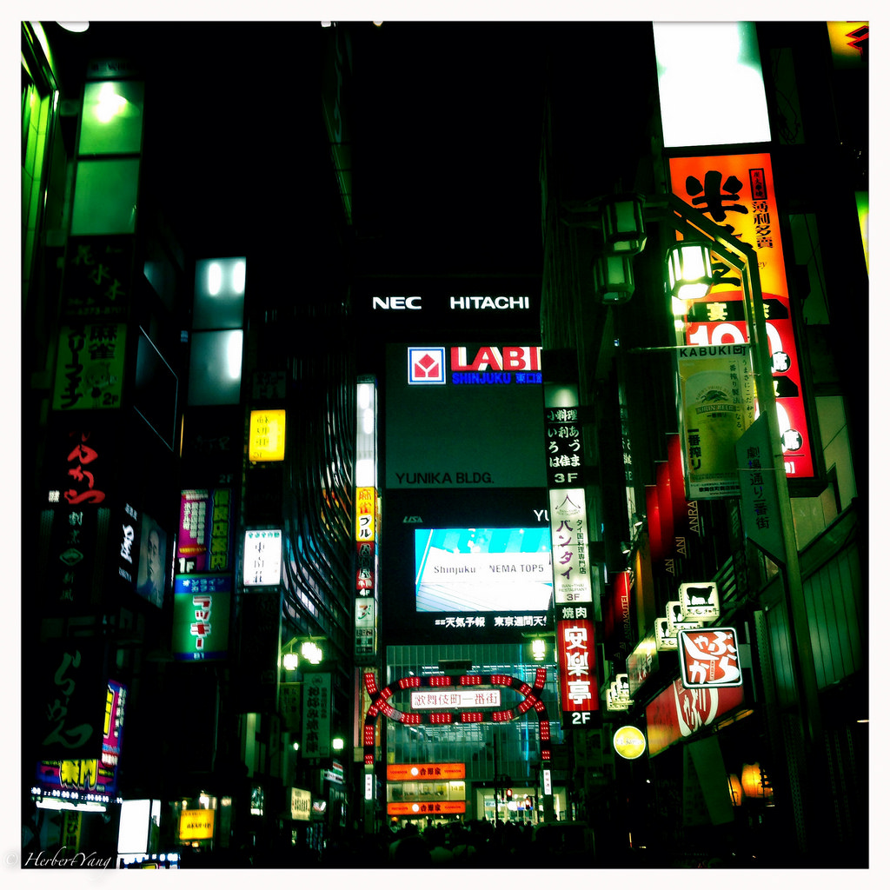
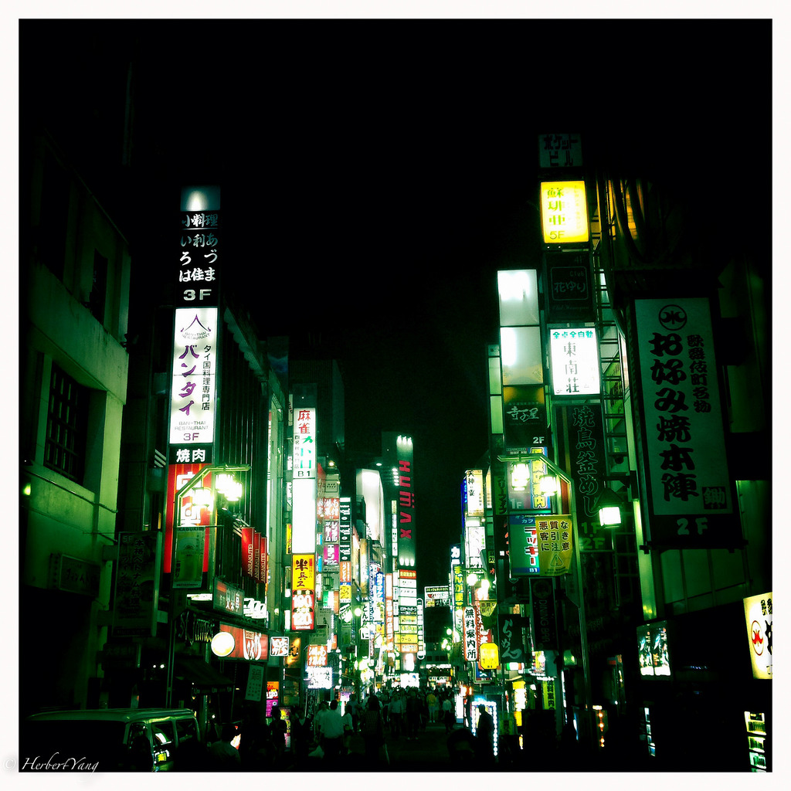
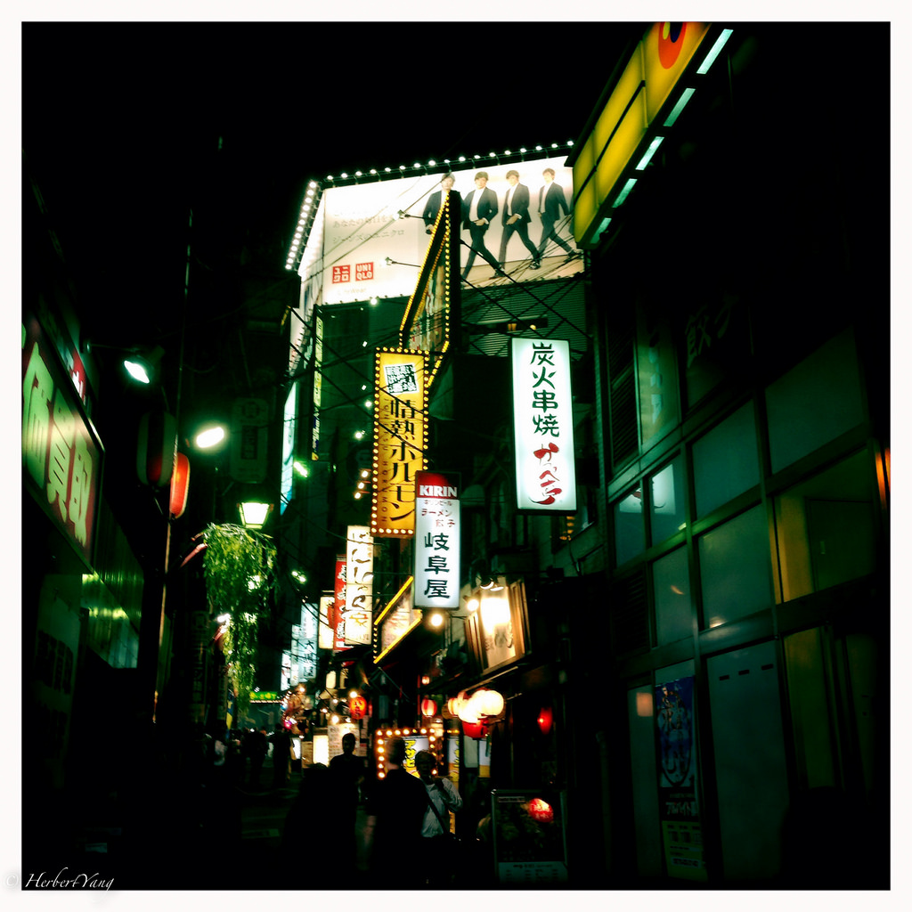
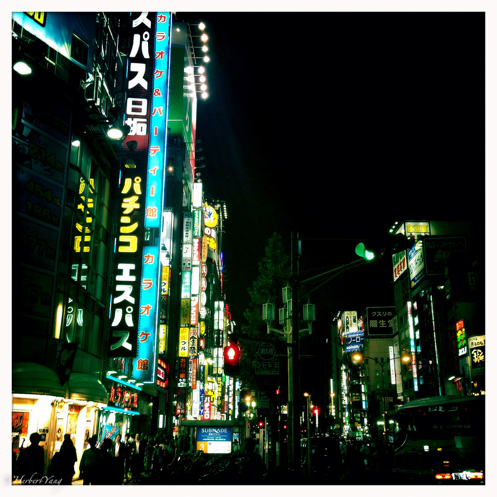
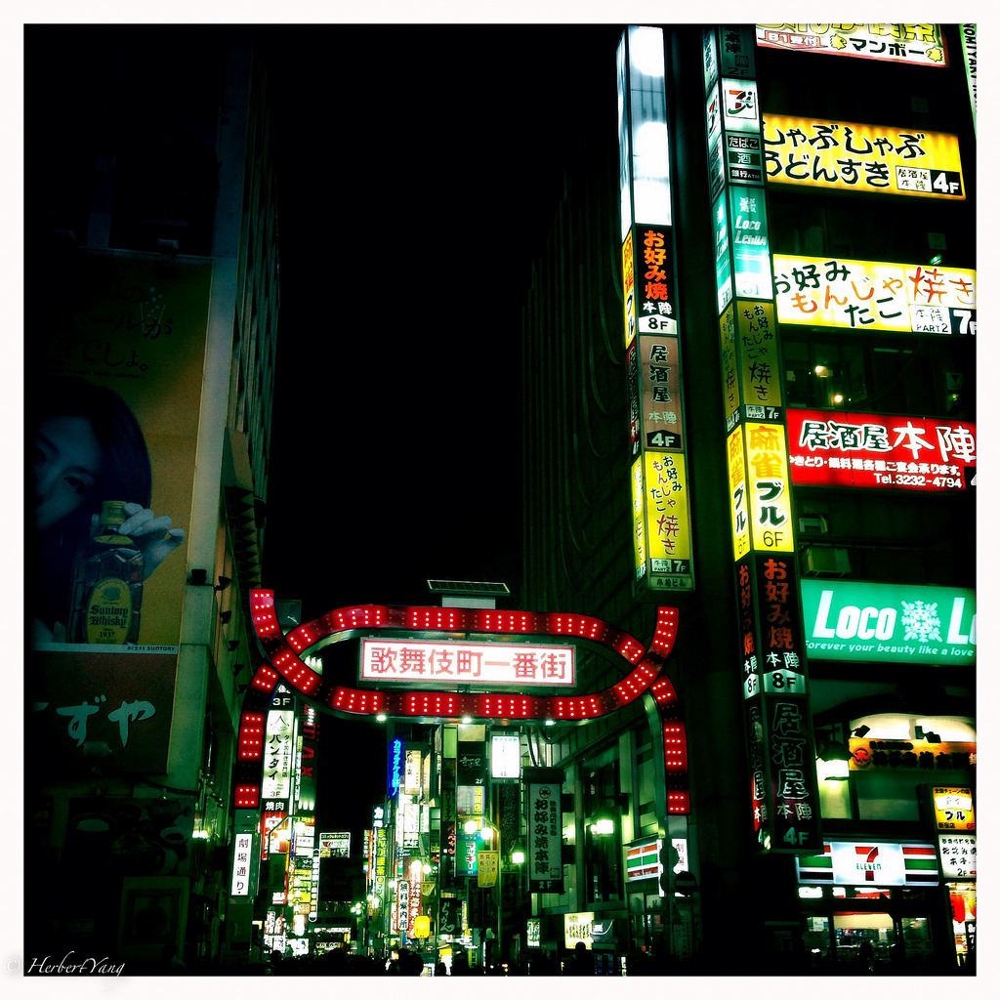

Title: Photo#20 - 歌舞伎町的刘建一
Date: 2014-09-25 08:00
Tags: 中文
Category: Photography
Slug: Kabukicho
Summary: 12年前我在东京近郊的八王子市住了半年，每周坐火车到新宿参加公司的培训，培训结束后顺便四处走走逛逛。新宿是一个钢筋水泥铸成的庞然大物，仿佛热带雨林中的洪荒巨兽，可以瞬间将任何人吞噬进无边的霓虹灯中。走过那幢足足有三层楼高的地标麦当劳，就来到了歌舞伎町。那是2000年，Pitt和Norton的《搏击俱乐部》刚刚上映。没想到，我赫然在歌舞伎町遇到现场版的搏击俱乐部。

12年前我在东京近郊的八王子市住了半年，每周坐火车到新宿参加公司的培训，培训结束后顺便四处走走逛逛。新宿是一个钢筋水泥铸成的庞然大物，仿佛热带雨林中的洪荒巨兽，可以瞬间将任何人吞噬进无边的霓虹灯中。走过那幢足足有三层楼高的地标麦当劳，就来到了歌舞伎町。

那是2000年，Pitt和Norton的《搏击俱乐部》刚刚上映。

没想到，我赫然在歌舞伎町遇到现场版的搏击俱乐部。

在一个宽阔的广场上，黑压压地围了上百人，大多是穿着深色西装白色衬衫的salary man。默然不语的人群时不时骚动一下，显然中间有事情在发生吸引了所有人的注意力。我慢慢地穿过人群，走进中心的空地。

一个人全身武装到牙齿，穿着层层护具和头盔，在奋力地抵挡另一个人狂风暴雨般的进攻。进攻者，好像一个普通的salary man，带着拳击手套，响应着人群低沉的欢呼声，不断地向防御者挥拳进击。在霓虹灯闪烁不定的夜幕下，这怪异的一幕印嵌入我的脑海，跟《攻壳机动队》里的画面融为一体。

这个画面后来被金城武的《不夜城》开场时那段歌舞伎町的超长镜头逐渐替代了。

1998年在日本上映的《不夜城》把超级男神金城武拍得那个是。。。帅得惊天动地。华人黑帮在东京争权夺利的冷血，中日混血儿刘建一（金城武）在新宿左右逢源的艰辛，浸润在歌舞伎町的每一个镜头里。

