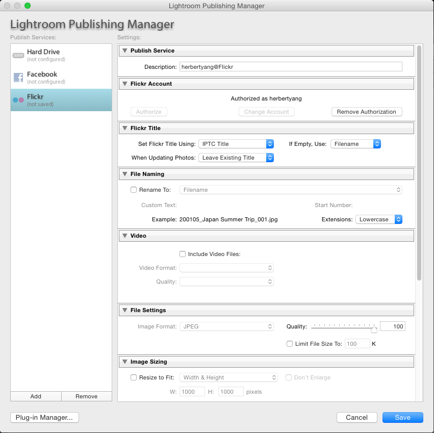
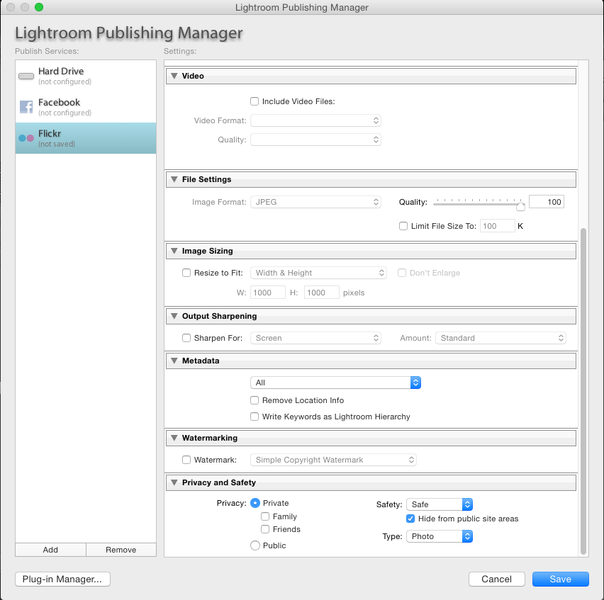

Title: How to Manage Your Photos - Part 2
Date: 2015-06-28 08:00
Tags:
Category: Tech
Slug: how-to-manage-photos-part-2
Summary: Here are the settings I use for the official Flickr plug-in in Lightroom 4.1. Extraordinary care needs to be taken at this step. If not set up correctly, all the existing Flickr photos might need to be re-published and that might take a long long time.

Here are the settings I use for the official Flickr plug-in in Lightroom 4.1. Extraordinary care needs to be taken at this step. If not set up correctly, all the existing Flickr photos might need to be re-published and that might take a long long time.

Flickr Title

- Set Flickr Title Using: *IPTC Title*
- If Empty, Use; *Filename*
- When Updating Photos: *Leave Existing Titles*
- note: Title should be set differently from filename. Filename is used to index photos in an album and give a unique identifier/handle to a photo. Title is used to give a more descriptive caption to a photo. Filename needs to be unique, while title can be anything. Caption is another item that often confuses and complicates this love triangle of filename-title-caption. I'll just leave caption blank.

Filename

- uncheck everything
- note: Renaming can be done in this Lightroom-to-Flickr as well, but I'd suggest doing file renaming within Lightroom, where you can have almost 100% control of what happens.

Video

- uncheck everything
- note: I keep videos separate from photos. All my videos get uploaded to youtube.

File Settings

- Set Quality to: *100*  
- note: The default is 60%. So make sure you change it to 100% to preserve the raw quality.

Image Sizing

- uncheck everything

Output Sharpening

- uncheck everything  

Metadata

- Choose: *All*
- uncheck everything else

Watermarking

- uncheck all  
- note: If you're a professional stock photographer, you might need to adjust this setting to stamp a watermark on your photos. It's not necessary for photos about families and friends.

Privacy and Safety

- Privacy: *Private*
- Safety: *Safe*, check "Hide from public site areas"
- Type: *Photo*
- note: It's critical to get this one right. You don't want to upload photos as public albums by default.  
