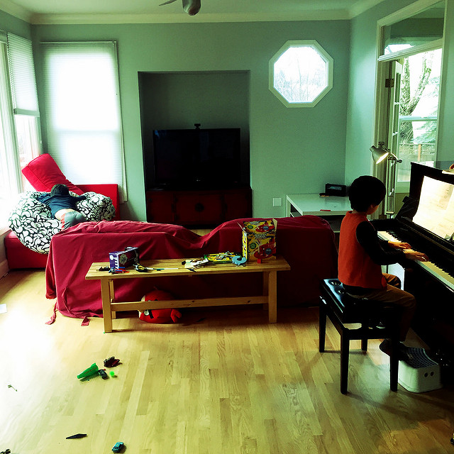

Title: Photo#22 - O Brother, Where Art Thou?
Date: 2015-12-20 08:00
Tags: 中文,诗歌
Category: Photography
Slug: o-brother-where-art-thou
Summary: amusing moments of two brothers

> 松梢藏远山[^1]，晨辉跃阑干

> 窗外风渐歇，堂内琴正酣[^2]

> 凌客[^3]心力憔[^4]，黑白键气豪

> 湖畔[^5]问天下，浥尘[^6]志更坚

My friend [LYZ](http://weibo.com/u/1743289671) has responded with a much better one, as usual:

> 凌客远来烽烟倦

> 瓜舍[^7]湖畔暂偷闲

> 松影琴声浮云淡

> 浥尘一曲且悠然

[^1]: Paul and Goblin的院子里有两棵树，左边一棵是松树，右边一棵也是松树
[^2]: Paul and Goblin's elder son is playing Bach
[^3]: 凌客 = Linkqlo
[^4]: 充满挑战的一年
[^5]: P&G's house is in Lake Oswego, Oregon
[^6]: 来自王维七言绝句《渭城曲》之“渭城朝雨浥轻尘”, P&G老大的中文名
[^7]: Paul在江湖上人称九瓜
