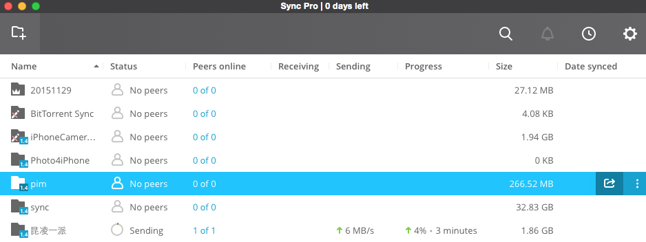
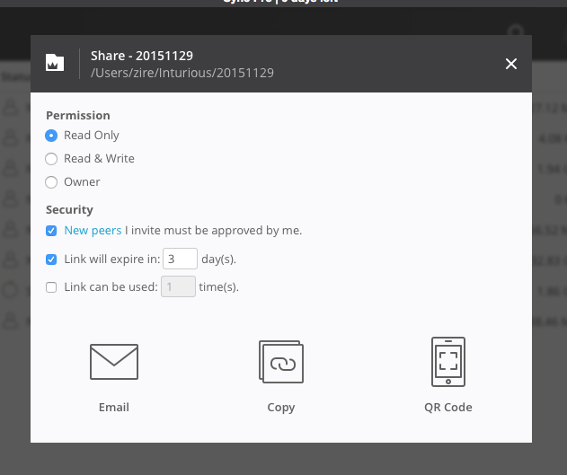
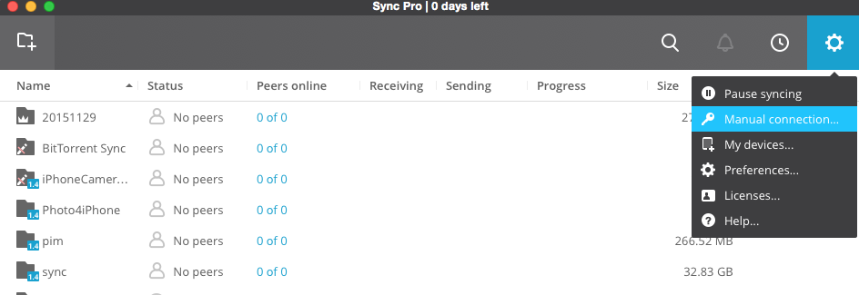
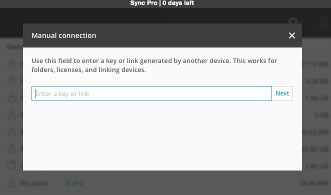
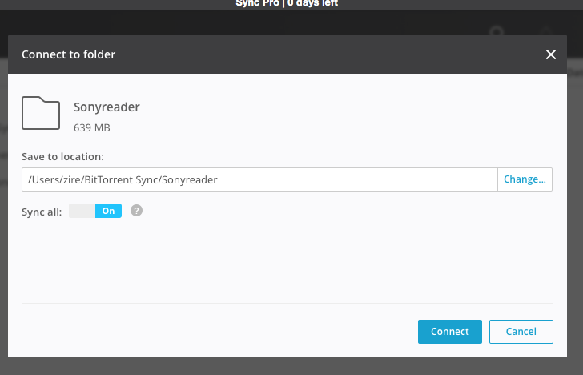
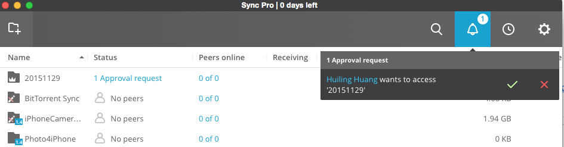

Title: How To Share Files and Photos Without Any Cloud Service
Date: 2016-01-01 08:00
Tags: 中文
Category: Tech
Slug: share-files-and-photos-without-cloud
Summary: 使用情景：用户A把自己电脑上的文件夹分享给用户B

使用情景：用户A把自己电脑上的文件夹分享给用户B

1. 用户A下载[BitTorrent Sync](https://www.getsync.com). BitTorrent Sync支持多个平台，Mac, Windows, iOs, Android，Windows Mobile和Kindle。作为简单的分享照片，使用它的免费版即可。
2. 用户A安装好BitTorrent Sync后，打开软件，按左上角`Add Folder`, 指定你想要分享的文件夹。添加后Status下显示`No peers`.

3. 用户A选择这个文件夹，点击右方（Date Synced下）的分享按钮，出来一个Share的菜单。

4. 用户A在Permission下指定这个文件夹对其他用户的分享权限，选择`Read Only`，其他的都选择默认即可。
5. 用户A选择把分享链接分享给其他朋友的方式，建议用`Copy`，最简单直接。点击了Copy后，这个文件夹的分享链接就被粘贴到clipboard上了。把这个链接发给朋友。
6. 用户B - 收到链接的朋友，也需要在自己的电脑上安装BitTorrent Sync
7. 用户B把链接copy下来，打开BitTorrent Sync，点击右上角的设置（多摸狗血的UI），选择`Manual Connection`，在接下来的窗口里粘贴链接，然后在本地电脑上选择文件夹的地址。

8. 这个时候用户A会在自己的BitTorrent Sync里收到一个提示，说用户B在申请文件夹的共享权限，批准即可。

9. Voila! 现在这个文件夹的文件正在被BitTorrent Sync用p2p的方式（不通过任何云服务的上载）被快乐地从A的电脑下载到B的电脑中。