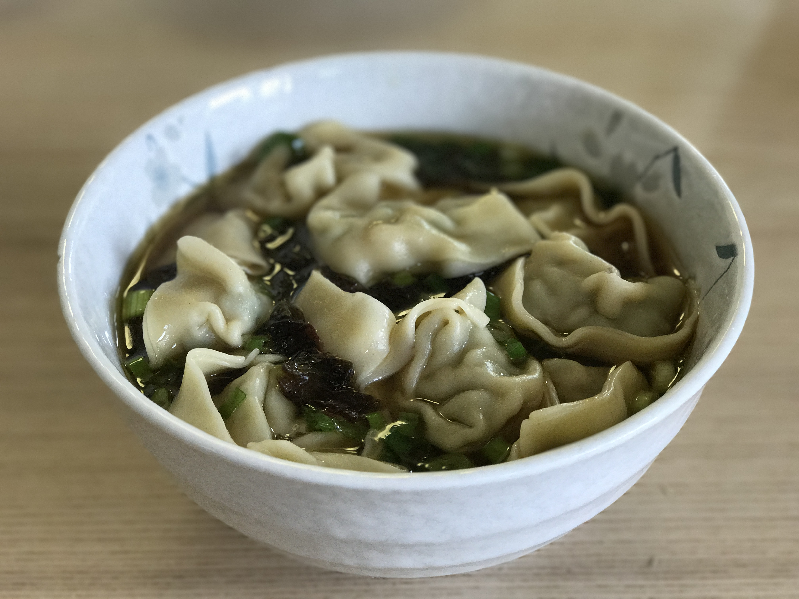

Title: 上海大馄饨 (Shanghainese Big Wonton Soup)
Date: 2017-03-03 08:00
Category: Gourmet
Tags: 中文
Slug: How-To-Make-Chinese-Dumpling-Soup
Summary: 馄饨在各个地方的叫法不同。四川称为*抄手*，广东称为*云吞*，江浙地区称为*馄饨*。上海馄饨又分为大馄饨和小馄饨。小馄饨吃了不怎么顶事儿，10~15个大馄饨则可以成为很好的午餐了，而且15-20分钟就可以做好。

馄饨在各个地方的叫法不同。四川称为*抄手*，广东称为*云吞*，江浙地区称为*馄饨*。上海馄饨又分为大馄饨和小馄饨。小馄饨吃了不怎么顶事儿，10~15个大馄饨则可以成为很好的午餐了，而且15-20分钟就可以做好。

## 食材

- 包好的冰冻馄饨（从中餐馆买）
- 基本：紫菜，葱，酱油，麻油
- 高级：蛋皮，榨菜，虾米

## 厨具

- 汤锅

## 步骤

1. 用电水壶烧一壶开水[^1]。
2. 把紫菜撕成细丝，放入碗里。
3. 把葱切末，放入碗里[^2]。
4. 将烧开的热水倒入汤锅。
5. 把冰冻馄饨放入汤锅，大火煮`10`分钟，不用加盖。中间水开了后馄饨会浮起来，加适量冷水继续煮[^3]。
6. 10分钟后，尝一个馄饨看熟了没有。熟了的话把馄饨捞起，放入碗里。
7. 将适量汤水倒入碗里，加适量酱油，麻油[^4]，跟碗底的紫菜，葱末搅拌均匀，做成馄饨汤。

[^1]: 用冷水也可以，不过会花比较长的时间
[^2]: 在高级版里可以再加上蛋皮，榨菜和虾米，味道更佳
[^3]: 混沌浮起一两次即可
[^4]: 口味偏重的人还可以加胡椒粉