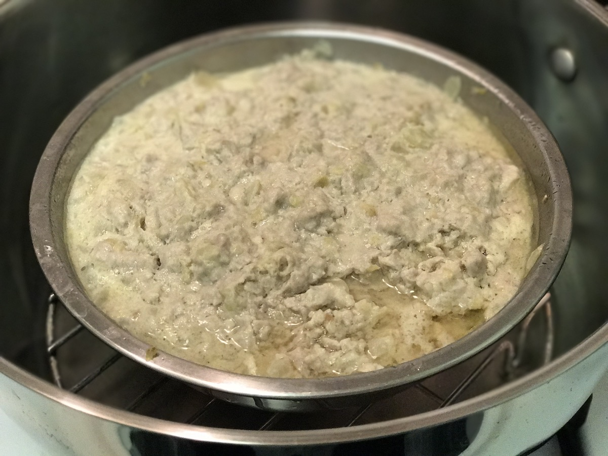

Title: 湖北汽水肉（Steamed Minced Meat）
Date: 2017-03-05 08:00
Tags: 中文
Category: Gourmet
Slug: steamed-minced-meat
Summary: 汽水肉是一道湖北传统名菜，美味可口，容易消化，特别适合儿童和老人。虽然在湖北家家都做汽水肉，但我在其他地方，不管是北京上海，还是香港新加坡以及北美的各大唐人街，从来没在任何一家餐馆见过这道菜，很奇怪。

汽水肉是一道湖北传统名菜，美味可口，容易消化，特别适合儿童和老人。虽然在湖北家家都做汽水肉，但我在其他地方，不管是北京上海，还是香港新加坡以及北美的各大唐人街，从来没在任何一家餐馆见过这道菜，很奇怪。

## 食材
- 里脊猪肉
- 食用油，料酒，生抽，盐，淀粉
- 生姜，洋葱, 葱

## 厨具
- 蒸锅，蒸屉

## 步骤
1. 把里脊肉从冰室里拿出来解冻[^1]。
2. 把里脊肉用清水清洗干净，再用热水冲洗掉血水。
3. 在肉还没有完全解冻之前，切片，然后加少许水，剁成肉末。
4. 将生姜切末。
5. 将洋葱切片，切成细末。
6. 将葱切末。
6. 打一个鸡蛋，搅拌均匀，加入适量冷水。
7. 将剁碎的里脊肉放在一个大碗里，加适量食用油，料酒，生抽，盐，淀粉，姜末和洋葱末，倒入搅拌好的鸡蛋汁，再一起搅拌均匀[^2]。最后把葱花撒在面上。
8. 在蒸锅里烧开水，再把大碗放入蒸屉上，盖上锅盖，旺火蒸`15`分钟。

[^1]: 如果要加快时间的话，可以把裹着塑料薄膜的冻肉泡在温水里
[^2]: 不要加太多水，刚刚盖过肉就可以